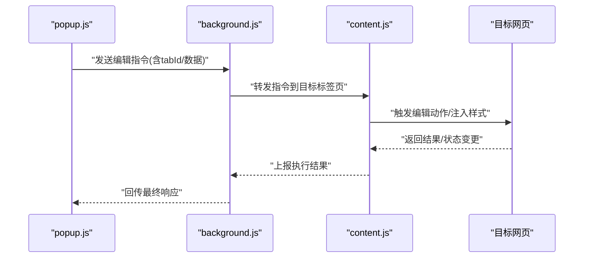
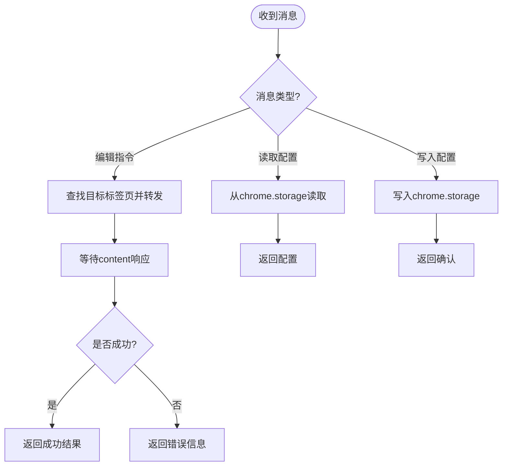
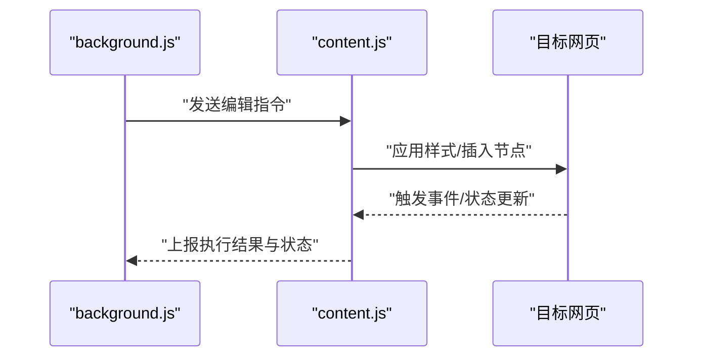
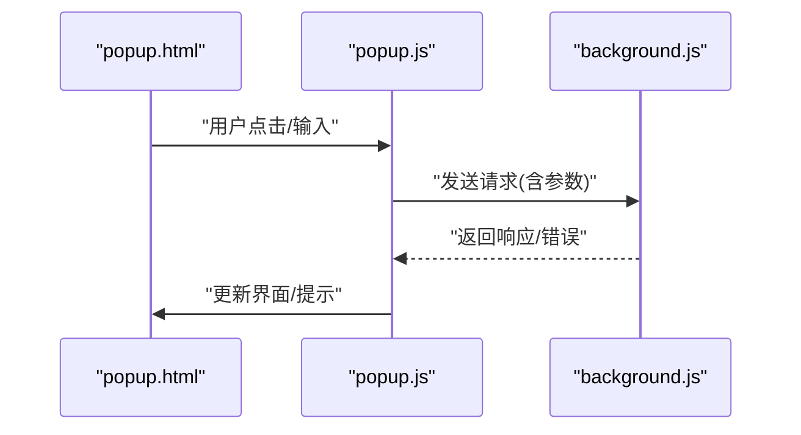
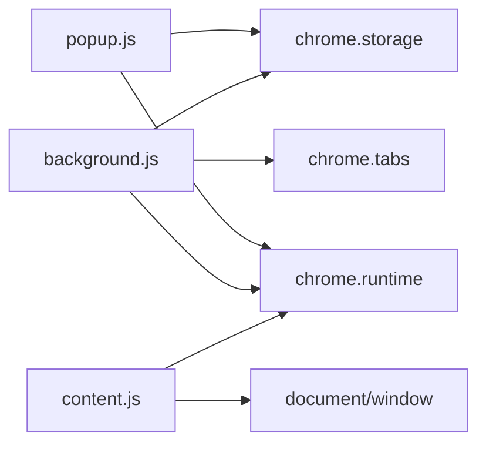

# API参考

<cite>
**本文引用的文件**
- [manifest.json](file://manifest.json)
- [background.js](file://background.js)
- [content.js](file://content.js)
- [popup.js](file://popup.js)
- [popup.html](file://popup.html)
- [content.css](file://content.css)
- [test.html](file://test.html)
</cite>

## 目录
1. [简介](#简介)
2. [项目结构](#项目结构)
3. [核心组件](#核心组件)
4. [架构总览](#架构总览)
5. [详细组件分析](#详细组件分析)
6. [依赖关系分析](#依赖关系分析)
7. [性能注意事项](#性能注意事项)
8. [故障排查指南](#故障排查指南)
9. [结论](#结论)
10. [附录：消息协议与示例](#附录消息协议与示例)

## 简介
本API参考文档面向HTML编辑器浏览器扩展，系统化说明扩展内各组件之间的通信机制、Chrome Web Extensions API使用方式、自定义事件与回调规范、权限与安全配置，以及调试与常见问题解决方案。文档以实际代码为依据，提供可追溯的源码位置与图示，帮助开发者在不同组件间进行稳定可靠的通信与集成。

## 项目结构
扩展采用典型的Chrome扩展三进程模型：
- background脚本：作为后台服务，负责持久化状态、跨上下文通信协调与资源管理。
- content脚本：注入到目标网页中，与页面DOM交互并桥接页面与扩展通信。
- popup界面：用户操作入口，通过消息与background/content交互。

```mermaid
graph TB
A["popup.js<br/>弹出窗口逻辑"] --> B["background.js<br/>后台服务"]
A --> C["content.js<br/>内容脚本"]
B < --> C
C --> D["目标网页DOM/事件"]
A -.-> E["popup.html<br/>UI模板"]
C -.-> F["content.css<br/>样式注入"]
```

图表来源
- [background.js:1-200](file://background.js#L1-L200)
- [content.js:1-200](file://content.js#L1-L200)
- [popup.js:1-200](file://popup.js#L1-L200)
- [popup.html:1-200](file://popup.html#L1-L200)
- [content.css:1-200](file://content.css#L1-L200)

章节来源
- [manifest.json:1-200](file://manifest.json#L1-L200)
- [background.js:1-200](file://background.js#L1-L200)
- [content.js:1-200](file://content.js#L1-L200)
- [popup.js:1-200](file://popup.js#L1-L200)
- [popup.html:1-200](file://popup.html#L1-L200)
- [content.css:1-200](file://content.css#L1-L200)

## 核心组件
- 后台服务（background.js）
  - 职责：监听来自popup与content的消息，转发与聚合；维护扩展级状态（如chrome.storage）；管理标签页生命周期相关能力。
  - 关键API：chrome.runtime、chrome.storage、chrome.tabs等。
- 内容脚本（content.js）
  - 职责：在目标网页中注入DOM操作能力，监听页面事件，向background/popup发送消息，接收指令执行编辑动作。
  - 关键API：window.postMessage、document事件、与扩展消息通道的桥接。
- 弹出窗口（popup.js + popup.html）
  - 职责：提供用户界面与交互入口，发起编辑任务、查询状态、触发页面更新。
  - 关键API：chrome.runtime.sendMessage、chrome.storage.local。

章节来源
- [background.js:1-200](file://background.js#L1-L200)
- [content.js:1-200](file://content.js#L1-L200)
- [popup.js:1-200](file://popup.js#L1-L200)
- [popup.html:1-200](file://popup.html#L1-L200)

## 架构总览
扩展通过消息总线实现跨上下文通信：
- popup与background之间通过chrome.runtime.sendMessage/postMessage进行请求-响应。
- content与background之间通过chrome.runtime.connect或sendMessage建立长连接或短消息通道。
- content与页面之间通过自定义事件或postMessage桥接，确保隔离性与兼容性。



图表来源
- [background.js:1-200](file://background.js#L1-L200)
- [content.js:1-200](file://content.js#L1-L200)
- [popup.js:1-200](file://popup.js#L1-L200)

## 详细组件分析

### 后台服务（background.js）
- 消息路由
  - 监听来自popup与content的消息，根据消息类型分发处理。
  - 支持请求-响应模式，保证调用方获得明确结果。
- 存储与状态
  - 使用chrome.storage.local持久化配置与缓存数据。
  - 提供统一的读写接口，避免直接散落的storage调用。
- 标签页管理
  - 通过chrome.tabs获取当前活跃标签页，定位content脚本注入点。
  - 在必要时重连或重建与content的连接。



图表来源
- [background.js:1-200](file://background.js#L1-L200)

章节来源
- [background.js:1-200](file://background.js#L1-L200)

### 内容脚本（content.js）
- 页面桥接
  - 监听页面自定义事件或DOM变化，将页面状态转换为扩展消息。
  - 通过window.postMessage与页面安全通信（如需）。
- 指令执行
  - 接收background转发的编辑指令，执行DOM操作或样式切换。
  - 将执行结果与后续状态变更回传给background。
- 样式注入
  - 动态加载content.css，确保UI一致性。



图表来源
- [content.js:1-200](file://content.js#L1-L200)
- [content.css:1-200](file://content.css#L1-L200)

章节来源
- [content.js:1-200](file://content.js#L1-L200)
- [content.css:1-200](file://content.css#L1-L200)

### 弹出窗口（popup.js + popup.html）
- 用户交互
  - 渲染UI并提供按钮/表单，收集用户输入。
  - 通过chrome.runtime.sendMessage向background发起请求。
- 状态展示
  - 从chrome.storage读取显示所需的状态与配置。
  - 对错误进行友好提示与重试引导。



图表来源
- [popup.js:1-200](file://popup.js#L1-L200)
- [popup.html:1-200](file://popup.html#L1-L200)

章节来源
- [popup.js:1-200](file://popup.js#L1-L200)
- [popup.html:1-200](file://popup.html#L1-L200)

## 依赖关系分析
- 模块耦合
  - popup仅依赖background进行业务编排，降低与content的直接耦合。
  - content仅依赖background进行指令下发，保持页面侧最小侵入。
- 外部依赖
  - Chrome Web Extensions API：chrome.runtime、chrome.storage、chrome.tabs。
  - 页面API：document、window、自定义事件。



图表来源
- [popup.js:1-200](file://popup.js#L1-L200)
- [background.js:1-200](file://background.js#L1-L200)
- [content.js:1-200](file://content.js#L1-L200)

章节来源
- [manifest.json:1-200](file://manifest.json#L1-L200)
- [popup.js:1-200](file://popup.js#L1-L200)
- [background.js:1-200](file://background.js#L1-L200)
- [content.js:1-200](file://content.js#L1-L200)

## 性能注意事项
- 消息体积控制：尽量传输必要字段，避免大对象频繁序列化。
- 连接复用：对高频场景使用长连接（connect）减少握手开销。
- 防抖与节流：对页面事件与批量更新做合并处理，降低DOM压力。
- 存储访问：批量读写chrome.storage，避免多次I/O。
- 样式注入：按需加载content.css，减少初始开销。

[本节为通用指导，不直接分析具体文件]

## 故障排查指南
- 无法连接到content脚本
  - 检查目标标签页是否已加载content脚本。
  - 确认background正确识别tabId并转发消息。
- 消息无响应
  - 核对消息类型与字段命名是否与协议一致。
  - 查看控制台日志与扩展后台日志，定位断点。
- 存储读取为空
  - 确认chrome.storage作用域与键名是否正确。
  - 首次使用需初始化默认值。
- 样式未生效
  - 检查content.css是否被正确注入。
  - 确认选择器与作用域匹配。

章节来源
- [background.js:1-200](file://background.js#L1-L200)
- [content.js:1-200](file://content.js#L1-L200)
- [popup.js:1-200](file://popup.js#L1-L200)

## 结论
本扩展通过清晰的分层与消息协议，实现了popup、background与content之间的可靠通信。遵循本文档的API约定与最佳实践，可在不同组件间高效协作，同时保障安全性与可维护性。建议在实际项目中结合测试用例与调试技巧持续优化。

[本节为总结性内容，不直接分析具体文件]

## 附录：消息协议与示例

### 消息协议总览
- 传输通道
  - popup与background：chrome.runtime.sendMessage/postMessage。
  - background与content：chrome.runtime.connect或sendMessage。
- 消息结构
  - type：字符串，消息类型标识。
  - payload：对象，携带业务数据。
  - tabId：可选，用于指定目标标签页。
  - requestId：可选，用于请求-响应关联。
- 响应结构
  - success：布尔，表示是否成功。
  - data：对象，业务数据。
  - error：对象，错误码与描述。

章节来源
- [background.js:1-200](file://background.js#L1-L200)
- [content.js:1-200](file://content.js#L1-L200)
- [popup.js:1-200](file://popup.js#L1-L200)

### 常用消息类型
- 编辑指令
  - 用途：触发页面编辑动作（如插入文本、切换样式）。
  - 关键字段：action、params。
- 状态查询
  - 用途：获取当前编辑状态或配置。
  - 关键字段：query、keys。
- 配置同步
  - 用途：读写扩展配置。
  - 关键字段：key、value。

章节来源
- [background.js:1-200](file://background.js#L1-L200)
- [content.js:1-200](file://content.js#L1-L200)
- [popup.js:1-200](file://popup.js#L1-L200)

### 错误处理规范
- 统一错误对象
  - code：数字或字符串错误码。
  - message：人类可读的错误描述。
  - details：附加信息（可选）。
- 常见错误
  - 连接失败：检查标签页与脚本注入状态。
  - 参数校验失败：核对payload字段与类型。
  - 存储异常：检查权限与存储空间。

章节来源
- [background.js:1-200](file://background.js#L1-L200)
- [content.js:1-200](file://content.js#L1-L200)
- [popup.js:1-200](file://popup.js#L1-L200)

### 自定义事件与回调
- 页面侧事件
  - 名称：由content脚本定义，用于通知页面状态变更。
  - 参数：包含当前编辑状态与变更详情。
- 扩展侧回调
  - 名称：由background/popup定义，用于接收content上报。
  - 参数：包含执行结果与状态快照。

章节来源
- [content.js:1-200](file://content.js#L1-L200)
- [background.js:1-200](file://background.js#L1-L200)
- [popup.js:1-200](file://popup.js#L1-L200)

### 权限配置与安全性
- 权限声明
  - 在manifest中声明必要的权限（如storage、tabs）。
  - 仅申请最小必要权限，降低安全风险。
- 内容安全策略
  - 避免内联脚本，使用外部脚本与样式。
  - 对传入数据进行严格校验与白名单过滤。
- 跨上下文通信
  - 使用扩展提供的消息API，避免直接访问其他上下文。
  - 对敏感信息进行脱敏与最小化传输。

章节来源
- [manifest.json:1-200](file://manifest.json#L1-L200)

### 调试技巧
- 启用扩展调试
  - 打开扩展管理页面，进入“服务工作者”或“后台页面”查看日志。
- 页面调试
  - 在目标网页控制台查看自定义事件与postMessage。
- 断点与日志
  - 在background、content、popup的关键路径设置断点。
  - 输出结构化日志，便于问题定位。

章节来源
- [background.js:1-200](file://background.js#L1-L200)
- [content.js:1-200](file://content.js#L1-L200)
- [popup.js:1-200](file://popup.js#L1-L200)

### 示例：组件间通信流程
- popup发起编辑请求
  - 步骤：用户操作 -> popup发送消息 -> background转发 -> content执行 -> 结果回传。
- 状态同步
  - 步骤：content监听页面变化 -> 上报background -> popup轮询或订阅 -> 更新UI。

章节来源
- [popup.js:1-200](file://popup.js#L1-L200)
- [background.js:1-200](file://background.js#L1-L200)
- [content.js:1-200](file://content.js#L1-L200)