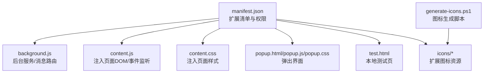
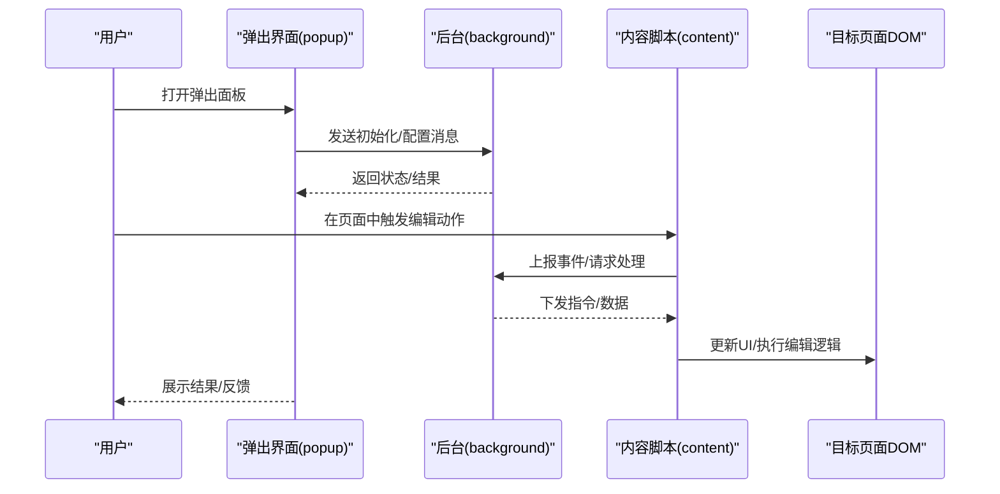
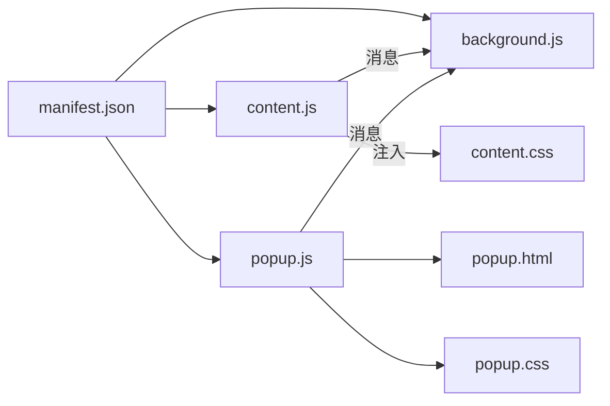

# 开发指南

<cite>
**本文引用的文件**
- [manifest.json](file://manifest.json)
- [background.js](file://background.js)
- [content.js](file://content.js)
- [content.css](file://content.css)
- [popup.html](file://popup.html)
- [popup.js](file://popup.js)
- [popup.css](file://popup.css)
- [test.html](file://test.html)
- [generate-icons.ps1](file://generate-icons.ps1)
</cite>

## 目录
1. [简介](#简介)
2. [项目结构](#项目结构)
3. [核心组件](#核心组件)
4. [架构总览](#架构总览)
5. [详细组件分析](#详细组件分析)
6. [依赖关系分析](#依赖关系分析)
7. [性能考虑](#性能考虑)
8. [故障排除指南](#故障排除指南)
9. [结论](#结论)
10. [附录](#附录)

## 简介
本指南面向HTML编辑器浏览器扩展的开发者，提供从环境搭建、代码组织、调试与测试到图标生成、版本管理与发布的完整流程。文档基于当前仓库的文件结构与实现，帮助新成员快速上手并高效协作。

## 项目结构
该扩展采用典型的浏览器扩展分层组织：清单与权限声明、后台脚本、内容脚本与样式、弹出界面及其资源、测试页面以及图标生成脚本。

图表来源
- [manifest.json:1-200](file://manifest.json#L1-L200)
- [background.js:1-200](file://background.js#L1-L200)
- [content.js:1-200](file://content.js#L1-L200)
- [content.css:1-200](file://content.css#L1-L200)
- [popup.html:1-200](file://popup.html#L1-L200)
- [popup.js:1-200](file://popup.js#L1-L200)
- [popup.css:1-200](file://popup.css#L1-L200)
- [test.html:1-200](file://test.html#L1-L200)
- [generate-icons.ps1:1-200](file://generate-icons.ps1#L1-L200)

章节来源
- [manifest.json:1-200](file://manifest.json#L1-L200)
- [background.js:1-200](file://background.js#L1-L200)
- [content.js:1-200](file://content.js#L1-L200)
- [content.css:1-200](file://content.css#L1-L200)
- [popup.html:1-200](file://popup.html#L1-L200)
- [popup.js:1-200](file://popup.js#L1-L200)
- [popup.css:1-200](file://popup.css#L1-L200)
- [test.html:1-200](file://test.html#L1-L200)
- [generate-icons.ps1:1-200](file://generate-icons.ps1#L1-L200)

## 核心组件
- 扩展清单与权限：集中管理扩展元数据、权限、脚本注入策略与资源路径。
- 后台脚本：负责跨上下文通信、持久化状态、与网页内容脚本的消息交互。
- 内容脚本：注入目标页面，操作DOM、监听用户交互、向后台发送消息。
- 弹出界面：提供用户可操作的UI面板，通过消息机制与后台或内容脚本通信。
- 测试页面：用于在本地验证功能、模拟不同场景。
- 图标生成脚本：自动化生成多尺寸图标，统一视觉规范。

章节来源
- [manifest.json:1-200](file://manifest.json#L1-L200)
- [background.js:1-200](file://background.js#L1-L200)
- [content.js:1-200](file://content.js#L1-L200)
- [popup.html:1-200](file://popup.html#L1-L200)
- [popup.js:1-200](file://popup.js#L1-L200)
- [test.html:1-200](file://test.html#L1-L200)
- [generate-icons.ps1:1-200](file://generate-icons.ps1#L1-L200)

## 架构总览
扩展采用“后台-内容-弹出”三端协作模式：
- 后台作为中枢，维护全局状态与跨标签页通信。
- 内容脚本负责页面内交互与DOM操作。
- 弹出界面提供可视化配置与快捷操作。
- 测试页面用于独立验证功能链路。

图表来源
- [background.js:1-200](file://background.js#L1-L200)
- [content.js:1-200](file://content.js#L1-L200)
- [popup.js:1-200](file://popup.js#L1-L200)

## 详细组件分析

### 扩展清单与权限（manifest）
- 职责：声明扩展名称、版本、图标、权限、脚本注入策略、API访问范围等。
- 关键点：确保内容与弹出脚本正确注册；按需申请最小权限；合理设置匹配规则与注入时机。
- 建议：将敏感信息外置或通过构建时注入；保持清单简洁可读。

章节来源
- [manifest.json:1-200](file://manifest.json#L1-L200)

### 后台脚本（background）
- 职责：接收来自弹出界面与内容脚本的消息，协调业务逻辑，必要时与外部服务交互。
- 关键点：消息路由清晰；避免阻塞主线程；对错误进行捕获与重试；合理使用存储API。
- 建议：将长任务拆分为异步队列；为关键路径添加日志与埋点。

章节来源
- [background.js:1-200](file://background.js#L1-L200)

### 内容脚本（content）
- 职责：注入目标页面，监听用户操作，修改DOM，与后台通信。
- 关键点：选择安全的DOM操作方式；避免与页面现有脚本冲突；使用事件委托提升性能。
- 建议：对注入时机与选择器做严格校验；提供降级方案以兼容不同站点。

章节来源
- [content.js:1-200](file://content.js#L1-L200)
- [content.css:1-200](file://content.css#L1-L200)

### 弹出界面（popup）
- 职责：提供可视化控制面板，读取/写入配置，触发编辑流程。
- 关键点：与后台通信解耦；UI状态与数据同步一致；加载资源最小化。
- 建议：使用模块化组织JS；对输入进行校验与提示；支持键盘快捷键。

章节来源
- [popup.html:1-200](file://popup.html#L1-L200)
- [popup.js:1-200](file://popup.js#L1-L200)
- [popup.css:1-200](file://popup.css#L1-L200)

### 测试页面（test）
- 职责：提供本地测试环境，模拟不同页面结构与交互场景。
- 关键点：覆盖常见与边界用例；便于快速复现问题；与真实环境保持一致的接口契约。
- 建议：将测试数据与逻辑分离；增加断言与可视化反馈。

章节来源
- [test.html:1-200](file://test.html#L1-L200)

### 图标生成脚本（generate-icons.ps1）
- 职责：根据源图自动生成多尺寸图标，保证在不同平台与分辨率下显示清晰。
- 关键点：输出路径与命名需与清单一致；支持批量处理与异常回滚。
- 建议：将生成步骤纳入构建流程；保留源图与产物版本控制。

章节来源
- [generate-icons.ps1:1-200](file://generate-icons.ps1#L1-L200)

## 依赖关系分析
- 清单驱动：所有脚本与资源的加载均由清单声明决定。
- 消息总线：后台、内容脚本与弹出界面通过消息机制耦合度低、扩展性强。
- 资源隔离：内容脚本与页面作用域隔离，样式通过注入CSS生效。

图表来源
- [manifest.json:1-200](file://manifest.json#L1-L200)
- [background.js:1-200](file://background.js#L1-L200)
- [content.js:1-200](file://content.js#L1-L200)
- [popup.js:1-200](file://popup.js#L1-L200)
- [content.css:1-200](file://content.css#L1-L200)
- [popup.html:1-200](file://popup.html#L1-L200)
- [popup.css:1-200](file://popup.css#L1-L200)

## 性能考虑
- 减少注入体积：仅加载必要脚本与样式，按需懒加载。
- 优化DOM操作：合并变更、使用DocumentFragment、避免重排重绘。
- 消息节流：对高频事件进行节流/防抖，降低后台压力。
- 存储读写：批量写入，避免频繁I/O。
- 内存管理：及时移除事件监听与定时器，防止泄漏。

## 故障排除指南
- 无法加载脚本/样式
  - 检查清单中的路径与权限是否正确。
  - 确认浏览器已启用开发者模式并重新加载扩展。
- 消息未送达
  - 核对消息名称与监听器注册位置。
  - 使用控制台查看报错与网络请求。
- 样式不生效
  - 确认注入时机与选择器优先级。
  - 检查是否被页面样式覆盖。
- 图标不显示
  - 运行图标生成脚本并确保输出路径与清单一致。
  - 清理缓存后重新加载扩展。
- 调试技巧
  - 使用浏览器开发者工具分别调试后台、内容脚本与弹出界面。
  - 在关键路径添加日志与断点，逐步定位问题。

章节来源
- [manifest.json:1-200](file://manifest.json#L1-L200)
- [background.js:1-200](file://background.js#L1-L200)
- [content.js:1-200](file://content.js#L1-L200)
- [popup.js:1-200](file://popup.js#L1-L200)
- [generate-icons.ps1:1-200](file://generate-icons.ps1#L1-L200)

## 结论
本扩展采用清晰的三层架构与消息驱动通信，具备良好的可维护性与扩展性。遵循本文档的环境搭建、调试测试、图标生成与发布流程，可显著提升开发效率与产品质量。

## 附录

### 开发环境搭建
- 必备工具
  - 现代浏览器（Chrome/Edge/Firefox）
  - 文本编辑器或IDE（VS Code推荐）
  - PowerShell（用于图标生成脚本）
- 安装步骤
  - 克隆仓库至本地。
  - 在浏览器开发者模式中加载本地扩展目录。
  - 根据需要安装额外插件以提升开发体验（如ESLint、Prettier）。

### 文件组织原则
- 按职责划分：后台、内容脚本、弹出界面各自独立。
- 资源集中：样式与脚本就近放置，清单统一管理。
- 命名规范：语义化文件名，避免歧义。

### 调试方法
- 后台调试：在扩展管理页面点击“服务工作者”进入调试。
- 内容脚本调试：在目标页面打开开发者工具，切换到对应脚本。
- 弹出界面调试：右键弹出面板选择“检查”。
- 日志与断点：在关键路径打印上下文信息，设置条件断点。

### 测试策略与测试页面
- 单元测试：针对纯函数与工具方法进行断言。
- 集成测试：模拟消息流与DOM交互，验证端到端流程。
- 测试页面：使用test.html构造典型场景，快速验证修复效果。

### 图标生成与自定义图标
- 使用方法
  - 准备高质量源图（透明背景、矢量优先）。
  - 运行generate-icons.ps1生成多尺寸图标。
  - 将输出复制到icons目录，并在清单中引用。
- 自定义流程
  - 设计符合规范的图标。
  - 调整尺寸与对比度，确保小尺寸可读性。
  - 提交前再次运行生成脚本并校验产物。

### 代码规范与最佳实践
- 编码风格：统一缩进、命名与注释规范。
- 模块化：拆分大文件，复用公共逻辑。
- 错误处理：捕获异常并提供友好提示。
- 安全：最小权限原则，避免注入不可信内容。

### 版本管理与发布流程
- 版本管理
  - 使用语义化版本号（主版本.次版本.修订号）。
  - 在清单中同步更新版本号与变更说明。
- 发布流程
  - 运行图标生成与静态检查。
  - 本地全量回归测试。
  - 打包扩展并提交到商店或内部分发渠道。
  - 记录发布日志与已知问题。