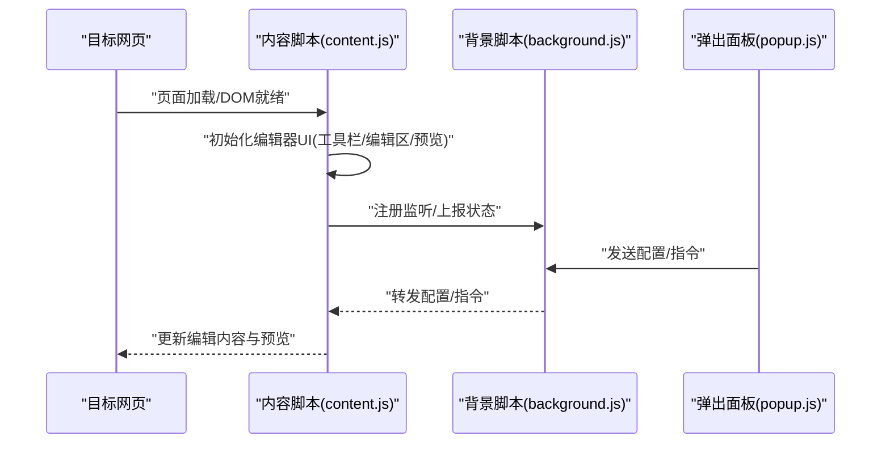
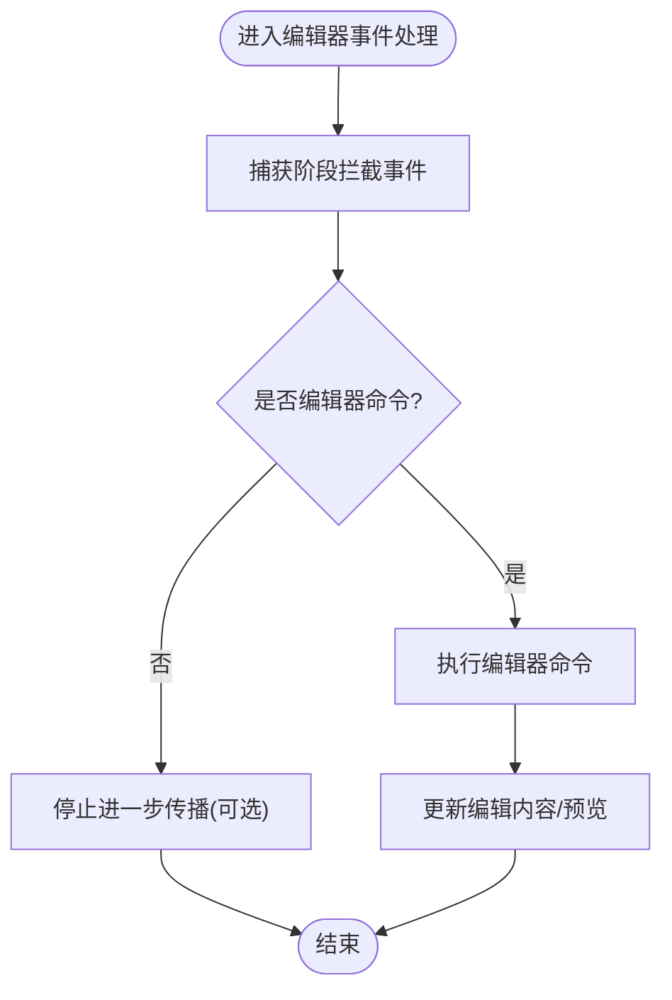
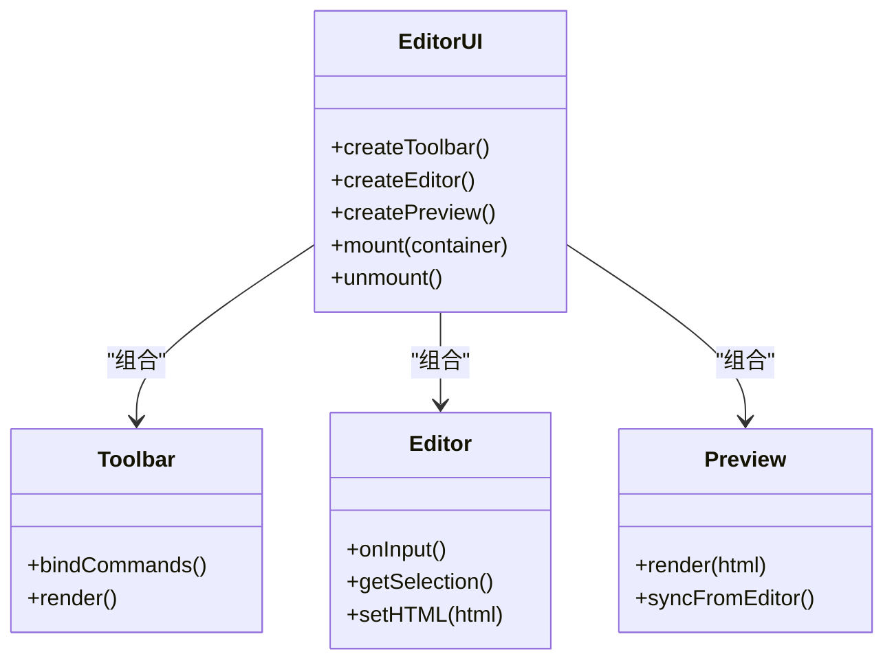
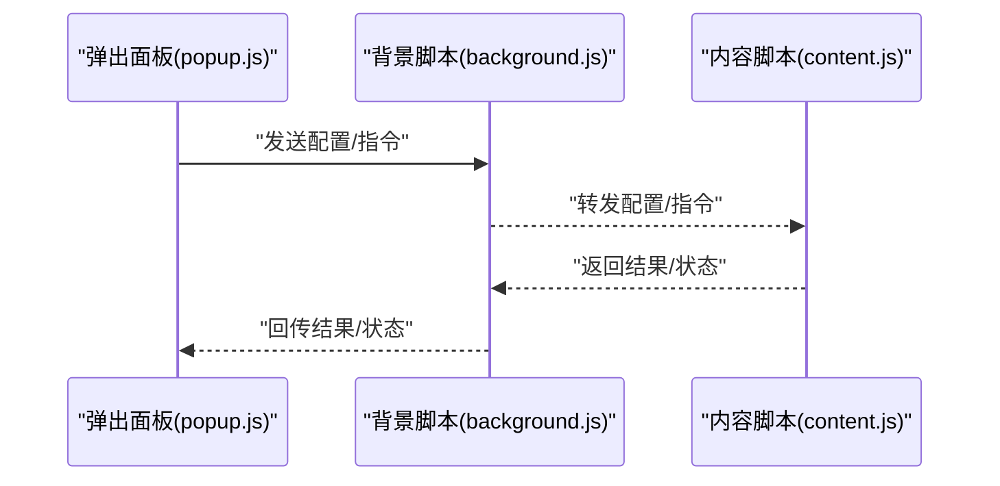
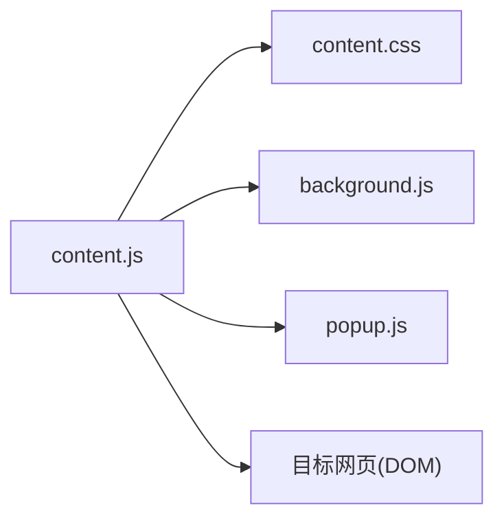

# 内容脚本架构

<cite>
**本文引用的文件**
- [content.js](file://content.js)
- [content.css](file://content.css)
- [manifest.json](file://manifest.json)
- [background.js](file://background.js)
- [popup.html](file://popup.html)
- [popup.js](file://popup.js)
- [popup.css](file://popup.css)
- [test.html](file://test.html)
</cite>

## 目录
1. [简介](#简介)
2. [项目结构](#项目结构)
3. [核心组件](#核心组件)
4. [架构总览](#架构总览)
5. [详细组件分析](#详细组件分析)
6. [依赖关系分析](#依赖关系分析)
7. [性能考虑](#性能考虑)
8. [故障排查指南](#故障排查指南)
9. [结论](#结论)
10. [附录](#附录)

## 简介
本文件为HTML编辑器浏览器扩展的内容脚本（Content Script）提供完整的架构文档。重点说明：
- 如何安全地将编辑功能注入目标网页，包括DOM观察者模式、样式隔离与事件冒泡处理策略。
- 编辑器UI的动态创建与管理机制，涵盖工具栏、编辑区域与预览窗口的渲染逻辑。
- 与页面原生内容的交互方式，避免与页面原有JavaScript代码冲突。
- 内容脚本生命周期管理：注入时机、内存优化与资源清理策略。
- DOM操作最佳实践与安全注意事项的示例路径指引。

## 项目结构
该扩展由以下关键部分组成：
- content.js：内容脚本主入口，负责在目标页面中注入编辑器UI、监听DOM变化、处理用户交互并与背景脚本通信。
- content.css：内容脚本使用的样式表，通过Shadow DOM或命名空间实现样式隔离。
- manifest.json：扩展清单，声明权限、注入策略、消息通道等。
- background.js：后台脚本，负责跨上下文的消息路由与持久化状态。
- popup.*：弹出面板的UI与逻辑，用于配置与触发编辑器相关操作。
- test.html：本地测试页面，便于验证编辑器注入效果。

```mermaid
graph TB
A["manifest.json"] --> B["content.js"]
A --> C["background.js"]
A --> D["popup.html / popup.js / popup.css"]
B --> E["content.css"]
B --> F["目标网页(iframe/宿主页面)"]
C < --> B
D < --> C
```

图表来源
- [manifest.json:1-200](file://manifest.json#L1-L200)
- [content.js:1-200](file://content.js#L1-L200)
- [background.js:1-200](file://background.js#L1-L200)
- [popup.html:1-200](file://popup.html#L1-L200)
- [popup.js:1-200](file://popup.js#L1-L200)
- [popup.css:1-200](file://popup.css#L1-L200)
- [content.css:1-200](file://content.css#L1-L200)

章节来源
- [manifest.json:1-200](file://manifest.json#L1-L200)
- [content.js:1-200](file://content.js#L1-L200)
- [background.js:1-200](file://background.js#L1-L200)
- [popup.html:1-200](file://popup.html#L1-L200)
- [popup.js:1-200](file://popup.js#L1-L200)
- [popup.css:1-200](file://popup.css#L1-L200)
- [content.css:1-200](file://content.css#L1-L200)

## 核心组件
- 内容脚本（content.js）
  - 负责在目标页面中动态创建并挂载编辑器UI（工具栏、编辑区、预览窗口）。
  - 使用DOM观察者监控目标节点变化，确保编辑器与页面内容同步。
  - 通过事件委托与捕获阶段拦截用户输入，避免与页面事件冲突。
  - 与background.js进行消息通信，完成跨上下文数据交换。
- 样式隔离（content.css）
  - 通过Shadow DOM或CSS命名空间隔离样式，防止污染宿主页面。
  - 提供可配置的编辑器主题与布局变量。
- 背景脚本（background.js）
  - 作为消息中枢，转发popup与content之间的指令与数据。
  - 管理扩展级状态与持久化配置。
- 弹出面板（popup.*）
  - 提供编辑器配置入口（如主题切换、快捷键设置、预览开关）。
  - 通过消息驱动控制内容脚本行为。

章节来源
- [content.js:1-200](file://content.js#L1-L200)
- [content.css:1-200](file://content.css#L1-L200)
- [background.js:1-200](file://background.js#L1-L200)
- [popup.html:1-200](file://popup.html#L1-L200)
- [popup.js:1-200](file://popup.js#L1-L200)
- [popup.css:1-200](file://popup.css#L1-L200)

## 架构总览
内容脚本在目标页面加载后注入，创建独立的UI容器（建议Shadow DOM），将工具栏、编辑区与预览窗口挂载到容器中。通过事件委托与捕获阶段拦截键盘与鼠标事件，保证与页面原有事件互不干扰。所有跨上下文的数据交换通过chrome.runtime消息通道完成，确保安全性与稳定性。



图表来源
- [content.js:1-200](file://content.js#L1-L200)
- [background.js:1-200](file://background.js#L1-L200)
- [popup.js:1-200](file://popup.js#L1-L200)

## 详细组件分析

### 内容脚本注入与生命周期管理
- 注入时机
  - 在DOMReady或特定元素出现时注入编辑器UI，避免阻塞页面渲染。
  - 对SPA场景使用MutationObserver监听路由或容器变化，按需重建或复用UI。
- 生命周期
  - 初始化：创建容器、绑定事件、建立消息通道。
  - 运行期：响应配置变更、同步编辑内容、更新预览。
  - 销毁：移除事件监听、断开消息通道、释放引用，避免内存泄漏。
- 安全与隔离
  - 使用Shadow DOM隔离样式与脚本作用域。
  - 仅通过白名单方法访问宿主页面API，避免直接修改全局对象。
  - 对用户输入进行清洗与转义，防止XSS风险。

章节来源
- [content.js:1-200](file://content.js#L1-L200)
- [content.css:1-200](file://content.css#L1-L200)
- [manifest.json:1-200](file://manifest.json#L1-L200)

### DOM观察者模式与事件冒泡处理
- 观察者模式
  - 使用MutationObserver监听目标容器的子树变化，检测新增/删除/替换节点。
  - 对关键节点（如编辑区、预览容器）建立细粒度观察，减少不必要的重排。
- 事件冒泡
  - 在捕获阶段拦截事件，优先处理编辑器命令（如加粗、插入链接）。
  - 使用事件委托降低监听器数量，提升性能。
  - 阻止不必要的事件传播，避免与页面原有逻辑冲突。



图表来源
- [content.js:1-200](file://content.js#L1-L200)

章节来源
- [content.js:1-200](file://content.js#L1-L200)

### 样式隔离技术
- Shadow DOM
  - 将编辑器UI置于独立影子树中，样式不会泄露到宿主页面，也不会被宿主样式覆盖。
  - 通过CSS自定义属性暴露主题变量，支持运行时切换。
- 命名空间与BEM
  - 若不使用Shadow DOM，则采用严格命名空间与BEM类名，避免类名冲突。
- 样式注入
  - 动态加载content.css至影子树或特定容器，确保样式作用域最小化。

章节来源
- [content.css:1-200](file://content.css#L1-L200)
- [content.js:1-200](file://content.js#L1-L200)

### 编辑器UI动态创建与管理
- 工具栏
  - 动态生成按钮组，绑定命令回调；支持可插拔的命令扩展点。
  - 使用事件委托统一处理点击与键盘快捷键。
- 编辑区域
  - 基于contentEditable或自定义渲染引擎；维护光标位置、选区与撤销栈。
  - 防抖保存与增量同步，减少重排与消息开销。
- 预览窗口
  - 在沙箱iframe或影子树中渲染预览，隔离脚本与样式。
  - 双向同步：编辑区变更触发预览更新，预览交互回写编辑内容。



图表来源
- [content.js:1-200](file://content.js#L1-L200)

章节来源
- [content.js:1-200](file://content.js#L1-L200)

### 与页面原生内容的交互与冲突规避
- 最小权限原则
  - 仅读取必要信息，避免写入宿主页面全局对象。
  - 通过白名单API访问页面DOM，限制范围与作用域。
- 冲突规避
  - 使用唯一前缀的类名与ID，避免选择器冲突。
  - 在捕获阶段处理事件，必要时stopPropagation阻断后续处理。
- 安全加固
  - 对用户输入进行清洗与转义，输出到预览时使用沙箱环境。
  - 禁止内联危险协议（如javascript:），过滤不安全标签。

章节来源
- [content.js:1-200](file://content.js#L1-L200)
- [content.css:1-200](file://content.css#L1-L200)

### 与背景脚本和弹出面板的通信
- 消息通道
  - 使用chrome.runtime.sendMessage/onMessage进行跨上下文通信。
  - 定义清晰的消息类型与载荷结构，包含版本兼容字段。
- 状态同步
  - 弹出面板配置变更通过背景脚本转发至内容脚本。
  - 内容脚本上报当前状态（如编辑模式、预览可见性）供UI展示。



图表来源
- [popup.js:1-200](file://popup.js#L1-L200)
- [background.js:1-200](file://background.js#L1-L200)
- [content.js:1-200](file://content.js#L1-L200)

章节来源
- [popup.js:1-200](file://popup.js#L1-L200)
- [background.js:1-200](file://background.js#L1-L200)
- [content.js:1-200](file://content.js#L1-L200)

## 依赖关系分析
- 内容脚本依赖
  - 样式：content.css（通过Shadow DOM或命名空间注入）。
  - 通信：background.js（消息路由）、popup.js（配置交互）。
  - 宿主页面：受限DOM访问，避免全局污染。
- 外部依赖
  - 浏览器API：chrome.runtime、document、window等。
  - 可选：第三方库（如Markdown解析器）需在沙箱或隔离环境中加载。



图表来源
- [content.js:1-200](file://content.js#L1-L200)
- [content.css:1-200](file://content.css#L1-L200)
- [background.js:1-200](file://background.js#L1-L200)
- [popup.js:1-200](file://popup.js#L1-L200)

章节来源
- [content.js:1-200](file://content.js#L1-L200)
- [content.css:1-200](file://content.css#L1-L200)
- [background.js:1-200](file://background.js#L1-L200)
- [popup.js:1-200](file://popup.js#L1-L200)

## 性能考虑
- 观察者节流
  - 对MutationObserver回调进行节流/防抖，避免频繁重排。
  - 仅观察必要节点与属性，减少开销。
- 事件委托
  - 将多个子元素事件绑定到父容器，降低监听器数量。
- 渲染优化
  - 批量更新DOM，减少回流与重绘。
  - 预览渲染使用虚拟滚动或分页加载长内容。
- 内存管理
  - 及时移除事件监听与观察者实例。
  - 释放大对象引用，避免闭包持有宿主页面引用。

[本节为通用性能指导，无需具体文件来源]

## 故障排查指南
- 编辑器未显示
  - 检查manifest注入策略与匹配规则是否正确。
  - 确认目标页面DOM结构是否满足注入条件。
- 事件冲突
  - 在捕获阶段拦截事件，必要时停止传播。
  - 检查是否存在重复绑定导致多次触发。
- 样式错乱
  - 确认样式是否注入到正确的影子树或容器。
  - 检查宿主页面是否覆盖了关键样式。
- 消息不通
  - 核对消息类型与载荷结构，确保双方一致。
  - 检查background脚本是否正确转发消息。

章节来源
- [content.js:1-200](file://content.js#L1-L200)
- [background.js:1-200](file://background.js#L1-L200)
- [manifest.json:1-200](file://manifest.json#L1-L200)

## 结论
本架构通过Shadow DOM与事件捕获实现安全的编辑器注入，结合观察者模式与事件委托保障性能与稳定性。通过清晰的通信契约与最小权限原则，避免与宿主页面冲突。配合完善的生命周期管理与资源清理策略，确保扩展在复杂页面环境下稳定运行。

[本节为总结性内容，无需具体文件来源]

## 附录
- 最佳实践示例路径
  - DOM操作与事件处理：参考内容脚本中的事件绑定与委托实现。
    - [content.js:1-200](file://content.js#L1-L200)
  - 样式隔离与主题变量：参考样式注入与自定义属性使用。
    - [content.css:1-200](file://content.css#L1-L200)
  - 消息通信与状态同步：参考popup与background、content之间的消息流转。
    - [popup.js:1-200](file://popup.js#L1-L200)
    - [background.js:1-200](file://background.js#L1-L200)
    - [content.js:1-200](file://content.js#L1-L200)
  - 注入策略与权限声明：参考manifest配置。
    - [manifest.json:1-200](file://manifest.json#L1-L200)
  - 本地测试页面：用于验证编辑器注入效果。
    - [test.html:1-200](file://test.html#L1-L200)