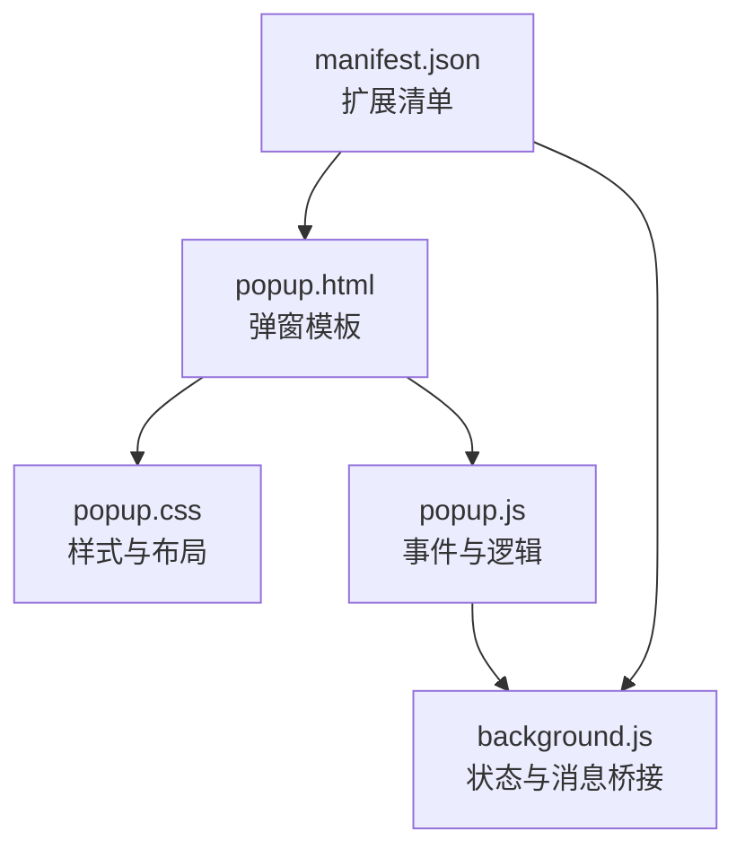
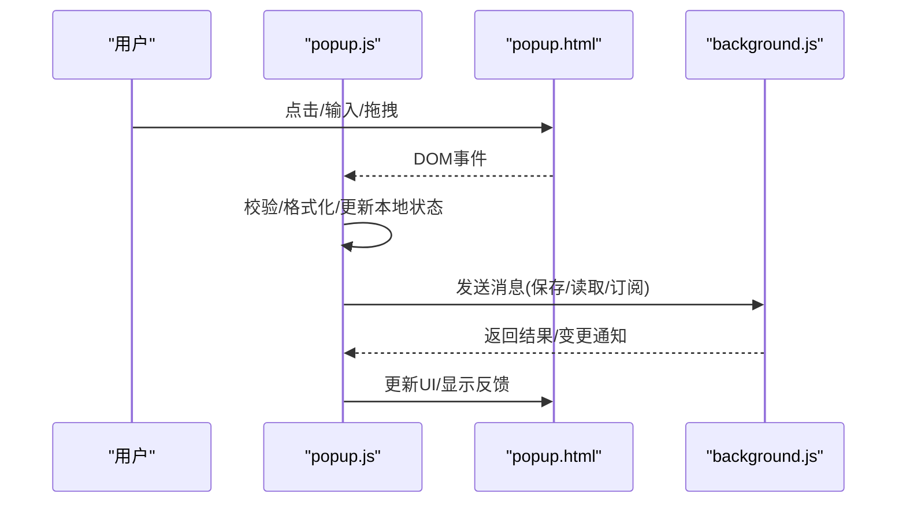
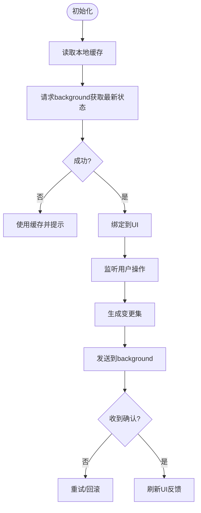
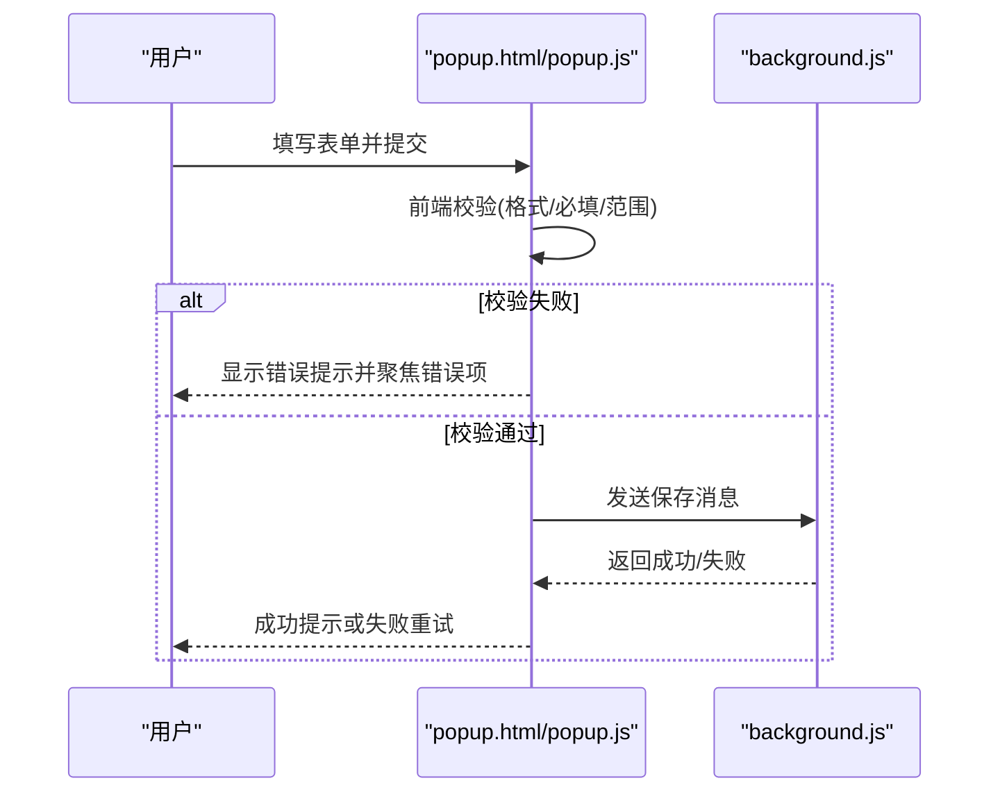
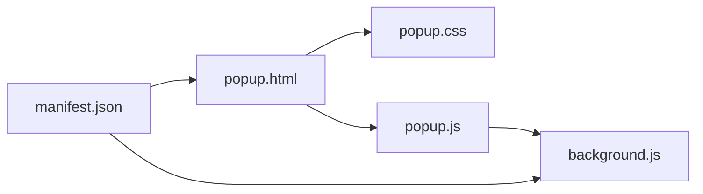

# 弹出窗口界面

<cite>
**本文引用的文件**
- [popup.html](file://popup.html)
- [popup.css](file://popup.css)
- [popup.js](file://popup.js)
- [background.js](file://background.js)
- [manifest.json](file://manifest.json)
</cite>

## 目录
1. [简介](#简介)
2. [项目结构](#项目结构)
3. [核心组件](#核心组件)
4. [架构总览](#架构总览)
5. [详细组件分析](#详细组件分析)
6. [依赖关系分析](#依赖关系分析)
7. [性能考虑](#性能考虑)
8. [故障排查指南](#故障排查指南)
9. [结论](#结论)
10. [附录](#附录)

## 简介
本文件面向HTML编辑器浏览器扩展的“弹出窗口（Popup）”界面，提供从设计原则到实现细节的系统化文档。重点覆盖：
- 用户交互界面的设计原则与组件结构
- HTML模板组织、CSS样式系统与JavaScript事件处理机制
- 响应式设计与多屏幕适配策略
- 与Background Script的数据绑定与实时状态同步
- 界面组件的可复用性封装（按钮、输入框、编辑器）
- 用户交互流程示例（表单验证、错误提示、操作确认）

## 项目结构
弹出窗口由三个核心文件组成：
- popup.html：定义弹出窗口的DOM结构与模板
- popup.css：定义视觉样式、布局与响应式规则
- popup.js：负责事件绑定、数据绑定、与Background Script通信以及UI状态管理

此外，扩展清单manifest.json声明了Popup入口，background.js作为后台脚本承担持久化状态与跨页面通信职责。

图表来源
- [popup.html:1-200](file://popup.html#L1-L200)
- [popup.css:1-200](file://popup.css#L1-L200)
- [popup.js:1-200](file://popup.js#L1-L200)
- [background.js:1-200](file://background.js#L1-L200)
- [manifest.json:1-200](file://manifest.json#L1-L200)

章节来源
- [popup.html:1-200](file://popup.html#L1-L200)
- [popup.css:1-200](file://popup.css#L1-L200)
- [popup.js:1-200](file://popup.js#L1-L200)
- [background.js:1-200](file://background.js#L1-L200)
- [manifest.json:1-200](file://manifest.json#L1-L200)

## 核心组件
- 模板层（HTML）
  - 容器与区域划分：标题区、工具栏、编辑区、状态栏
  - 可复用元素：按钮、输入框、下拉选择、开关等
  - 语义化标签与无障碍属性（aria-*）
- 样式层（CSS）
  - 基于Flexbox/Grid的布局系统
  - 主题变量（颜色、字号、间距）
  - 响应式断点与缩放策略
- 行为层（JS）
  - 事件委托与最小化监听器
  - 表单校验与即时反馈
  - 与Background Script的消息通信与状态同步
  - 组件封装与实例化管理

章节来源
- [popup.html:1-200](file://popup.html#L1-L200)
- [popup.css:1-200](file://popup.css#L1-L200)
- [popup.js:1-200](file://popup.js#L1-L200)

## 架构总览
弹出窗口采用“视图-行为-状态”分层：
- 视图：popup.html + popup.css
- 行为：popup.js（事件、校验、渲染）
- 状态：background.js（持久化、跨上下文共享）

消息通道通过浏览器扩展API在popup与background之间传递，确保状态一致性与操作即时反馈。

图表来源
- [popup.js:1-200](file://popup.js#L1-L200)
- [background.js:1-200](file://background.js#L1-L200)
- [popup.html:1-200](file://popup.html#L1-L200)

## 详细组件分析

### 模板组织与组件拆分
- 区域划分
  - 顶部：标题与快捷操作
  - 中部：编辑区（富文本或代码编辑器容器）
  - 底部：状态栏（字符数、模式、最后保存时间）
- 可复用组件
  - 按钮：统一尺寸、禁用态、加载态
  - 输入框：带占位符、校验提示、图标前缀
  - 编辑器：容器+工具栏+内容区，支持切换模式
- 无障碍与可访问性
  - aria-label、role、tabindex、键盘导航

章节来源
- [popup.html:1-200](file://popup.html#L1-L200)

### CSS样式系统与响应式设计
- 设计令牌
  - 颜色、字体、圆角、阴影、间距等以变量形式集中管理
- 布局系统
  - Flexbox用于行内对齐，Grid用于面板布局
  - 工具栏与编辑区自适应高度
- 响应式策略
  - 使用媒体查询在不同视口下调整排版与字号
  - 小屏优先：堆叠布局；大屏优先：分栏布局
  - 动态缩放：根据容器宽度调整编辑器工具栏密度

章节来源
- [popup.css:1-200](file://popup.css#L1-L200)

### JavaScript事件处理与数据绑定
- 事件模型
  - 事件委托减少监听器数量
  - 防抖/节流优化高频事件（如输入、滚动）
- 数据绑定
  - 双向绑定：输入变化→状态更新→视图刷新
  - 单向绑定：状态变更→局部重绘
- 与Background Script通信
  - 消息类型：读取配置、保存内容、订阅变更
  - 错误重试与超时处理
  - 增量同步：仅传输差异字段

章节来源
- [popup.js:1-200](file://popup.js#L1-L200)
- [background.js:1-200](file://background.js#L1-L200)

### 与Background Script的数据绑定与实时同步
- 启动时拉取状态
  - 初始化时向background请求当前配置/内容
- 运行时订阅变更
  - background在状态变化时主动推送给popup
- 离线与恢复
  - 网络或权限异常时降级为本地缓存
  - 恢复后合并冲突并提示用户

图表来源
- [popup.js:1-200](file://popup.js#L1-L200)
- [background.js:1-200](file://background.js#L1-L200)

### 组件可复用性设计
- 抽象基类/工厂
  - 统一的创建接口：init、render、destroy
  - 配置项：默认值、校验规则、事件回调
- 组件族
  - Button：主按钮、次按钮、危险按钮、加载态
  - Input：文本、数字、密码、带校验
  - Editor：基础容器、工具栏、模式切换
- 样式隔离
  - BEM命名或CSS模块风格，避免全局污染
  - 主题切换通过变量注入

章节来源
- [popup.js:1-200](file://popup.js#L1-L200)
- [popup.css:1-200](file://popup.css#L1-L200)

### 用户交互流程示例
- 表单验证
  - 实时校验：输入时触发规则检查
  - 提交校验：汇总错误并定位首个错误项
- 错误提示
  - 非阻塞提示：轻量文案
  - 阻塞提示：模态确认或步骤引导
- 操作确认
  - 二次确认：删除/覆盖等高风险操作
  - 撤销/重做：记录操作历史

图表来源
- [popup.js:1-200](file://popup.js#L1-L200)
- [background.js:1-200](file://background.js#L1-L200)
- [popup.html:1-200](file://popup.html#L1-L200)

## 依赖关系分析
- 内部依赖
  - popup.html依赖popup.css进行样式渲染
  - popup.js依赖popup.html的DOM节点与popup.css的样式类名
  - popup.js与background.js通过消息API通信
- 外部依赖
  - 浏览器扩展API（消息、存储、选项页等）
  - 可选：第三方编辑器库（若嵌入富文本/代码编辑器）

图表来源
- [popup.html:1-200](file://popup.html#L1-L200)
- [popup.css:1-200](file://popup.css#L1-L200)
- [popup.js:1-200](file://popup.js#L1-L200)
- [background.js:1-200](file://background.js#L1-L200)
- [manifest.json:1-200](file://manifest.json#L1-L200)

章节来源
- [popup.html:1-200](file://popup.html#L1-L200)
- [popup.css:1-200](file://popup.css#L1-L200)
- [popup.js:1-200](file://popup.js#L1-L200)
- [background.js:1-200](file://background.js#L1-L200)
- [manifest.json:1-200](file://manifest.json#L1-L200)

## 性能考虑
- 渲染优化
  - 批量更新DOM，避免频繁重排重绘
  - 虚拟滚动（长列表场景）
- 事件优化
  - 防抖/节流输入与滚动事件
  - 事件委托降低监听器数量
- 通信优化
  - 增量同步与去抖动消息
  - 失败重试与退避策略
- 内存管理
  - 及时移除监听器与销毁组件实例
  - 大对象序列化与压缩传输

[本节为通用指导，不直接分析具体文件]

## 故障排查指南
- 常见问题
  - 消息未送达：检查manifest权限与消息路由
  - 样式错乱：确认CSS作用域与类名一致性
  - 状态不同步：核对消息协议与版本号
- 调试建议
  - 在popup控制台查看日志与错误堆栈
  - 在background中打印消息收发详情
  - 使用浏览器开发者工具的“应用”面板检查存储
- 快速修复
  - 重置本地缓存并重新拉取状态
  - 降级到只读模式并提示用户

章节来源
- [popup.js:1-200](file://popup.js#L1-L200)
- [background.js:1-200](file://background.js#L1-L200)

## 结论
本弹出窗口界面通过清晰的三层架构（HTML/CSS/JS）与稳定的消息通道，实现了高可用、易维护且可扩展的用户交互体验。配合响应式设计与组件化封装，可在多种设备与屏幕尺寸下保持一致的使用感受。与Background Script的实时同步确保了数据的准确性与操作的即时反馈。

[本节为总结性内容，不直接分析具体文件]

## 附录
- 术语
  - Popup：浏览器扩展的弹出窗口界面
  - Background Script：后台脚本，负责持久化与跨上下文通信
  - 消息协议：popup与background之间的数据结构约定
- 参考
  - 浏览器扩展API文档
  - 响应式设计最佳实践
  - 组件化开发规范

[本节为补充信息，不直接分析具体文件]