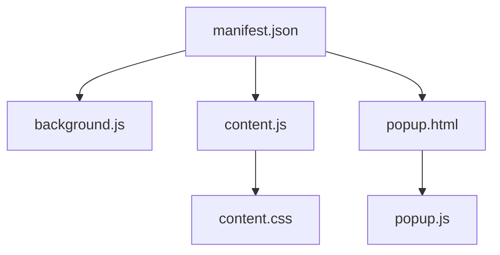
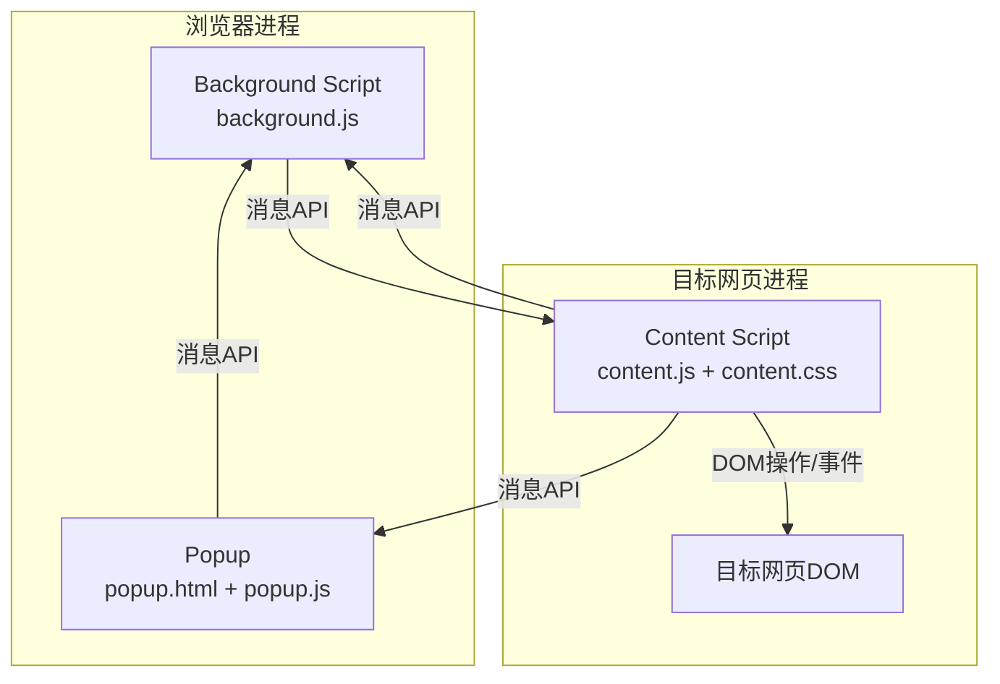
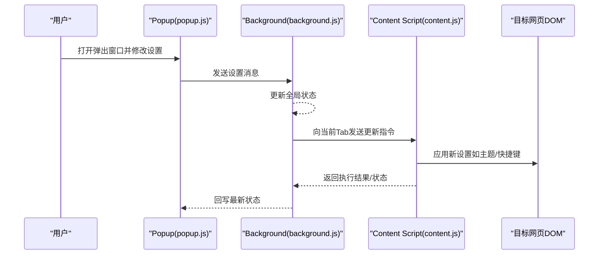
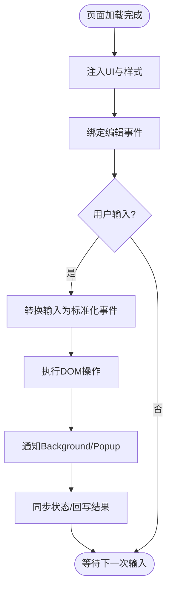
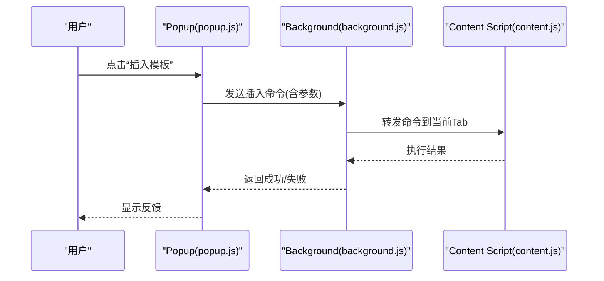
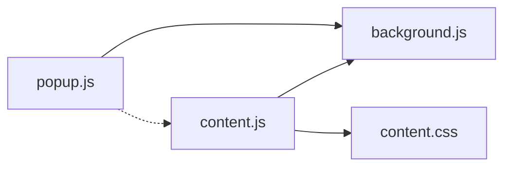
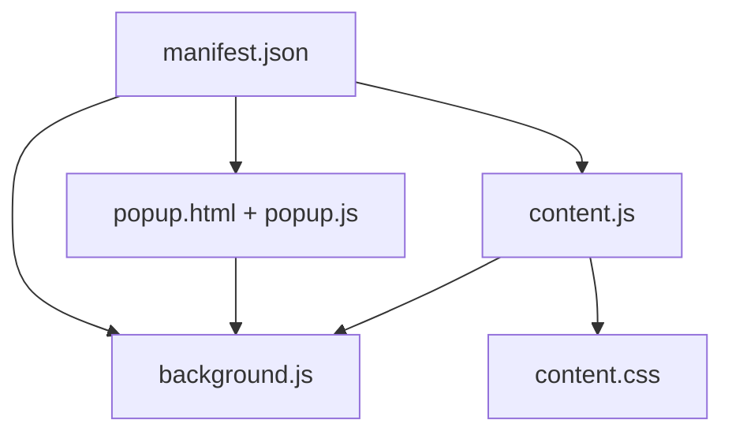
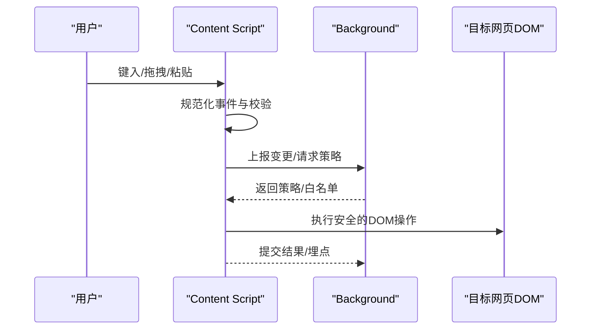

# 架构设计

<cite>
**本文引用的文件**
- [manifest.json](file://manifest.json)
- [background.js](file://background.js)
- [content.js](file://content.js)
- [content.css](file://content.css)
- [popup.html](file://popup.html)
- [popup.js](file://popup.js)
- [popup.css](file://popup.css)
</cite>

## 目录
1. [简介](#简介)
2. [项目结构](#项目结构)
3. [核心组件](#核心组件)
4. [架构总览](#架构总览)
5. [详细组件分析](#详细组件分析)
6. [依赖关系分析](#依赖关系分析)
7. [性能考虑](#性能考虑)
8. [故障排查指南](#故障排查指南)
9. [结论](#结论)
10. [附录](#附录)

## 简介
本文件为“HTML编辑器浏览器扩展”的架构设计文档，围绕三进程架构（Background Script、Content Script、Popup）展开，明确各进程职责、通信机制、注入策略、数据流与状态同步方案，并给出系统边界、依赖关系与时序图。同时说明技术决策的原因与权衡，以及可扩展性设计。

## 项目结构
扩展由以下关键文件组成：
- manifest.json：声明扩展权限、脚本加载点、图标与资源等。
- background.js：后台服务，负责跨页面/标签页的状态管理与消息路由。
- content.js：内容脚本，注入到目标网页中，提供编辑能力与UI交互。
- content.css：内容脚本样式，隔离于宿主页面样式。
- popup.html/popup.js/popup.css：弹出窗口界面与逻辑，用于配置与全局控制。

图表来源
- [manifest.json:1-200](file://manifest.json#L1-L200)
- [background.js:1-200](file://background.js#L1-L200)
- [content.js:1-200](file://content.js#L1-L200)
- [content.css:1-200](file://content.css#L1-L200)
- [popup.html:1-200](file://popup.html#L1-L200)
- [popup.js:1-200](file://popup.js#L1-L200)
- [popup.css:1-200](file://popup.css#L1-L200)

章节来源
- [manifest.json:1-200](file://manifest.json#L1-L200)

## 核心组件
- Background Script（后台服务）
  - 职责：维护全局状态、监听消息、在合适时机向内容脚本发送指令、管理跨标签页上下文。
  - 关键点：使用浏览器消息API进行进程间通信；可注册tab事件以感知页面加载完成。
- Content Script（内容脚本）
  - 职责：注入到目标网页DOM，创建编辑工具栏/面板，处理用户输入并执行DOM操作；与Background/Popup双向通信。
  - 关键点：通过document.createElement等方式安全注入UI；使用MutationObserver或事件委托监听编辑变化；避免污染宿主页面命名空间。
- Popup（弹出窗口）
  - 职责：提供设置项、开关、版本信息等；向Background或当前Tab的内容脚本发送命令。
  - 关键点：通过消息API与Background或指定Tab通信；UI与逻辑分离（HTML/CSS/JS）。

章节来源
- [background.js:1-200](file://background.js#L1-L200)
- [content.js:1-200](file://content.js#L1-L200)
- [popup.html:1-200](file://popup.html#L1-L200)
- [popup.js:1-200](file://popup.js#L1-L200)

## 架构总览
扩展采用三进程架构，通过浏览器消息API实现松耦合通信。Background作为协调者，Content Script作为页面内执行者，Popup作为用户入口。

图表来源
- [manifest.json:1-200](file://manifest.json#L1-L200)
- [background.js:1-200](file://background.js#L1-L200)
- [content.js:1-200](file://content.js#L1-L200)
- [popup.js:1-200](file://popup.js#L1-L200)

章节来源
- [manifest.json:1-200](file://manifest.json#L1-L200)

## 详细组件分析

### Background Script（后台服务）
- 角色定位：全局状态中心、消息路由、生命周期管理。
- 主要行为：
  - 监听来自Popup与Content Script的消息，转发或执行业务逻辑。
  - 在合适的时机（如页面加载完成）向目标Tab的内容脚本发送初始化或更新指令。
  - 维护扩展启用/禁用状态、默认配置等。
- 通信方式：
  - 接收/发送消息API，支持按tab过滤的目标通信。
- 错误处理：
  - 对无效消息、目标不可达等情况进行兜底处理，避免崩溃。

图表来源
- [background.js:1-200](file://background.js#L1-L200)
- [content.js:1-200](file://content.js#L1-L200)
- [popup.js:1-200](file://popup.js#L1-L200)

章节来源
- [background.js:1-200](file://background.js#L1-L200)

### Content Script（内容脚本）
- 角色定位：页面内执行者，负责将编辑功能注入到目标网页。
- 注入机制：
  - 通过manifest声明在特定URL匹配时注入。
  - 动态创建UI元素（工具栏/面板），附加到目标DOM，使用Shadow DOM或唯一前缀类名避免冲突。
  - 样式通过content.css注入，确保与宿主页面隔离。
- 事件与数据流：
  - 监听用户输入（键盘/鼠标/剪贴板），转换为标准化事件。
  - 将变更上报给Background或Popup，必要时请求确认或回滚。
  - 对富文本/HTML片段执行安全的DOM操作，避免XSS风险。
- 状态同步：
  - 订阅Background的配置变更，实时更新UI与行为。
  - 当页面切换或重绘时，重建或恢复编辑器状态。

图表来源
- [content.js:1-200](file://content.js#L1-L200)
- [content.css:1-200](file://content.css#L1-L200)

章节来源
- [content.js:1-200](file://content.js#L1-L200)
- [content.css:1-200](file://content.css#L1-L200)

### Popup（弹出窗口）
- 角色定位：用户配置入口，展示扩展状态与选项。
- 主要行为：
  - 渲染设置界面，读取/写入扩展配置。
  - 通过消息API与Background通信，触发全局行为或向当前Tab发送指令。
  - 显示帮助信息、版本、快捷键提示等。
- 与Content Script交互：
  - 可通过Background转发或直接按tab ID向内容脚本发送命令（如“插入模板”、“切换模式”）。

图表来源
- [popup.js:1-200](file://popup.js#L1-L200)
- [background.js:1-200](file://background.js#L1-L200)
- [content.js:1-200](file://content.js#L1-L200)

章节来源
- [popup.js:1-200](file://popup.js#L1-L200)

## 依赖关系分析
- 外部依赖：浏览器提供的消息API、DOM API、可选的存储API（用于持久化配置）。
- 内部依赖：
  - Popup依赖Background进行状态读写与命令下发。
  - Content Script依赖Background获取全局配置，并向其上报状态。
  - Content CSS仅被Content Script引用，保证样式隔离。
- 潜在循环依赖：无直接代码级循环依赖；通过消息API解耦。

图表来源
- [popup.js:1-200](file://popup.js#L1-L200)
- [background.js:1-200](file://background.js#L1-L200)
- [content.js:1-200](file://content.js#L1-L200)
- [content.css:1-200](file://content.css#L1-L200)

章节来源
- [manifest.json:1-200](file://manifest.json#L1-L200)

## 性能考虑
- 注入与渲染
  - 延迟注入：仅在需要时创建UI，减少初始开销。
  - 批量更新：合并多次DOM变更，降低重排重绘。
- 事件处理
  - 事件节流/防抖：对高频输入（如滚动、输入）进行节流，避免卡顿。
  - 事件委托：在容器上统一监听，减少监听器数量。
- 内存管理
  - 及时移除监听器与节点，防止内存泄漏。
  - 大对象缓存时使用弱引用或惰性加载。
- 网络与存储
  - 配置变更本地缓存，减少重复请求。
  - 异步I/O，避免阻塞主线程。

[本节为通用指导，不直接分析具体文件]

## 故障排查指南
- 常见问题
  - 内容脚本未注入：检查manifest中的匹配规则与页面URL。
  - 消息无法送达：确认目标Tab存在且已加载内容脚本；检查权限与端口。
  - UI未生效：确认CSS注入顺序与选择器优先级；检查Shadow DOM隔离。
  - 状态不同步：核对Background状态广播与Content Script订阅逻辑。
- 调试建议
  - 在Popup控制台查看消息收发日志。
  - 在目标网页控制台检查内容脚本是否运行及报错。
  - 逐步缩小范围：先验证Background与Popup通信，再验证Background与Content Script通信。

章节来源
- [background.js:1-200](file://background.js#L1-L200)
- [content.js:1-200](file://content.js#L1-L200)
- [popup.js:1-200](file://popup.js#L1-L200)

## 结论
本扩展采用清晰的三进程架构，通过消息API实现松耦合通信，Content Script负责页面内编辑能力注入与DOM操作，Background承担状态管理与路由，Popup提供用户入口。该设计具备良好的可扩展性与可维护性，适合后续增加更多编辑能力与集成点。

[本节为总结，不直接分析具体文件]

## 附录

### 系统边界定义
- 扩展边界：由manifest声明的脚本与资源构成。
- 页面边界：内容脚本运行在目标网页进程中，受同源策略与沙箱限制。
- 通信边界：仅允许通过浏览器消息API进行跨进程通信。

### 组件依赖关系图

图表来源
- [manifest.json:1-200](file://manifest.json#L1-L200)
- [background.js:1-200](file://background.js#L1-L200)
- [content.js:1-200](file://content.js#L1-L200)
- [content.css:1-200](file://content.css#L1-L200)
- [popup.html:1-200](file://popup.html#L1-L200)
- [popup.js:1-200](file://popup.js#L1-L200)

### 数据流设计（从用户输入到DOM操作）

图表来源
- [content.js:1-200](file://content.js#L1-L200)
- [background.js:1-200](file://background.js#L1-L200)

### 技术决策与权衡
- 三进程架构
  - 优点：职责清晰、易于测试与扩展；缺点：通信开销需优化。
- 注入策略
  - 使用内容脚本而非用户脚本，获得更高权限与稳定性；需关注样式隔离与兼容性。
- 消息API
  - 统一通信接口，便于调试与监控；需注意消息序列化与错误重试。
- 可扩展性
  - 插件化命令体系：通过消息协议扩展新能力；保持向后兼容。

[本节为概念性讨论，不直接分析具体文件]