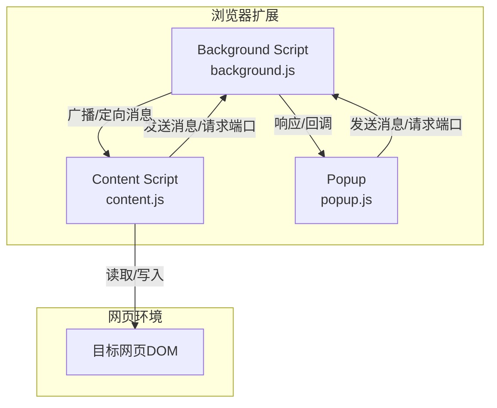
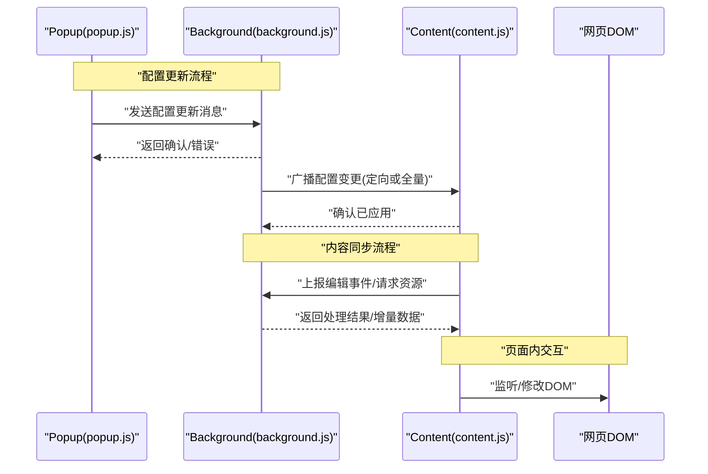
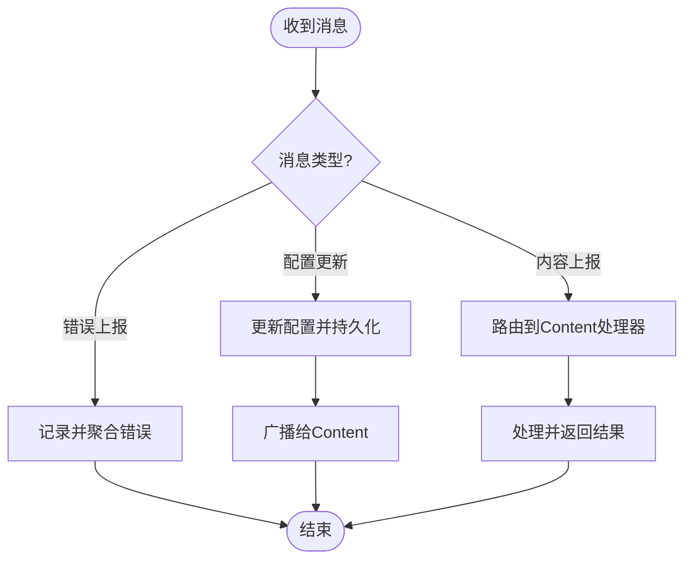
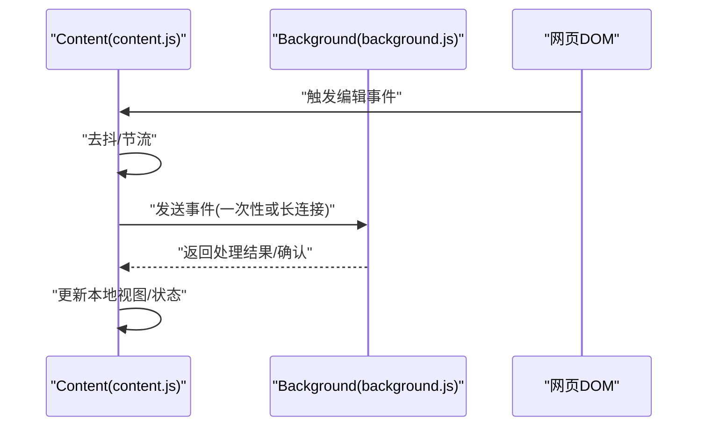
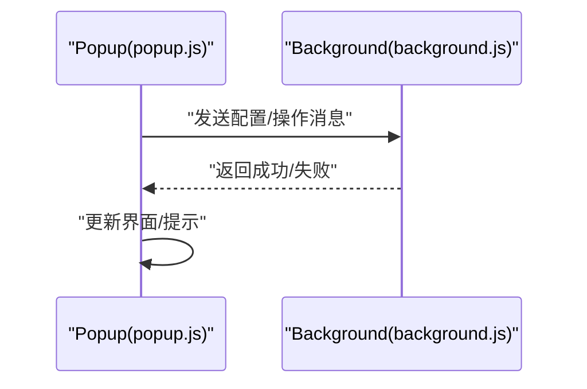
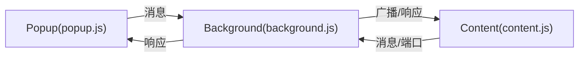

# 消息通信机制

<cite>
**本文引用的文件**
- [manifest.json](file://manifest.json)
- [background.js](file://background.js)
- [content.js](file://content.js)
- [popup.js](file://popup.js)
</cite>

## 目录
1. [简介](#简介)
2. [项目结构](#项目结构)
3. [核心组件](#核心组件)
4. [架构总览](#架构总览)
5. [详细组件分析](#详细组件分析)
6. [依赖关系分析](#依赖关系分析)
7. [性能考虑](#性能考虑)
8. [故障排查指南](#故障排查指南)
9. [结论](#结论)
10. [附录：通信协议与示例场景](#附录通信协议与示例场景)

## 简介
本文件面向HTML编辑器浏览器扩展的消息通信机制，系统性阐述Chrome扩展中Background Script、Content Script与Popup之间的通信模式。重点覆盖以下方面：
- Chrome扩展消息传递API的使用模式：sendMessage、onMessage、port连接（runtime.connect）的适用场景与差异
- 通信协议设计：消息格式定义、错误处理、超时与重试策略
- 事件驱动架构：通过事件监听器实现松耦合的组件通信
- 状态同步策略：确保三个进程间数据一致性
- 常见通信场景：配置更新、内容同步、错误报告等
- 性能优化建议与调试技巧

## 项目结构
本项目采用典型的Chrome扩展三进程模型：
- Background Script：作为全局后台服务，负责持久化配置、转发消息、管理长连接与定时任务
- Content Script：注入到网页上下文，负责页面内DOM操作、与Background/Popup进行双向通信
- Popup：用户界面入口，用于展示设置、触发操作并接收结果反馈

图表来源
- [background.js:1-200](file://background.js#L1-L200)
- [content.js:1-200](file://content.js#L1-L200)
- [popup.js:1-200](file://popup.js#L1-L200)

章节来源
- [manifest.json:1-200](file://manifest.json#L1-L200)
- [background.js:1-200](file://background.js#L1-L200)
- [content.js:1-200](file://content.js#L1-L200)
- [popup.js:1-200](file://popup.js#L1-L200)

## 核心组件
- Background Script（background.js）
  - 职责：集中式消息路由、配置存储、跨进程协调、长连接管理、错误上报聚合
  - 关键能力：
    - 监听来自Popup和Content的消息（chrome.runtime.onMessage）
    - 维护与Content的端口连接（chrome.runtime.connect），支持双向流式通信
    - 提供统一的错误封装与重试策略
- Content Script（content.js）
  - 职责：在网页上下文中执行，监听DOM变化、捕获编辑行为、向Background上报事件或请求资源
  - 关键能力：
    - 使用sendMessage发起一次性请求
    - 使用connect建立长连接，持续推送编辑事件或拉取增量数据
- Popup（popup.js）
  - 职责：用户交互界面，触发配置变更、查看状态、获取编辑结果
  - 关键能力：
    - 通过sendMessage与Background交互
    - 可选地通过port与Background保持会话级连接

章节来源
- [background.js:1-200](file://background.js#L1-L200)
- [content.js:1-200](file://content.js#L1-L200)
- [popup.js:1-200](file://popup.js#L1-L200)

## 架构总览
下图展示了三类进程间的典型通信路径与角色分工：

图表来源
- [background.js:1-200](file://background.js#L1-L200)
- [content.js:1-200](file://content.js#L1-L200)
- [popup.js:1-200](file://popup.js#L1-L200)

## 详细组件分析

### Background Script（background.js）
- 消息路由与分发
  - 统一入口：监听所有来自由Popup与Content发出的消息，按消息类型分派到对应处理器
  - 错误封装：将异常包装为统一错误对象，包含错误码、错误信息与可重试标志
  - 超时控制：对耗时操作设置超时，避免阻塞消息通道
- 端口连接管理
  - 使用connect与Content建立长连接，适合高频、低延迟的事件流（如编辑事件）
  - 连接生命周期：建立、心跳检测、断线重连、优雅关闭
- 配置与状态
  - 集中保存用户配置与运行时状态，保证Popup与Content的一致性
  - 变更广播：当配置更新时，主动通知相关Content实例

图表来源
- [background.js:1-200](file://background.js#L1-L200)

章节来源
- [background.js:1-200](file://background.js#L1-L200)

### Content Script（content.js）
- 事件采集与上报
  - 监听页面编辑事件（如输入、粘贴、撤销/重做），将结构化事件发送到Background
  - 对敏感或大体积数据进行压缩或分批上报
- 长连接使用
  - 通过connect与Background建立会话，持续推送事件或拉取增量数据
  - 心跳与重连：定期发送心跳，断线自动重连，保障稳定性
- 本地缓存与去抖
  - 对频繁事件进行去抖/节流，减少网络开销
  - 临时缓存未提交的数据，等待批量提交

图表来源
- [content.js:1-200](file://content.js#L1-L200)
- [background.js:1-200](file://background.js#L1-L200)

章节来源
- [content.js:1-200](file://content.js#L1-L200)

### Popup（popup.js）
- 用户交互与命令下发
  - 通过sendMessage向Background发送配置变更或操作指令
  - 接收异步响应并更新UI
- 可选长连接
  - 对于需要实时反馈的场景，可通过port与Background保持会话
- 错误提示
  - 根据返回的错误码显示友好提示，并提供重试入口

图表来源
- [popup.js:1-200](file://popup.js#L1-L200)
- [background.js:1-200](file://background.js#L1-L200)

章节来源
- [popup.js:1-200](file://popup.js#L1-L200)

## 依赖关系分析
- 模块耦合
  - Popup与Background强耦合于消息协议；Content与Background通过协议与端口解耦
  - 通过消息类型与版本号实现协议演进，降低破坏性变更风险
- 外部依赖
  - Chrome扩展API：runtime.sendMessage/onMessage、runtime.connect/disconnect
  - 可选：storage API用于持久化配置
- 潜在循环依赖
  - 通过单向消息流避免循环调用；如需回调，使用唯一ID关联请求与响应

图表来源
- [background.js:1-200](file://background.js#L1-L200)
- [content.js:1-200](file://content.js#L1-L200)
- [popup.js:1-200](file://popup.js#L1-L200)

章节来源
- [background.js:1-200](file://background.js#L1-L200)
- [content.js:1-200](file://content.js#L1-L200)
- [popup.js:1-200](file://popup.js#L1-L200)

## 性能考虑
- 消息批处理与去抖
  - 对高频事件（如输入）进行合并与去抖，降低Background压力
- 长连接优先
  - 对持续流式数据使用port连接，减少握手开销
- 超时与重试
  - 为耗时操作设置合理超时，配合指数退避重试
- 数据压缩
  - 对大体积消息进行压缩或分页传输
- 内存与CPU
  - 避免在Content中执行重型计算，必要时委托Background处理
- 调试与监控
  - 使用console日志与错误上报，结合浏览器开发者工具进行定位

[本节为通用指导，不直接分析具体文件]

## 故障排查指南
- 常见问题
  - 消息未到达：检查权限与脚本加载顺序，确认消息类型匹配
  - 端口断开：实现心跳与重连逻辑，记录断线原因
  - 超时失败：调整超时阈值，增加重试与降级策略
- 定位方法
  - 在Background集中打印消息路由日志
  - 在Content中记录事件采集与上报频率
  - 在Popup中记录用户操作与响应时间
- 恢复策略
  - 配置回滚、数据重建、清理无效连接

章节来源
- [background.js:1-200](file://background.js#L1-L200)
- [content.js:1-200](file://content.js#L1-L200)
- [popup.js:1-200](file://popup.js#L1-L200)

## 结论
本扩展采用以Background为中心的消息路由与端口连接模式，结合Popup与Content的职责分离，实现了稳定、可扩展的跨进程通信。通过统一的协议、错误封装与超时重试机制，保障了在不同场景下的可靠性。后续可进一步引入版本化协议与更细粒度的权限控制，以提升安全性与可维护性。

[本节为总结性内容，不直接分析具体文件]

## 附录：通信协议与示例场景

### 消息格式定义（建议）
- 字段约定
  - type：消息类型（字符串）
  - id：请求唯一标识（字符串/数字）
  - payload：业务数据（对象）
  - ts：时间戳（毫秒）
  - version：协议版本（字符串）
- 响应格式
  - ok：是否成功（布尔）
  - data：返回数据（对象/数组）
  - error：错误信息（对象，包含code、message）

章节来源
- [background.js:1-200](file://background.js#L1-L200)
- [content.js:1-200](file://content.js#L1-L200)
- [popup.js:1-200](file://popup.js#L1-L200)

### 错误处理与超时机制
- 错误分类
  - 客户端错误：参数校验失败、权限不足
  - 服务端错误：Background处理异常、下游服务不可用
  - 网络错误：超时、断网、端口断开
- 超时策略
  - sendMessage默认超时：建议1-3秒
  - port心跳间隔：建议5-10秒
  - 重试策略：指数退避，最大重试次数限制
- 降级方案
  - 离线缓存、本地优先、只读模式

章节来源
- [background.js:1-200](file://background.js#L1-L200)
- [content.js:1-200](file://content.js#L1-L200)
- [popup.js:1-200](file://popup.js#L1-L200)

### 事件驱动与状态同步
- 事件驱动
  - 使用事件监听器解耦组件：Content采集事件→Background路由→Popup订阅结果
  - 通过消息类型区分不同事件，便于扩展与维护
- 状态同步
  - 单一事实源：Background持有权威配置与状态
  - 变更广播：配置更新时主动通知Content与Popup
  - 冲突解决：基于时间戳或版本号合并，最后写入者胜

章节来源
- [background.js:1-200](file://background.js#L1-L200)
- [content.js:1-200](file://content.js#L1-L200)
- [popup.js:1-200](file://popup.js#L1-L200)

### 常见通信场景示例（代码片段路径）
- 配置更新
  - Popup发送配置更新消息至Background，Background持久化并广播给Content
  - 参考路径：
    - [popup.js:1-200](file://popup.js#L1-L200)
    - [background.js:1-200](file://background.js#L1-L200)
    - [content.js:1-200](file://content.js#L1-L200)
- 内容同步
  - Content采集编辑事件，通过sendMessage或port上报Background，Background处理后返回结果
  - 参考路径：
    - [content.js:1-200](file://content.js#L1-L200)
    - [background.js:1-200](file://background.js#L1-L200)
- 错误报告
  - Content捕获异常并上报Background，Background聚合日志并返回处理结果
  - 参考路径：
    - [content.js:1-200](file://content.js#L1-L200)
    - [background.js:1-200](file://background.js#L1-L200)

### 调试技巧
- 启用详细日志
  - 在Background集中记录消息收发与处理耗时
  - 在Content中记录事件频率与上报成功率
- 使用开发者工具
  - 检查Console输出、Network面板（如有Web请求）、Extension页面中的Background控制台
- 模拟故障
  - 模拟超时、断网、端口断开，验证重试与降级逻辑

章节来源
- [background.js:1-200](file://background.js#L1-L200)
- [content.js:1-200](file://content.js#L1-L200)
- [popup.js:1-200](file://popup.js#L1-L200)