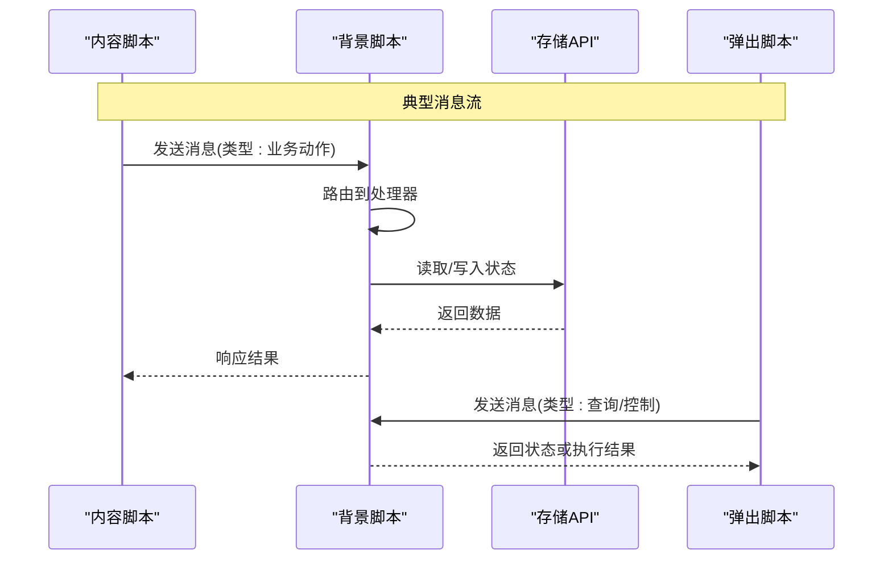
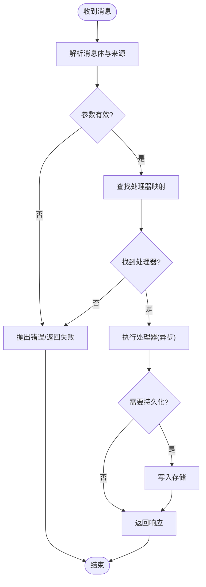
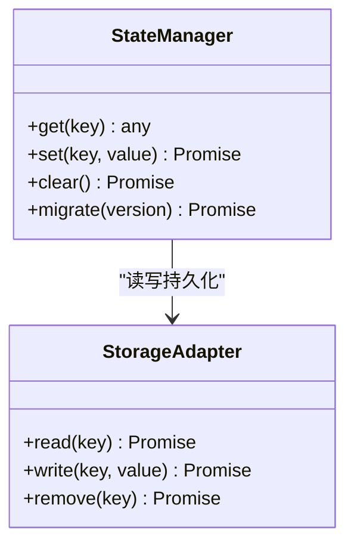
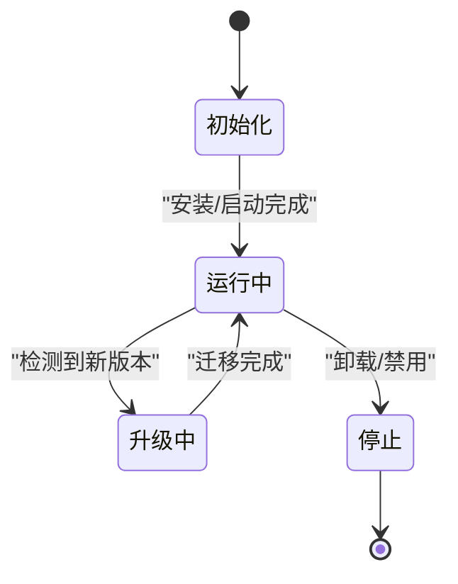
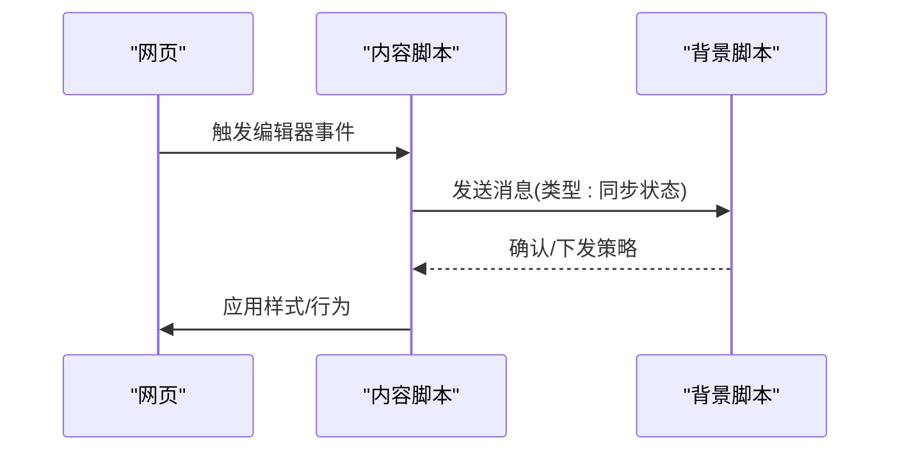
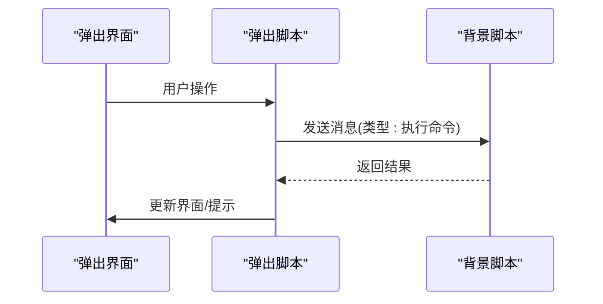
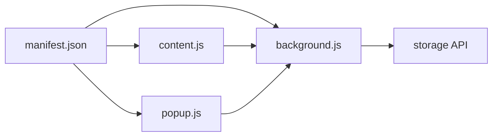

# 背景脚本架构

<cite>
**本文引用的文件**
- [background.js](file://background.js)
- [manifest.json](file://manifest.json)
- [content.js](file://content.js)
- [popup.js](file://popup.js)
</cite>

## 目录
1. [简介](#简介)
2. [项目结构](#项目结构)
3. [核心组件](#核心组件)
4. [架构总览](#架构总览)
5. [详细组件分析](#详细组件分析)
6. [依赖关系分析](#依赖关系分析)
7. [性能考虑](#性能考虑)
8. [故障排查指南](#故障排查指南)
9. [结论](#结论)
10. [附录](#附录)

## 简介
本文件为 HTML 编辑器浏览器扩展的背景脚本（Background Script）提供系统化、可操作的架构文档。重点覆盖以下方面：
- 背景脚本作为后台服务的核心职责：消息路由、状态管理、扩展生命周期管理
- 服务初始化流程，监听来自 Content Script 与 Popup 的消息，处理异步操作
- 与 Chrome Web Extensions API 的集成：权限声明、存储访问、事件监听机制
- 错误处理策略、日志记录与服务监控的实现建议
- 具体代码示例路径，展示消息处理器实现模式与安全的数据持久化方式

## 项目结构
本项目采用按功能/角色划分的文件组织方式，关键文件如下：
- background.js：背景脚本，负责跨上下文通信、全局状态与生命周期管理
- manifest.json：扩展清单，声明权限、脚本入口、内容脚本注入等
- content.js：页面内脚本，负责与页面 DOM 交互并转发消息到背景脚本
- popup.js：弹出窗口脚本，负责 UI 交互并通过背景脚本执行扩展能力

```mermaid
graph TB
A["manifest.json<br/>扩展清单"] --> B["background.js<br/>背景脚本"]
A --> C["content.js<br/>内容脚本"]
A --> D["popup.js<br/>弹出脚本"]
C < --> B
D < --> B
```

图表来源
- [manifest.json:1-200](file://manifest.json#L1-L200)
- [background.js:1-200](file://background.js#L1-L200)
- [content.js:1-200](file://content.js#L1-L200)
- [popup.js:1-200](file://popup.js#L1-L200)

章节来源
- [manifest.json:1-200](file://manifest.json#L1-L200)
- [background.js:1-200](file://background.js#L1-L200)
- [content.js:1-200](file://content.js#L1-L200)
- [popup.js:1-200](file://popup.js#L1-L200)

## 核心组件
- 背景脚本（background.js）
  - 职责：统一消息路由、全局状态维护、扩展生命周期管理、与存储 API 交互、对外暴露能力给 Content Script 与 Popup
  - 关键点：消息分发器、状态机、异步任务队列、错误捕获与上报、日志输出
- 内容脚本（content.js）
  - 职责：在目标页面中注入逻辑，收集页面上下文信息，向背景脚本发送消息，接收指令并执行页面级操作
- 弹出脚本（popup.js）
  - 职责：渲染弹出界面，通过背景脚本触发扩展能力（如读取配置、执行命令），展示结果

章节来源
- [background.js:1-200](file://background.js#L1-L200)
- [content.js:1-200](file://content.js#L1-L200)
- [popup.js:1-200](file://popup.js#L1-L200)

## 架构总览
背景脚本作为“后台服务”，承担三大职责：
- 消息路由：根据消息类型将请求分派到对应处理器，确保可扩展与解耦
- 状态管理：维护扩展运行期状态，必要时持久化到 storage
- 生命周期管理：监听安装、更新、卸载等事件，完成资源初始化与清理



图表来源
- [background.js:1-200](file://background.js#L1-L200)
- [content.js:1-200](file://content.js#L1-L200)
- [popup.js:1-200](file://popup.js#L1-L200)

## 详细组件分析

### 背景脚本：消息路由与处理器
- 设计要点
  - 使用消息类型作为键，注册处理器映射表，新增能力只需添加新处理器
  - 所有处理器统一签名，包含消息体、端口、回调/响应通道
  - 对耗时操作进行异步编排，避免阻塞主线程
- 常见消息类型
  - 来自内容脚本：页面上下文采集、DOM 操作、编辑器状态同步
  - 来自弹出脚本：配置读写、批量任务调度、统计上报
- 安全与健壮性
  - 校验消息来源与字段类型
  - 超时与重试策略
  - 异常捕获与降级处理



图表来源
- [background.js:1-200](file://background.js#L1-L200)

章节来源
- [background.js:1-200](file://background.js#L1-L200)

### 背景脚本：状态管理与持久化
- 内存状态
  - 用于短期运行态（如当前会话、临时缓存、并发任务计数）
- 持久化存储
  - 使用 storage.local 保存用户配置、编辑器偏好、历史统计
  - 读写前做版本兼容与默认值合并
- 一致性保障
  - 写操作加锁或串行化，避免竞态
  - 读操作支持缓存与失效策略



图表来源
- [background.js:1-200](file://background.js#L1-L200)

章节来源
- [background.js:1-200](file://background.js#L1-L200)

### 背景脚本：扩展生命周期管理
- 安装/更新/卸载
  - 监听安装事件，初始化默认配置与迁移
  - 监听更新事件，处理数据格式变更
  - 监听卸载事件，清理定时任务与监听器
- 运行时事件
  - 标签页创建/关闭、网络请求拦截（如需）
  - 通知与图标角标更新（按需）



图表来源
- [background.js:1-200](file://background.js#L1-L200)
- [manifest.json:1-200](file://manifest.json#L1-L200)

章节来源
- [background.js:1-200](file://background.js#L1-L200)
- [manifest.json:1-200](file://manifest.json#L1-L200)

### 内容脚本：与背景脚本通信
- 注入时机与范围
  - 在指定域名或匹配规则下注入，最小化影响
- 消息协议
  - 定义统一的 message 结构：type、payload、timestamp、requestId
- 页面交互
  - 监听编辑器事件，增量同步状态
  - 接收背景脚本指令，执行 DOM 操作或样式切换



图表来源
- [content.js:1-200](file://content.js#L1-L200)
- [background.js:1-200](file://background.js#L1-L200)

章节来源
- [content.js:1-200](file://content.js#L1-L200)
- [background.js:1-200](file://background.js#L1-L200)

### 弹出脚本：UI 与扩展能力调用
- 界面与状态
  - 从背景脚本拉取配置与状态，渲染 UI
- 操作触发
  - 用户点击后通过背景脚本执行任务（如导出、格式化、统计）
- 反馈与错误
  - 显示成功/失败提示，必要时引导用户调整权限或设置



图表来源
- [popup.js:1-200](file://popup.js#L1-L200)
- [background.js:1-200](file://background.js#L1-L200)

章节来源
- [popup.js:1-200](file://popup.js#L1-L200)
- [background.js:1-200](file://background.js#L1-L200)

## 依赖关系分析
- 外部依赖
  - Chrome Web Extensions API：storage、tabs、runtime、permissions 等
- 内部依赖
  - 背景脚本依赖存储适配器与消息路由
  - 内容脚本与弹出脚本仅依赖消息通道



图表来源
- [manifest.json:1-200](file://manifest.json#L1-L200)
- [background.js:1-200](file://background.js#L1-L200)
- [content.js:1-200](file://content.js#L1-L200)
- [popup.js:1-200](file://popup.js#L1-L200)

章节来源
- [manifest.json:1-200](file://manifest.json#L1-L200)
- [background.js:1-200](file://background.js#L1-L200)

## 性能考虑
- 消息批处理与节流
  - 对高频事件（如输入、滚动）进行合并与节流，降低背景脚本压力
- 异步与并发控制
  - 使用队列限制并发数，避免存储 API 拥塞
- 存储读写优化
  - 批量写入、差异更新、缓存热点数据
- 内存占用
  - 及时释放定时器与事件监听器，避免泄漏

[本节为通用指导，不直接分析具体文件]

## 故障排查指南
- 常见问题定位
  - 消息未到达：检查权限声明与消息路由映射
  - 存储读写失败：检查 quota、序列化与版本迁移
  - 页面交互异常：核对注入规则与事件绑定
- 日志与监控
  - 在背景脚本中集中记录关键步骤、错误堆栈与耗时
  - 对关键指标（消息吞吐、错误率、存储延迟）进行采样上报
- 调试技巧
  - 使用开发者工具查看扩展控制台
  - 为消息附加 requestId，便于追踪链路

章节来源
- [background.js:1-200](file://background.js#L1-L200)

## 结论
背景脚本在本扩展中扮演“后台服务”的角色，通过清晰的消息路由、稳健的状态管理与完善的生命周期管理，连接内容脚本与弹出脚本，协调与存储 API 的交互。遵循本文的模式与实践，可在保证安全与性能的前提下，持续扩展编辑器的能力。

[本节为总结性内容，不直接分析具体文件]

## 附录
- 消息处理器实现模式参考
  - 处理器注册与分派：见 [background.js:1-200](file://background.js#L1-L200)
  - 异步任务编排与错误处理：见 [background.js:1-200](file://background.js#L1-L200)
- 安全与持久化最佳实践
  - 权限最小化与动态申请：见 [manifest.json:1-200](file://manifest.json#L1-L200)
  - 存储读写封装与版本迁移：见 [background.js:1-200](file://background.js#L1-L200)
- 与 Content/Popup 的通信约定
  - 消息协议与错误码：见 [content.js:1-200](file://content.js#L1-L200)、[popup.js:1-200](file://popup.js#L1-L200)