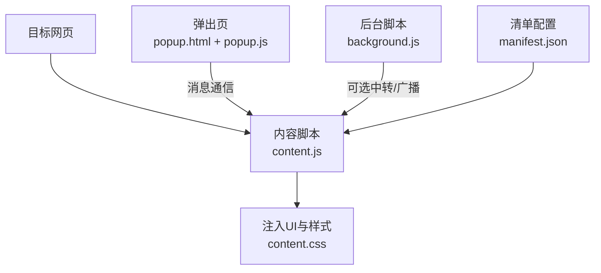
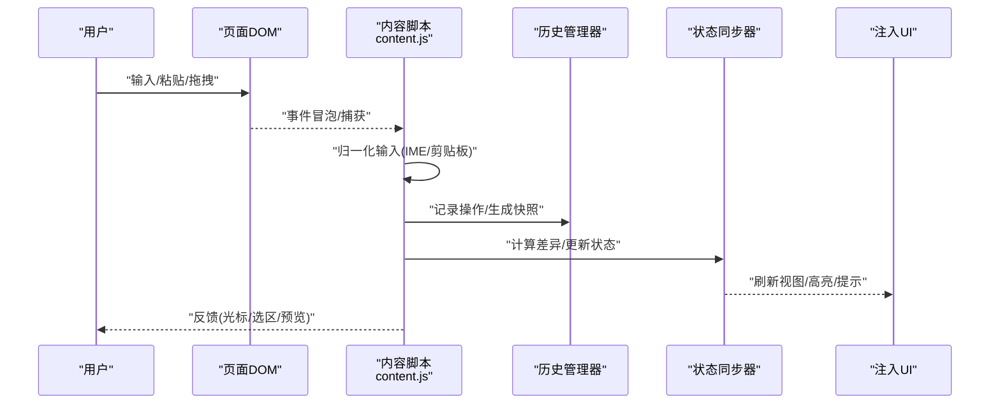
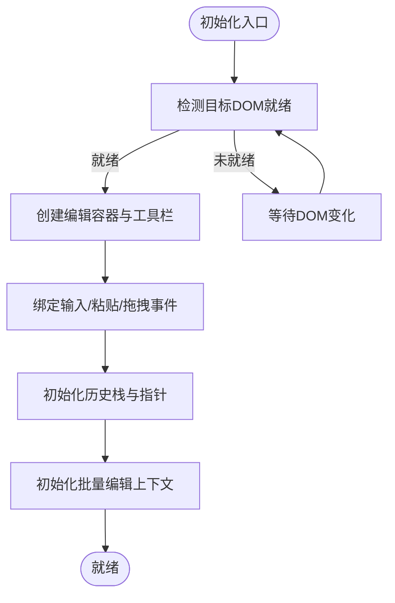
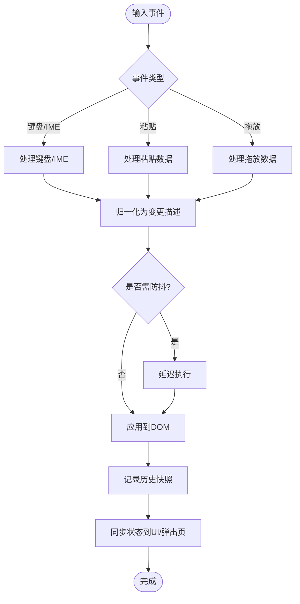
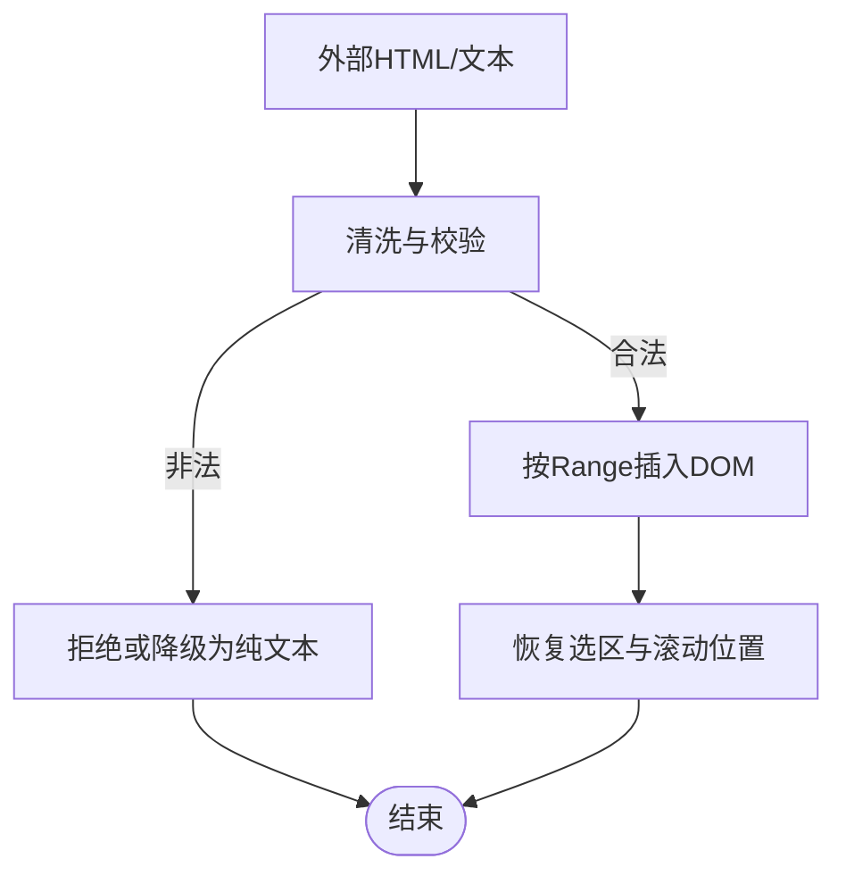
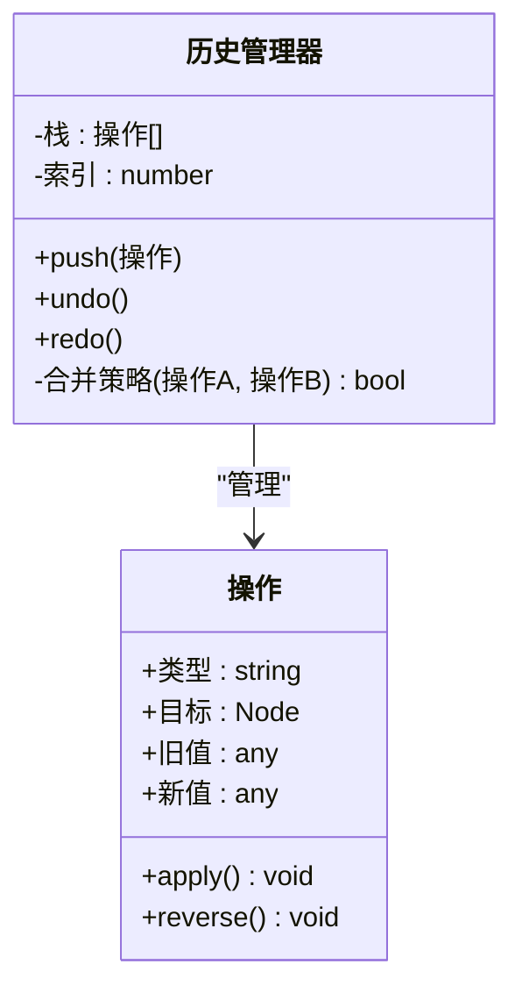
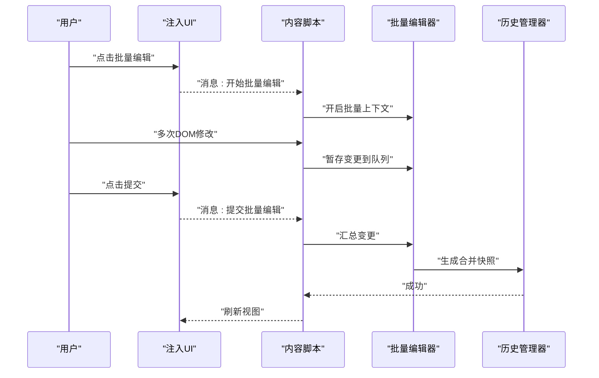
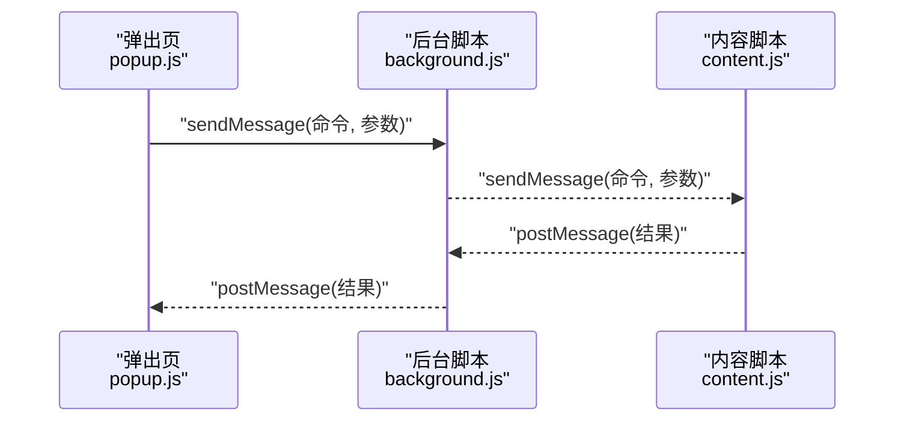
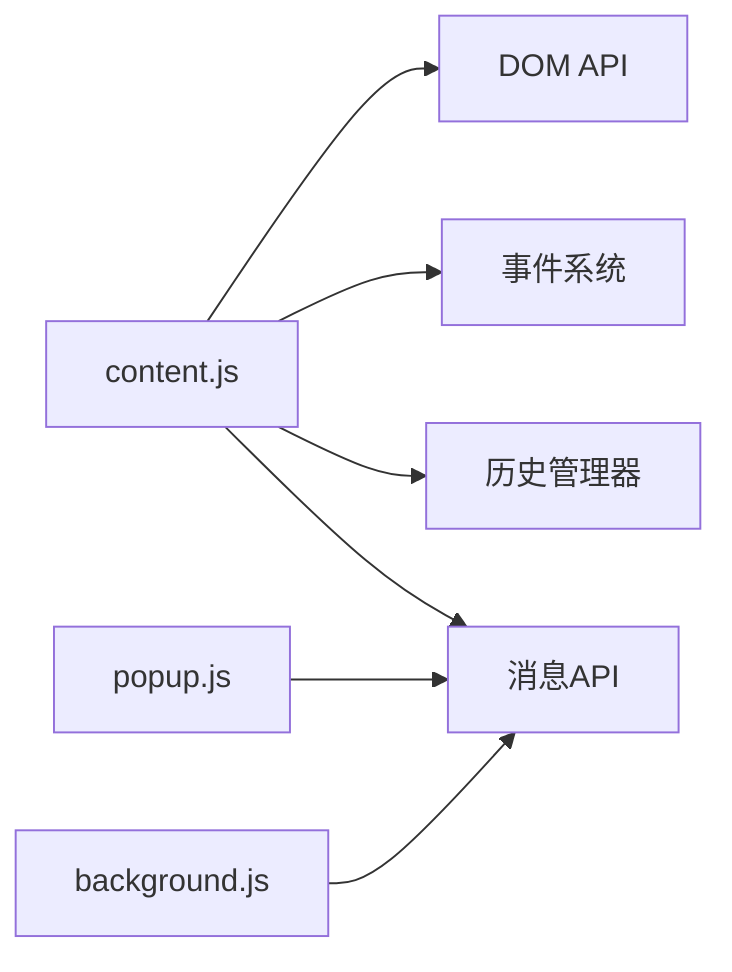

# HTML编辑功能

<cite>
**本文引用的文件**
- [background.js](file://background.js)
- [content.css](file://content.css)
- [content.js](file://content.js)
- [manifest.json](file://manifest.json)
- [popup.html](file://popup.html)
- [popup.js](file://popup.js)
- [test.html](file://test.html)
</cite>

## 目录
1. [简介](#简介)
2. [项目结构](#项目结构)
3. [核心组件](#核心组件)
4. [架构总览](#架构总览)
5. [详细组件分析](#详细组件分析)
6. [依赖关系分析](#依赖关系分析)
7. [性能考虑](#性能考虑)
8. [故障排查指南](#故障排查指南)
9. [结论](#结论)
10. [附录](#附录)

## 简介
本文件面向HTML编辑器的“核心编辑功能”，聚焦于实时HTML编辑的实现原理与工程实践。内容涵盖：
- DOM操作技术与内容注入机制
- 编辑器初始化流程
- 用户输入监听、文本变更处理与状态同步
- 撤销/重做的历史记录管理、快照创建与恢复
- 批量编辑（对多个DOM元素统一修改）的技术实现
- 性能优化建议（防抖、内存管理、大型文档编辑最佳实践）

该文档以仓库中的浏览器扩展实现为依据，重点围绕内容脚本（content.js）、弹出页（popup.js/popup.html）、后台脚本（background.js）以及样式（content.css）进行系统化说明，并通过图示展示关键数据流与控制流。

## 项目结构
本项目为浏览器扩展，采用典型三层职责划分：
- 内容脚本 content.js：在目标页面中注入编辑能力，负责DOM监听、内容注入、状态同步、撤销/重做与批量编辑等核心逻辑。
- 弹出页 popup.js/popup.html：提供用户界面与交互入口，通过消息通道与内容脚本通信，触发编辑动作。
- 后台脚本 background.js：作为扩展的后台服务，可转发或协调跨上下文的消息。
- 样式 content.css：为注入的编辑UI提供样式。
- manifest.json：声明扩展权限、脚本注入策略与消息通信接口。
- test.html：用于本地验证编辑功能的测试页面。

图表来源
- [content.js:1-200](file://content.js#L1-L200)
- [popup.js:1-200](file://popup.js#L1-L200)
- [background.js:1-200](file://background.js#L1-L200)
- [content.css:1-200](file://content.css#L1-L200)
- [manifest.json:1-200](file://manifest.json#L1-L200)

章节来源
- [content.js:1-200](file://content.js#L1-L200)
- [popup.js:1-200](file://popup.js#L1-L200)
- [background.js:1-200](file://background.js#L1-L200)
- [content.css:1-200](file://content.css#L1-L200)
- [manifest.json:1-200](file://manifest.json#L1-L200)

## 核心组件
- 编辑器初始化器：负责在目标页面中注入编辑容器、绑定事件、建立撤销栈与批量编辑上下文。
- 输入监听器：监听键盘、鼠标、粘贴、输入法等输入事件，捕获变更并触发更新。
- 内容注入器：将HTML片段或富文本安全地插入到指定节点，保持光标位置与选择范围。
- 状态同步器：将编辑器内部状态（如选区、历史索引、批量编辑标记）同步回页面元素或弹出页。
- 撤销/重做管理器：维护操作历史、生成快照、执行撤销/重做与合并相邻同类操作。
- 批量编辑器：支持对多个DOM节点进行统一修改，并在提交时一次性应用变更，减少重排重绘。
- 消息桥接：与popup.js和background.js进行消息收发，触发远程命令或上报状态。

章节来源
- [content.js:1-200](file://content.js#L1-L200)
- [popup.js:1-200](file://popup.js#L1-L200)
- [background.js:1-200](file://background.js#L1-L200)

## 架构总览
下图展示了从用户输入到页面渲染的关键路径，包括事件捕获、变更处理、历史快照、状态同步与UI更新。

图表来源
- [content.js:1-200](file://content.js#L1-L200)
- [popup.js:1-200](file://popup.js#L1-L200)

## 详细组件分析

### 编辑器初始化过程
- 注入时机：在页面加载完成后，通过MutationObserver或DOMContentLoaded检测目标节点，确保DOM稳定后再注入编辑容器。
- 容器创建：动态创建编辑容器与工具栏，挂载到目标节点附近，避免破坏原有布局。
- 事件绑定：为输入区域绑定input、compositionstart/compositionend、paste、drop等事件，统一进入变更管线。
- 历史初始化：创建空的历史栈与当前索引指针，准备撤销/重做。
- 批量上下文：初始化批量编辑标记与待提交队列，支持后续批量操作。
- 消息通道：向popup.js注册消息监听，接收外部命令（如“开始批量编辑”“提交批量编辑”）。

图表来源
- [content.js:1-200](file://content.js#L1-L200)
- [manifest.json:1-200](file://manifest.json#L1-L200)

章节来源
- [content.js:1-200](file://content.js#L1-L200)

### 用户输入监听与文本变更处理
- 输入事件：使用input事件捕获大部分变更；针对IME输入，结合compositionstart/compositionend避免中间态污染历史。
- 剪贴板与拖拽：拦截paste/drop事件，规范化数据（纯文本/HTML），必要时转换格式后插入。
- 变更归一化：将不同来源的变更转换为统一的“增量/替换”描述，便于历史管理与批量提交。
- 防抖/节流：对高频输入进行节流或防抖，降低重排重绘压力，提升响应性。
- 光标与选区：在插入/替换前后保存并恢复Selection/Caret，保证编辑体验一致。

图表来源
- [content.js:1-200](file://content.js#L1-L200)

章节来源
- [content.js:1-200](file://content.js#L1-L200)

### 内容注入机制与安全
- 注入方式：通过createElement/DOM API安全插入节点，避免直接innerHTML拼接不可信内容。
- 内容清洗：对粘贴或外部传入的HTML进行白名单过滤与属性清理，防止XSS。
- 位置控制：基于Range/Selection精确插入，保持原有结构与样式。
- 样式隔离：通过shadow DOM或命名空间类名避免与宿主页面冲突。

图表来源
- [content.js:1-200](file://content.js#L1-L200)
- [content.css:1-200](file://content.css#L1-L200)

章节来源
- [content.js:1-200](file://content.js#L1-L200)
- [content.css:1-200](file://content.css#L200-L400)

### 撤销/重做：历史管理与快照恢复
- 历史模型：维护一个操作栈与当前索引，支持向前/向后移动。
- 快照策略：对大文档采用“增量快照”或“结构化快照”（记录变更节点ID与旧值），减少内存占用。
- 合并规则：相邻同类操作（如连续键入）可合并以减少历史长度。
- 恢复逻辑：根据快照重建DOM或应用反向操作，同时恢复选区与滚动位置。
- 边界条件：处理嵌套编辑、iframe、动态节点增删导致的快照失效问题。

图表来源
- [content.js:1-200](file://content.js#L1-L200)

章节来源
- [content.js:1-200](file://content.js#L1-L200)

### 批量编辑：多元素统一修改
- 启动批量编辑：标记所有受影响的节点，暂停即时历史写入，收集变更到队列。
- 统一修改：遍历节点集合执行相同变换（如样式、属性、文本替换），保持操作幂等。
- 提交批量编辑：一次性生成合并后的历史快照，减少重排次数，提高性能。
- 取消批量编辑：丢弃队列并恢复原状，不产生历史。

图表来源
- [content.js:1-200](file://content.js#L1-L200)
- [popup.js:1-200](file://popup.js#L1-L200)

章节来源
- [content.js:1-200](file://content.js#L1-L200)
- [popup.js:1-200](file://popup.js#L1-L200)

### 与弹出页/后台脚本的通信
- 消息协议：定义清晰的命令字与参数结构，如“注入编辑器”“获取状态”“批量编辑开始/提交”。
- 生命周期：在content.js中监听来自popup.js的消息，执行对应动作；在popup.js中调用chrome.runtime.sendMessage发送命令。
- 错误处理：对无效命令、目标节点缺失、权限不足等情况返回明确错误码与提示信息。

图表来源
- [popup.js:1-200](file://popup.js#L1-L200)
- [background.js:1-200](file://background.js#L1-L200)
- [content.js:1-200](file://content.js#L1-L200)

章节来源
- [popup.js:1-200](file://popup.js#L1-L200)
- [background.js:1-200](file://background.js#L1-L200)
- [content.js:1-200](file://content.js#L1-L200)

## 依赖关系分析
- content.js依赖：
  - DOM API（Node、Element、Range、Selection、MutationObserver）
  - 事件系统（键盘、剪贴板、拖拽、Composition）
  - 历史管理器（自定义模块或内联实现）
  - 消息API（chrome.runtime / window.postMessage）
- popup.js依赖：
  - 消息API（chrome.runtime）
  - UI框架（原生DOM或轻量库）
- background.js依赖：
  - 消息API（chrome.runtime）
  - 可选：存储API（chrome.storage）用于持久化配置

图表来源
- [content.js:1-200](file://content.js#L1-L200)
- [popup.js:1-200](file://popup.js#L1-L200)
- [background.js:1-200](file://background.js#L1-L200)

章节来源
- [content.js:1-200](file://content.js#L1-L200)
- [popup.js:1-200](file://popup.js#L1-L200)
- [background.js:1-200](file://background.js#L1-L200)

## 性能考虑
- 防抖与节流
  - 对input事件进行防抖，合并短时间内的多次变更，减少历史快照频率。
  - 对大规模DOM更新使用requestAnimationFrame批处理，避免阻塞主线程。
- 内存管理
  - 历史快照采用增量或引用式结构，避免复制整棵DOM树。
  - 及时释放不再使用的节点引用，避免内存泄漏。
- 大型文档编辑
  - 虚拟滚动或分片渲染，仅渲染可视区域。
  - 使用DocumentFragment批量插入节点，减少重排。
  - 限制单次批量编辑的节点数量，必要时分页处理。
- 输入体验
  - 正确处理IME输入，避免中间态写入历史。
  - 在复杂替换后恢复Selection与滚动位置，提升一致性。

[本节为通用性能指导，不直接分析具体文件]

## 故障排查指南
- 常见问题
  - 注入失败：检查目标节点是否存在、权限是否允许、页面是否处于沙箱环境。
  - 历史错乱：确认快照粒度与合并策略是否正确；检查动态节点增删导致的选择失效。
  - 批量编辑异常：确认批量上下文是否正确关闭；提交前校验变更队列是否为空。
  - 消息通信失败：核对命令字与参数结构；检查popup/background/content之间的消息路由。
- 调试建议
  - 在content.js中添加日志输出，记录事件类型、变更描述、历史操作。
  - 使用浏览器开发者工具的Performance面板分析重排重绘热点。
  - 对粘贴与拖放内容进行最小化复现，定位清洗逻辑问题。

章节来源
- [content.js:1-200](file://content.js#L1-L200)
- [popup.js:1-200](file://popup.js#L1-L200)
- [background.js:1-200](file://background.js#L1-L200)

## 结论
本方案通过内容脚本在目标页面注入编辑能力，结合输入监听、内容注入、历史管理与批量编辑，实现了高效、稳定的实时HTML编辑。通过合理的快照策略、防抖与批处理机制，兼顾了性能与用户体验。配合弹出页与后台脚本的消息通信，提供了灵活的扩展能力与可维护的架构。

[本节为总结性内容，不直接分析具体文件]

## 附录
- 参考文件
  - 内容脚本：[content.js](file://content.js)
  - 弹出页脚本与页面：[popup.js](file://popup.js)、[popup.html](file://popup.html)
  - 后台脚本：[background.js](file://background.js)
  - 样式：[content.css](file://content.css)
  - 清单配置：[manifest.json](file://manifest.json)
  - 测试页面：[test.html](file://test.html)

[本节为参考信息，不直接分析具体文件]