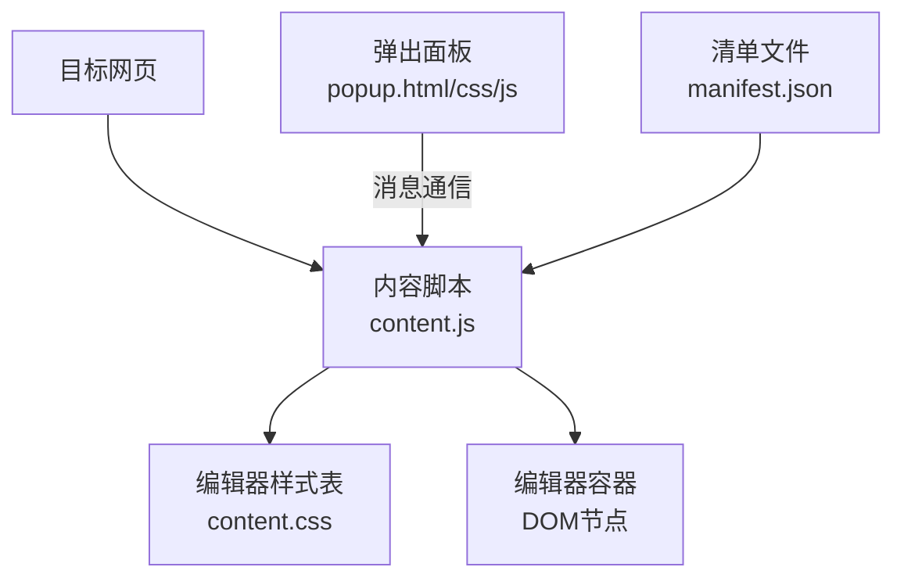
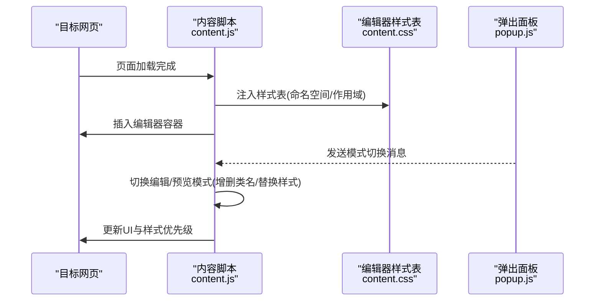
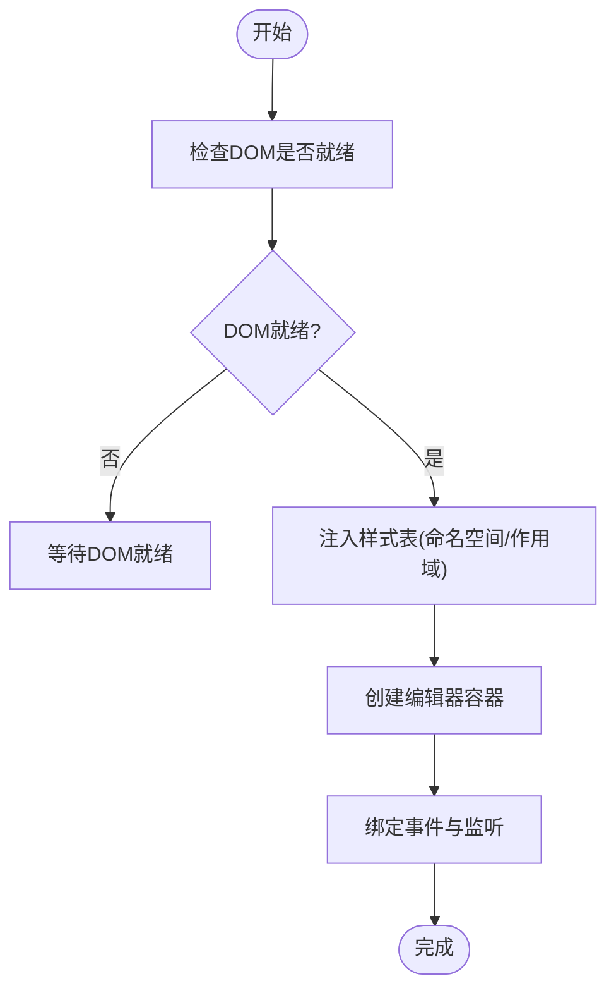
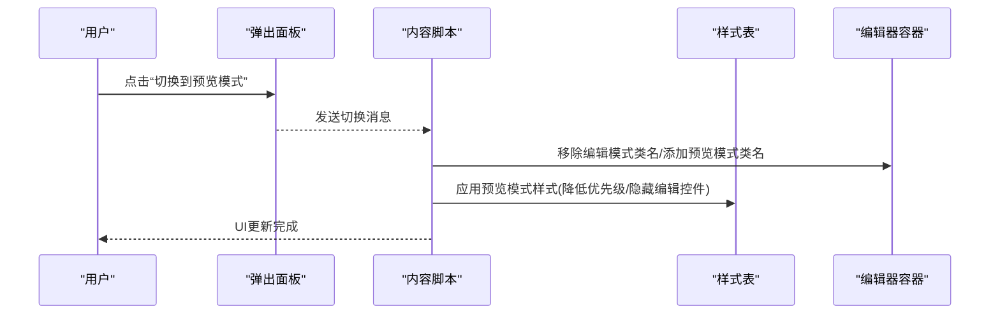
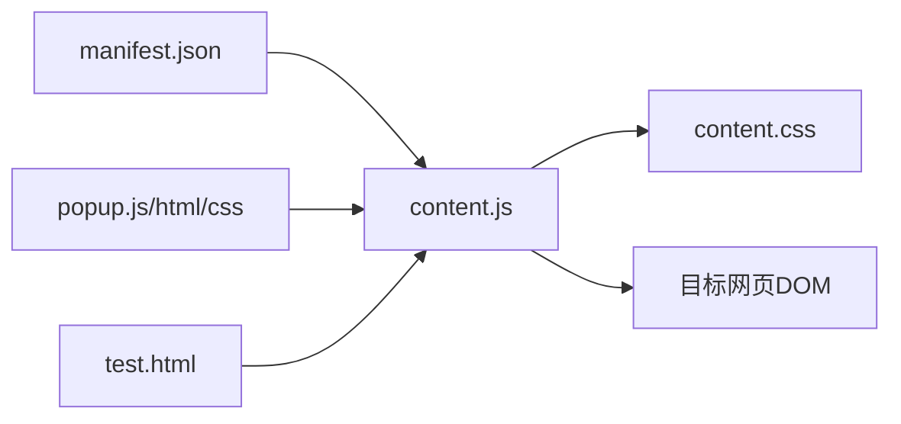

# 样式管理

<cite>
**本文引用的文件**
- [content.css](file://content.css)
- [content.js](file://content.js)
- [popup.html](file://popup.html)
- [popup.css](file://popup.css)
- [popup.js](file://popup.js)
- [manifest.json](file://manifest.json)
- [test.html](file://test.html)
</cite>

## 目录
1. [简介](#简介)
2. [项目结构](#项目结构)
3. [核心组件](#核心组件)
4. [架构总览](#架构总览)
5. [详细组件分析](#详细组件分析)
6. [依赖关系分析](#依赖关系分析)
7. [性能考虑](#性能考虑)
8. [故障排查指南](#故障排查指南)
9. [结论](#结论)
10. [附录](#附录)

## 简介
本文件面向HTML编辑器的“样式管理系统”，聚焦以下目标：
- 样式注入机制：将编辑器样式安全地应用到目标网页，避免污染或破坏原页面样式。
- 样式隔离技术：通过CSS命名空间、作用域隔离与冲突消解策略，确保编辑器样式与宿主页面互不干扰。
- 动态样式切换：实现编辑模式与预览模式的样式切换。
- 样式优先级管理：保证编辑器样式在必要时正确覆盖目标页面样式。
- 响应式样式：在不同设备尺寸下提供适配策略。
- 性能优化：样式表合并、选择器优化与渲染性能提升技巧。

## 项目结构
本项目为浏览器扩展（Content Script + Popup）形态，样式管理的核心由内容脚本与弹出面板共同完成：
- content.js：在目标网页中注入并管理编辑器所需的样式与DOM容器，负责样式注入、模式切换与事件桥接。
- content.css：编辑器样式主体，采用命名空间与作用域隔离，避免与宿主页面样式冲突。
- popup.html/popup.css/popup.js：弹出面板用于触发编辑/预览模式切换、配置项设置等交互。
- manifest.json：声明内容脚本、权限与资源加载方式，决定样式注入时机与作用域。
- test.html：本地测试页面，用于验证样式注入效果与隔离性。

图表来源
- [content.js:1-200](file://content.js#L1-L200)
- [content.css:1-200](file://content.css#L1-L200)
- [popup.html:1-200](file://popup.html#L1-L200)
- [popup.css:1-200](file://popup.css#L1-L200)
- [popup.js:1-200](file://popup.js#L1-L200)
- [manifest.json:1-200](file://manifest.json#L1-L200)

章节来源
- [content.js:1-200](file://content.js#L1-L200)
- [content.css:1-200](file://content.css#L1-L200)
- [popup.html:1-200](file://popup.html#L1-L200)
- [popup.css:1-200](file://popup.css#L1-L200)
- [popup.js:1-200](file://popup.js#L1-L200)
- [manifest.json:1-200](file://manifest.json#L1-L200)

## 核心组件
- 样式注入器：在目标页面中创建并挂载样式表，使用命名空间前缀与作用域包裹，确保样式仅作用于编辑器内部。
- 模式切换器：监听来自弹出面板的消息，切换编辑/预览模式，动态增删类名或替换样式表引用。
- 优先级管理器：通过插入顺序与选择器特异性控制，确保编辑器样式在需要时覆盖宿主页面样式。
- 响应式适配层：基于媒体查询与容器宽度断点，提供不同屏幕尺寸的布局与排版规则。
- 隔离与冲突消解：通过命名空间、限定选择器与重置策略，避免与宿主页面样式相互影响。

章节来源
- [content.js:1-200](file://content.js#L1-L200)
- [content.css:1-200](file://content.css#L1-L200)

## 架构总览
样式管理采用“内容脚本驱动 + 样式表隔离”的架构：
- 内容脚本在目标页面生命周期内注入样式表与编辑器容器，并通过消息通道与弹出面板通信。
- 样式表以命名空间与作用域隔离，确保只影响编辑器内部元素。
- 模式切换通过切换类名或替换样式表实现，优先级由插入顺序与选择器特异性保障。
- 响应式样式通过媒体查询与容器宽度断点实现，适配不同设备尺寸。

图表来源
- [content.js:1-200](file://content.js#L1-L200)
- [content.css:1-200](file://content.css#L1-L200)
- [popup.js:1-200](file://popup.js#L1-L200)

## 详细组件分析

### 样式注入机制
- 注入时机：在目标页面DOMContentLoaded或相应生命周期钩子中注入样式表与容器，确保DOM就绪后再操作。
- 注入方式：动态创建样式节点并插入到文档头部或特定容器，使用命名空间前缀与作用域包裹，避免全局污染。
- 作用域隔离：所有编辑器相关样式均限定在命名空间容器内，使用后代选择器或属性选择器精确匹配。
- 优先级控制：通过插入顺序与选择器特异性确保编辑器样式可覆盖宿主页面样式；必要时提高选择器层级或使用!important作为兜底。

图表来源
- [content.js:1-200](file://content.js#L1-L200)
- [content.css:1-200](file://content.css#L1-L200)

章节来源
- [content.js:1-200](file://content.js#L1-L200)
- [content.css:1-200](file://content.css#L1-L200)

### 样式隔离技术
- CSS命名空间：为编辑器容器定义唯一命名空间前缀，所有样式选择器限定在该命名空间内，避免与宿主页面冲突。
- 作用域隔离：通过容器ID或class限定样式作用范围，使用后代选择器或属性选择器精准匹配编辑器内部元素。
- 冲突解决方案：对可能冲突的通用选择器进行限定；必要时使用更高特异性的选择器或重置宿主样式。
- 示例路径（不含代码）：
  - 命名空间容器样式定义：[content.css:1-200](file://content.css#L1-L200)
  - 编辑器内部元素样式限定：[content.css:1-200](file://content.css#L1-L200)

章节来源
- [content.css:1-200](file://content.css#L1-L200)

### 动态样式切换（编辑模式/预览模式）
- 模式切换入口：弹出面板按钮点击后通过消息通道通知内容脚本切换模式。
- 切换策略：为编辑器容器添加/移除模式类名，或动态替换样式表引用，实现编辑与预览两种视觉状态。
- 优先级保障：模式切换时调整选择器特异性或插入顺序，确保预览模式下宿主页面样式不被编辑器样式覆盖。
- 示例路径（不含代码）：
  - 模式切换逻辑：[content.js:1-200](file://content.js#L1-L200)
  - 模式相关样式：[content.css:1-200](file://content.css#L1-L200)
  - 弹出面板交互：[popup.js:1-200](file://popup.js#L1-L200), [popup.html:1-200](file://popup.html#L1-L200)

图表来源
- [popup.js:1-200](file://popup.js#L1-L200)
- [content.js:1-200](file://content.js#L1-L200)
- [content.css:1-200](file://content.css#L1-L200)

章节来源
- [content.js:1-200](file://content.js#L1-L200)
- [content.css:1-200](file://content.css#L1-L200)
- [popup.js:1-200](file://popup.js#L1-L200)
- [popup.html:1-200](file://popup.html#L1-L200)

### 样式优先级管理
- 插入顺序：后注入的样式表具有更高优先级；编辑器样式通常在宿主页面之后注入，以确保覆盖。
- 选择器特异性：通过更具体的选择器（如命名空间+类名+伪类）提高优先级，减少!important的使用。
- 模式切换时的优先级调整：预览模式下降低编辑器样式优先级，避免覆盖宿主页面样式；编辑模式下提高优先级以显示编辑控件。
- 示例路径（不含代码）：
  - 样式注入顺序控制：[content.js:1-200](file://content.js#L1-L200)
  - 优先级相关样式规则：[content.css:1-200](file://content.css#L1-L200)

章节来源
- [content.js:1-200](file://content.js#L1-L200)
- [content.css:1-200](file://content.css#L1-L200)

### 响应式样式实现
- 媒体查询：针对不同屏幕尺寸定义断点，调整编辑器布局、字号与间距。
- 容器宽度断点：根据编辑器容器宽度自适应布局，支持移动端窄屏与桌面端宽屏。
- 适配策略：在小屏设备上简化工具栏、折叠面板；在大屏设备上展示更多编辑控件。
- 示例路径（不含代码）：
  - 响应式样式规则：[content.css:1-200](file://content.css#L1-L200)

章节来源
- [content.css:1-200](file://content.css#L1-L200)

### 关键样式规则与应用方式（示例路径）
- 命名空间容器样式：[content.css:1-200](file://content.css#L1-L200)
- 编辑器内部元素样式限定：[content.css:1-200](file://content.css#L1-L200)
- 模式切换类名样式：[content.css:1-200](file://content.css#L1-L200)
- 响应式媒体查询：[content.css:1-200](file://content.css#L1-L200)

章节来源
- [content.css:1-200](file://content.css#L1-L200)

## 依赖关系分析
- 内容脚本依赖清单文件声明的内容脚本注入策略与权限。
- 样式表依赖命名空间与作用域隔离，避免与宿主页面冲突。
- 弹出面板通过消息通道与内容脚本通信，触发样式切换与配置更新。
- 测试页面用于验证样式注入效果与隔离性。

图表来源
- [manifest.json:1-200](file://manifest.json#L1-L200)
- [content.js:1-200](file://content.js#L1-L200)
- [content.css:1-200](file://content.css#L1-L200)
- [popup.js:1-200](file://popup.js#L1-L200)
- [popup.html:1-200](file://popup.html#L1-L200)
- [popup.css:1-200](file://popup.css#L1-L200)
- [test.html:1-200](file://test.html#L1-L200)

章节来源
- [manifest.json:1-200](file://manifest.json#L1-L200)
- [content.js:1-200](file://content.js#L1-L200)
- [content.css:1-200](file://content.css#L1-L200)
- [popup.js:1-200](file://popup.js#L1-L200)
- [popup.html:1-200](file://popup.html#L1-L200)
- [popup.css:1-200](file://popup.css#L1-L200)
- [test.html:1-200](file://test.html#L1-L200)

## 性能考虑
- 样式表合并：将多个小样式表合并为单一文件，减少HTTP请求与解析开销。
- 选择器优化：避免深层嵌套与通配符滥用，使用具体选择器提高匹配效率。
- 渲染性能：减少重排与重绘，批量更新样式；使用transform与opacity进行动画以提升性能。
- 懒加载：仅在进入编辑模式时加载完整样式集，预览模式使用轻量样式。
- 缓存策略：利用浏览器缓存与Service Worker缓存静态资源，减少重复加载。

## 故障排查指南
- 样式未生效：检查内容脚本是否正确注入样式表；确认命名空间与作用域是否匹配。
- 样式冲突：查看宿主页面是否存在同名类或ID；通过提高选择器特异性或限定作用域解决。
- 模式切换无效：确认消息通道是否正常通信；检查类名切换逻辑与样式规则是否对应。
- 响应式异常：检查媒体查询断点与容器宽度；确认样式规则是否被其他规则覆盖。
- 调试建议：使用浏览器开发者工具的样式面板与网络面板，观察样式注入顺序与请求情况。

章节来源
- [content.js:1-200](file://content.js#L1-L200)
- [content.css:1-200](file://content.css#L1-L200)
- [popup.js:1-200](file://popup.js#L1-L200)

## 结论
本样式管理系统通过命名空间与作用域隔离、动态模式切换、优先级管理与响应式适配，实现了在目标网页中安全、可控地注入编辑器样式，同时避免对宿主页面造成污染。结合性能优化策略，可在复杂页面环境中保持良好用户体验与渲染性能。

## 附录
- 相关文件路径（不含代码）：
  - 内容脚本与样式表：[content.js:1-200](file://content.js#L1-L200), [content.css:1-200](file://content.css#L1-L200)
  - 弹出面板与交互：[popup.html:1-200](file://popup.html#L1-L200), [popup.css:1-200](file://popup.css#L1-L200), [popup.js:1-200](file://popup.js#L1-L200)
  - 清单与测试：[manifest.json:1-200](file://manifest.json#L1-L200), [test.html:1-200](file://test.html#L1-L200)