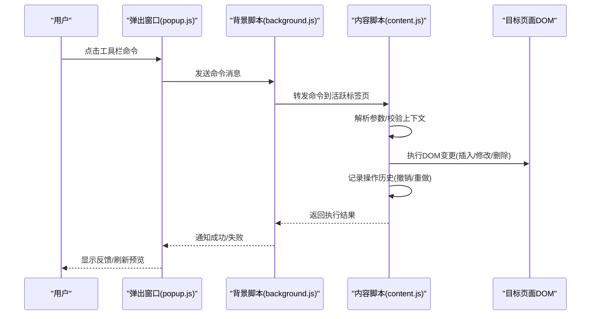
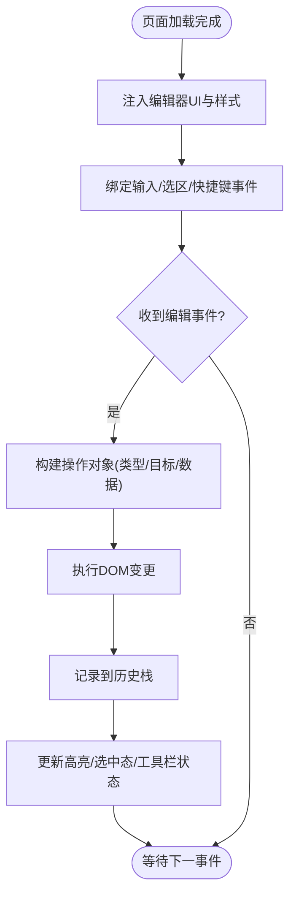
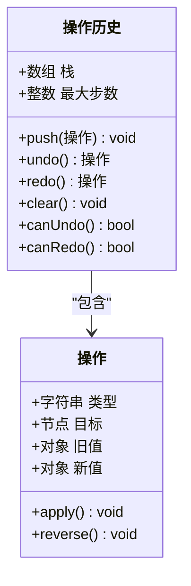
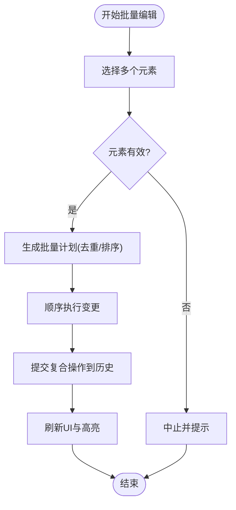
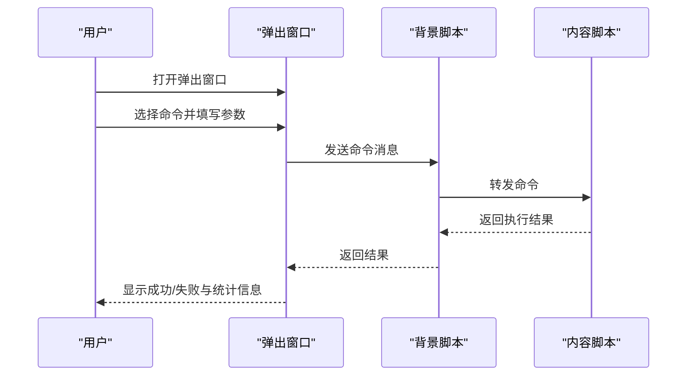
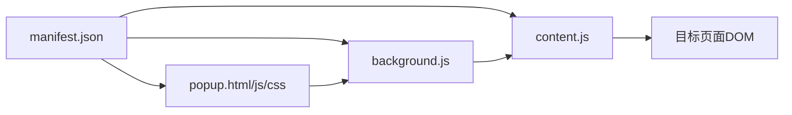

# 核心功能

<cite>
**本文引用的文件**
- [manifest.json](file://manifest.json)
- [background.js](file://background.js)
- [content.js](file://content.js)
- [content.css](file://content.css)
- [popup.html](file://popup.html)
- [popup.js](file://popup.js)
- [popup.css](file://popup.css)
</cite>

## 目录
1. [简介](#简介)
2. [项目结构](#项目结构)
3. [核心组件](#核心组件)
4. [架构总览](#架构总览)
5. [详细组件分析](#详细组件分析)
6. [依赖关系分析](#依赖关系分析)
7. [性能考虑](#性能考虑)
8. [故障排查指南](#故障排查指南)
9. [结论](#结论)
10. [附录](#附录)

## 简介
本扩展为网页提供“实时HTML编辑”能力，允许用户在当前页面中直接对DOM进行可视化修改、批量调整样式与属性，并通过弹出窗口进行工具栏操作。其核心包括：
- 内容脚本注入与DOM操作：在目标页面注入编辑器UI与交互逻辑，实现所见即所得的编辑体验。
- 样式管理：通过动态样式表与类名切换控制元素外观，避免污染宿主页面样式。
- 撤销/重做：基于操作历史栈与快照机制，支持安全的回滚与前进。
- 批量编辑：选中多个节点后统一应用变更（如批量改色、批量添加类名等）。
- 弹出窗口界面：提供工具栏、命令面板与状态提示，承载用户的主要交互入口。

## 项目结构
扩展由以下关键文件组成：
- manifest.json：声明扩展权限、内容脚本、弹出页与背景脚本。
- background.js：后台任务与跨上下文通信协调。
- content.js：注入到目标页面的核心逻辑，负责DOM操作、事件监听、撤销重做与批量编辑。
- content.css：编辑器UI样式与高亮、选中态等视觉反馈。
- popup.html/popup.js/popup.css：弹出窗口的布局、交互与样式。

```mermaid
graph TB
A["浏览器"] --> B["manifest.json<br/>扩展清单"]
B --> C["background.js<br/>后台脚本"]
B --> D["content.js<br/>内容脚本"]
B --> E["popup.html<br/>popup.js<br/>popup.css<br/>弹出窗口"]
D --> F["目标页面DOM<br/>实时编辑/样式/撤销重做/批量编辑"]
E < --> C
E < --> D
```

图表来源
- [manifest.json:1-200](file://manifest.json#L1-L200)
- [background.js:1-200](file://background.js#L1-L200)
- [content.js:1-200](file://content.js#L1-L200)
- [popup.html:1-200](file://popup.html#L1-L200)
- [popup.js:1-200](file://popup.js#L1-L200)
- [popup.css:1-200](file://popup.css#L1-L200)

章节来源
- [manifest.json:1-200](file://manifest.json#L1-L200)

## 核心组件
- 内容脚本（content.js）：负责在目标页面注入编辑器UI、处理用户输入、执行DOM变更、维护撤销/重做历史、执行批量编辑。
- 弹出窗口（popup.html/js/css）：提供工具栏按钮、命令面板、选择器与预览，驱动内容脚本执行具体编辑命令。
- 背景脚本（background.js）：作为消息中转与持久化存储的协调者，连接弹出窗口与内容脚本。
- 样式（content.css/popup.css）：隔离宿主页面样式，确保编辑器UI一致性与可访问性。

章节来源
- [content.js:1-200](file://content.js#L1-L200)
- [popup.html:1-200](file://popup.html#L1-L200)
- [popup.js:1-200](file://popup.js#L1-L200)
- [popup.css:1-200](file://popup.css#L1-L200)
- [background.js:1-200](file://background.js#L1-L200)

## 架构总览
扩展采用“弹出窗口—背景脚本—内容脚本”三层协作模式：
- 弹出窗口：用户触发编辑命令（如加粗、改色、批量替换类名）。
- 背景脚本：转发消息、管理会话与配置。
- 内容脚本：在目标页面执行真实DOM操作，更新视图并维护撤销/重做历史。



图表来源
- [popup.js:1-200](file://popup.js#L1-L200)
- [background.js:1-200](file://background.js#L1-L200)
- [content.js:1-200](file://content.js#L1-L200)

## 详细组件分析

### 实时HTML编辑（DOM操作与内容注入）
- 注入策略：内容脚本在页面加载完成后注入编辑器容器与样式，使用Shadow DOM或命名空间类隔离样式，避免与宿主冲突。
- 事件绑定：为可编辑区域绑定键盘与鼠标事件，捕获输入、选区变化、拖拽等行为，转换为内部操作指令。
- DOM变更：以最小化变更原则执行插入、替换、删除等操作；优先使用DocumentFragment批量构建节点以减少重排。
- 可见性：通过CSS类切换显示/隐藏编辑器控件，保持宿主页面布局稳定。



图表来源
- [content.js:1-200](file://content.js#L1-L200)
- [content.css:1-200](file://content.css#L1-L200)

章节来源
- [content.js:1-200](file://content.js#L1-L200)
- [content.css:1-200](file://content.css#L1-L200)

### 样式管理
- 隔离与覆盖：通过独立样式表与限定选择器控制编辑器UI；对目标元素仅添加/移除类名，不直接内联复杂样式。
- 主题与状态：使用CSS变量与状态类（如选中、悬停、禁用）统一管理视觉反馈。
- 性能：批量更新样式时合并变更，减少多次reflow；必要时使用requestAnimationFrame调度。

章节来源
- [content.css:1-200](file://content.css#L1-L200)
- [popup.css:1-200](file://popup.css#L1-L200)

### 撤销/重做机制（操作历史与状态管理）
- 历史模型：每个编辑动作封装为不可变的操作对象（类型、目标、旧值、新值），推入历史栈。
- 限制与压缩：设置最大步数；对连续同类操作进行合并以减少栈大小。
- 执行与回滚：撤销时按逆序回放操作；重做时正向回放；保证DOM状态一致性。
- 并发安全：在批量编辑期间暂停历史记录，提交后生成复合操作。



图表来源
- [content.js:1-200](file://content.js#L1-L200)

章节来源
- [content.js:1-200](file://content.js#L1-L200)

### 批量编辑（多元素统一修改）
- 选择范围：支持框选、多选节点或按选择器匹配一组元素。
- 变更应用：将同一操作应用到所有选中节点，生成复合操作记录。
- 反馈与撤销：批量成功后一次性更新UI；撤销时整体回滚该批次。



图表来源
- [content.js:1-200](file://content.js#L1-L200)

章节来源
- [content.js:1-200](file://content.js#L1-L200)

### 用户界面与交互流程（弹出窗口）
- 布局：顶部工具栏（常用命令）、中部命令面板（选择器/参数输入）、底部状态栏（操作计数/错误提示）。
- 交互：点击工具栏触发命令→弹出窗口构造参数→通过背景脚本发送到内容脚本→内容脚本执行并返回结果→弹出窗口更新状态。
- 可访问性：提供键盘导航、焦点管理与屏幕阅读器友好标签。



图表来源
- [popup.html:1-200](file://popup.html#L1-L200)
- [popup.js:1-200](file://popup.js#L1-L200)
- [background.js:1-200](file://background.js#L1-L200)
- [content.js:1-200](file://content.js#L1-L200)

章节来源
- [popup.html:1-200](file://popup.html#L1-L200)
- [popup.js:1-200](file://popup.js#L1-L200)
- [popup.css:1-200](file://popup.css#L1-L200)

## 依赖关系分析
- 清单依赖：manifest.json声明内容脚本、弹出页与背景脚本的加载时机与权限。
- 运行时依赖：
  - 弹出窗口依赖背景脚本进行跨上下文通信。
  - 内容脚本依赖目标页面DOM API与样式系统。
  - 背景脚本可能依赖本地存储或消息通道。



图表来源
- [manifest.json:1-200](file://manifest.json#L1-L200)
- [background.js:1-200](file://background.js#L1-L200)
- [content.js:1-200](file://content.js#L1-L200)
- [popup.html:1-200](file://popup.html#L1-L200)
- [popup.js:1-200](file://popup.js#L1-L200)
- [popup.css:1-200](file://popup.css#L1-L200)

章节来源
- [manifest.json:1-200](file://manifest.json#L1-L200)

## 性能考虑
- DOM变更批量化：使用DocumentFragment与最小化重排策略，避免频繁reflow/repaint。
- 事件节流/防抖：对高频输入事件进行节流，降低计算压力。
- 历史栈控制：限制最大步数与合并相似操作，减少内存占用。
- 样式更新优化：批量添加/移除类名，避免逐元素内联样式。
- 动画与渲染：使用requestAnimationFrame调度UI更新，保证流畅度。

[本节为通用性能建议，不直接分析具体文件]

## 故障排查指南
- 无法注入编辑器：检查manifest中内容脚本作用域与页面URL匹配规则；确认页面未阻止脚本注入。
- 命令无响应：验证弹出窗口与背景脚本、内容脚本之间的消息通道是否畅通；检查目标页面是否存在可操作节点。
- 撤销/重做异常：检查历史栈边界条件与操作逆函数是否正确实现；确认批量编辑期间历史暂停与恢复逻辑。
- 样式错乱：确认样式隔离策略生效；避免全局选择器污染；检查类名冲突。

章节来源
- [content.js:1-200](file://content.js#L1-L200)
- [popup.js:1-200](file://popup.js#L1-L200)
- [background.js:1-200](file://background.js#L1-L200)

## 结论
本扩展通过内容脚本在目标页面实现实时HTML编辑，结合弹出窗口与背景脚本形成完整的编辑工作流。撤销/重做与批量编辑提升了编辑效率与安全性，样式隔离保证了宿主页面稳定性。遵循本文的性能与最佳实践，可在复杂页面中获得稳定高效的编辑体验。

[本节为总结性内容，不直接分析具体文件]

## 附录
- 使用场景示例（路径引用）
  - 快速加粗/斜体：参考弹出窗口命令与内容脚本的文本格式化流程。
    - [popup.js:1-200](file://popup.js#L1-L200)
    - [content.js:1-200](file://content.js#L1-L200)
  - 批量改色：通过选择器匹配多元素并统一应用颜色变更。
    - [content.js:1-200](file://content.js#L1-L200)
  - 撤销/重做：通过历史栈进行回滚与前进。
    - [content.js:1-200](file://content.js#L1-L200)
  - 样式隔离：通过content.css与popup.css管理UI样式。
    - [content.css:1-200](file://content.css#L1-L200)
    - [popup.css:1-200](file://popup.css#L1-L200)

[本节为附录说明，不直接分析具体文件]