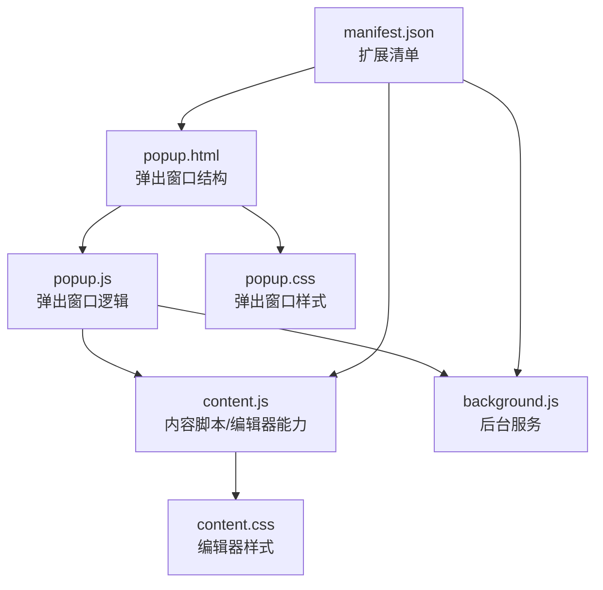
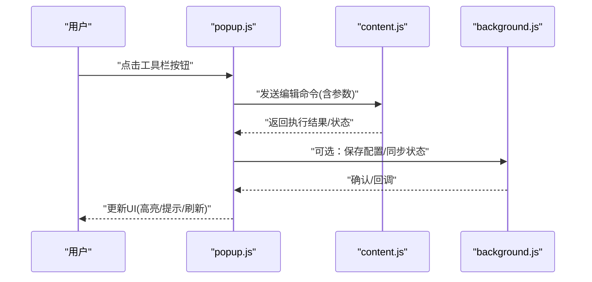
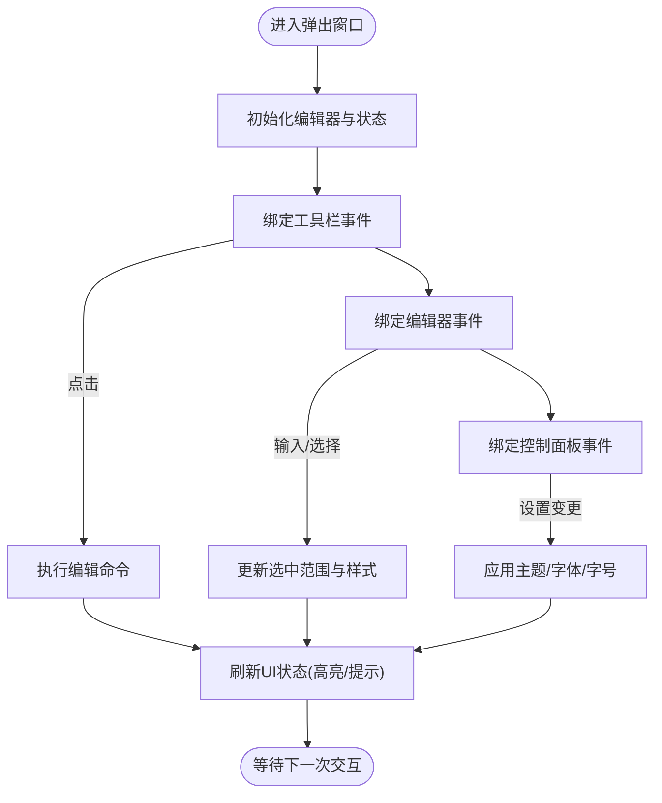
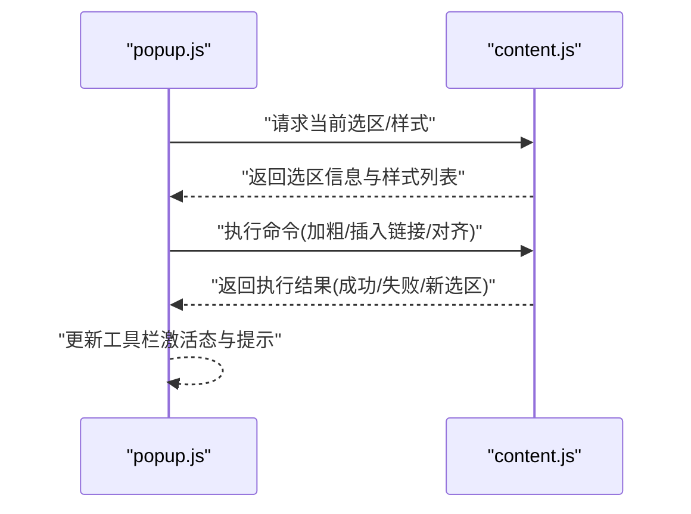
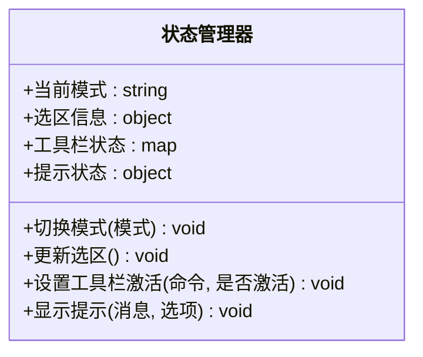
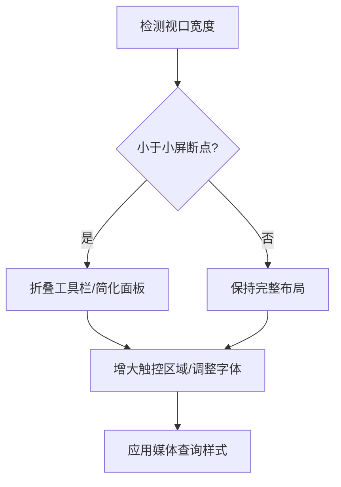
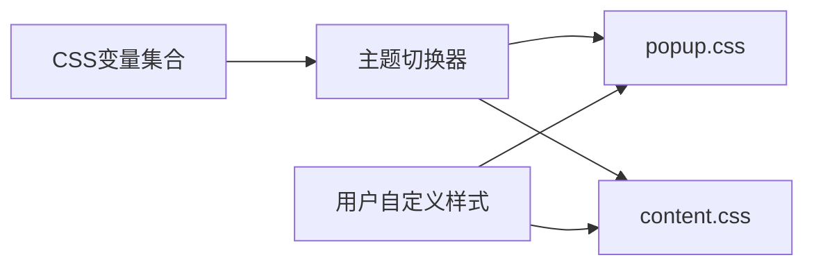
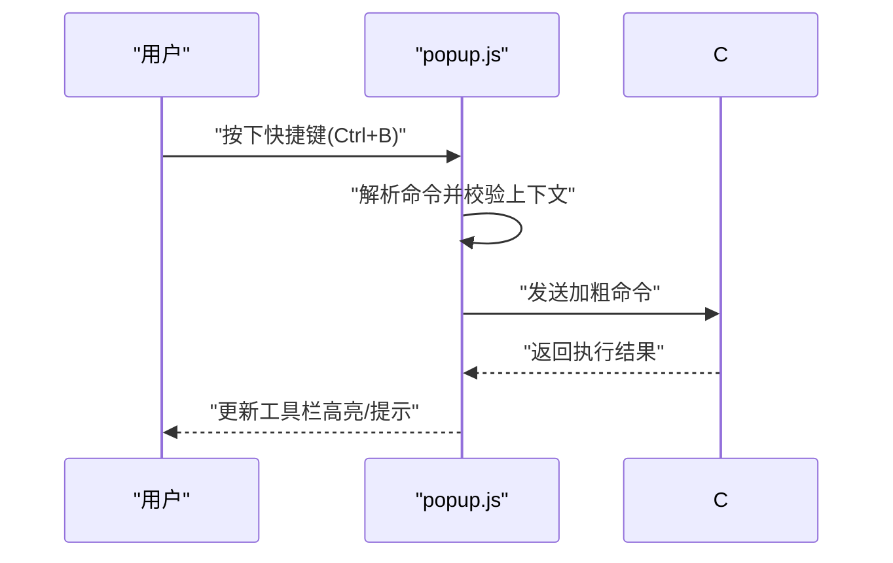
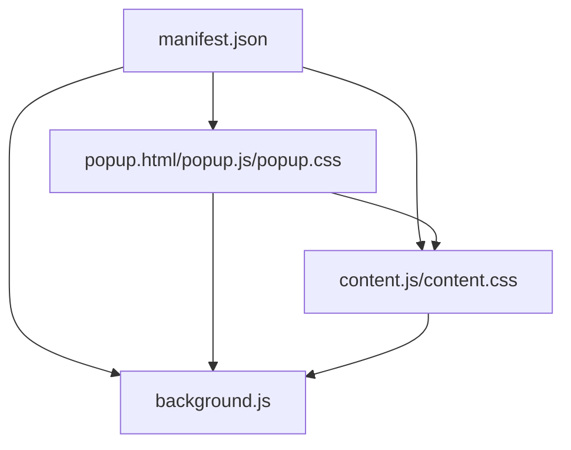

# 用户界面

<cite>
**本文引用的文件**
- [popup.html](file://popup.html)
- [popup.js](file://popup.js)
- [popup.css](file://popup.css)
- [content.js](file://content.js)
- [content.css](file://content.css)
- [background.js](file://background.js)
- [manifest.json](file://manifest.json)
</cite>

## 目录
1. [简介](#简介)
2. [项目结构](#项目结构)
3. [核心组件](#核心组件)
4. [架构总览](#架构总览)
5. [详细组件分析](#详细组件分析)
6. [依赖关系分析](#依赖关系分析)
7. [性能考虑](#性能考虑)
8. [故障排查指南](#故障排查指南)
9. [结论](#结论)
10. [附录](#附录)

## 简介
本文件面向HTML编辑器的用户界面，聚焦弹出窗口（Popup）的设计与实现。文档覆盖以下方面：
- 弹出窗口的布局与组织：工具栏、编辑器区域、控制面板的职责划分与交互流程
- 响应式设计：不同屏幕尺寸下的适配策略
- 状态管理：按钮激活态、编辑模式切换、工具提示显示等
- 交互事件：点击、拖拽、键盘快捷键等处理机制
- 样式系统：CSS变量、主题切换、自定义样式支持
- 可访问性与用户体验优化建议

## 项目结构
本项目为浏览器扩展的弹出界面，主要文件职责如下：
- popup.html：弹出窗口的骨架结构，包含工具栏、编辑器容器、控制面板等区域
- popup.js：弹出窗口的交互逻辑，负责事件绑定、状态管理、与内容脚本通信
- popup.css：弹出窗口的样式定义，包括布局、主题变量、响应式断点
- content.js：注入到目标页面的内容脚本，提供编辑器能力（如富文本编辑API封装）
- content.css：注入到目标页面的样式，用于编辑器区域的视觉呈现
- background.js：后台脚本，负责跨上下文消息转发或持久化任务
- manifest.json：扩展清单，声明权限、脚本注入、弹出页面入口等

**图表来源**
- [popup.html:1-200](file://popup.html#L1-L200)
- [popup.js:1-300](file://popup.js#L1-L300)
- [content.js:1-300](file://content.js#L1-L300)
- [content.css:1-200](file://content.css#L1-L200)
- [background.js:1-200](file://background.js#L1-L200)
- [manifest.json:1-100](file://manifest.json#L1-L100)

**章节来源**
- [popup.html:1-200](file://popup.html#L1-L200)
- [popup.js:1-300](file://popup.js#L1-L300)
- [content.js:1-300](file://content.js#L1-L300)
- [content.css:1-200](file://content.css#L1-L200)
- [background.js:1-200](file://background.js#L1-L200)
- [manifest.json:1-100](file://manifest.json#L1-L100)

## 核心组件
- 工具栏：提供常用编辑操作（加粗、斜体、插入链接、对齐方式等），通过按钮或图标触发命令
- 编辑器区域：基于可编辑元素（如contenteditable）或iframe承载的富文本编辑区，支持实时预览与输入
- 控制面板：设置项（字体、字号、主题、导出格式等），以表单或面板形式组织
- 状态管理：集中维护当前编辑模式、选中范围、工具栏激活态、提示框显隐等
- 消息通道：通过浏览器扩展的消息机制在popup、content、background之间传递指令与数据

**章节来源**
- [popup.js:1-300](file://popup.js#L1-L300)
- [content.js:1-300](file://content.js#L1-L300)
- [popup.css:1-200](file://popup.css#L1-L200)

## 架构总览
弹出窗口作为UI入口，将用户操作转换为命令并通过消息发送给内容脚本；内容脚本在目标页面执行编辑操作并返回结果；后台脚本可承担持久化或跨标签页协调任务。

**图表来源**
- [popup.js:1-300](file://popup.js#L1-L300)
- [content.js:1-300](file://content.js#L1-L300)
- [background.js:1-200](file://background.js#L1-L200)

## 详细组件分析

### 弹出窗口布局与交互
- 布局结构：顶部工具栏、中部编辑器区域、底部或侧边控制面板
- 交互流程：
  - 点击工具栏按钮：调用对应命令，更新选中范围与样式
  - 拖拽调整编辑器尺寸：监听鼠标事件，动态计算宽高并应用
  - 键盘快捷键：捕获组合键（如Ctrl+B/Ctrl+I），映射到编辑命令
  - 工具提示：悬停显示说明，延迟出现与自动隐藏

**图表来源**
- [popup.html:1-200](file://popup.html#L1-L200)
- [popup.js:1-300](file://popup.js#L1-L300)
- [popup.css:1-200](file://popup.css#L1-L200)

**章节来源**
- [popup.html:1-200](file://popup.html#L1-L200)
- [popup.js:1-300](file://popup.js#L1-L300)
- [popup.css:1-200](file://popup.css#L1-L200)

### 编辑器区域与内容脚本协作
- 编辑器区域由内容脚本提供富文本能力，popup通过消息驱动其执行命令
- 内容脚本维护DOM选择器、光标位置、选区信息，并在需要时回传popup
- 双向通信确保UI与编辑状态一致

**图表来源**
- [popup.js:1-300](file://popup.js#L1-L300)
- [content.js:1-300](file://content.js#L1-L300)

**章节来源**
- [popup.js:1-300](file://popup.js#L1-L300)
- [content.js:1-300](file://content.js#L1-L300)

### 状态管理
- 按钮激活状态：根据当前选区的样式或命令可用性切换高亮
- 编辑模式切换：如“所见即所得”与“源码视图”之间的切换
- 工具提示：统一控制显示时机、定位与生命周期
- 状态存储：使用内存对象或本地存储缓存用户偏好

**图表来源**
- [popup.js:1-300](file://popup.js#L1-L300)

**章节来源**
- [popup.js:1-300](file://popup.js#L1-L300)

### 响应式设计
- 断点策略：针对小屏设备折叠工具栏、隐藏次要控件、增大触控区域
- 弹性布局：使用flex/grid自适应排列，保证在不同分辨率下可用
- 字体与间距：依据屏幕密度调整字号与内边距，提升可读性
- 媒体查询：按宽度阈值切换布局与行为

**图表来源**
- [popup.css:1-200](file://popup.css#L1-L200)

**章节来源**
- [popup.css:1-200](file://popup.css#L1-L200)

### 样式系统与主题
- CSS变量：定义颜色、字体、阴影、圆角等主题令牌，便于全局切换
- 主题切换：通过根节点属性或类名切换主题，动态更新变量值
- 自定义样式：允许用户注入额外样式表或覆盖变量
- 编辑器样式：content.css提供编辑器基础样式，与popup主题保持一致

**图表来源**
- [popup.css:1-200](file://popup.css#L1-L200)
- [content.css:1-200](file://content.css#L1-L200)

**章节来源**
- [popup.css:1-200](file://popup.css#L1-L200)
- [content.css:1-200](file://content.css#L1-L200)

### 用户交互事件处理器
- 点击：工具栏按钮、控制面板选项的事件绑定与命令分发
- 拖拽：编辑器尺寸调整、面板展开/收起
- 键盘快捷键：捕获组合键，映射到编辑命令，避免冲突
- 焦点管理：确保Tab顺序合理，支持键盘导航

**图表来源**
- [popup.js:1-300](file://popup.js#L1-L300)
- [content.js:1-300](file://content.js#L1-L300)

**章节来源**
- [popup.js:1-300](file://popup.js#L1-L300)
- [content.js:1-300](file://content.js#L1-L300)

### 具体UI组件示例与使用场景
- 工具栏按钮：创建按钮元素，绑定点击事件，调用命令函数，更新激活态
- 编辑器容器：初始化可编辑区域，监听输入与选择变化，同步状态
- 控制面板：表单控件与开关，监听变更事件，应用主题或设置
- 提示组件：封装显示/隐藏逻辑，支持定位与超时关闭

[本节为概念性说明，不直接分析具体文件]

## 依赖关系分析
- popup.js依赖popup.html结构与popup.css样式，并与content.js进行消息通信
- content.js依赖content.css样式，提供编辑器能力给popup调用
- background.js可能参与消息转发或持久化，被popup或content间接使用
- manifest.json声明脚本注入与权限，影响整体运行环境

**图表来源**
- [manifest.json:1-100](file://manifest.json#L1-L100)
- [popup.js:1-300](file://popup.js#L1-L300)
- [content.js:1-300](file://content.js#L1-L300)
- [background.js:1-200](file://background.js#L1-L200)

**章节来源**
- [manifest.json:1-100](file://manifest.json#L1-L100)
- [popup.js:1-300](file://popup.js#L1-L300)
- [content.js:1-300](file://content.js#L1-L300)
- [background.js:1-200](file://background.js#L1-L200)

## 性能考虑
- 事件节流与防抖：对频繁输入与拖拽事件进行优化，减少重绘
- 最小化DOM操作：批量更新样式与内容，避免多次回流
- 懒加载与按需渲染：仅在需要时初始化编辑器或加载面板
- 消息通信优化：合并消息、减少往返次数，提高响应速度

[本节提供通用指导，不直接分析具体文件]

## 故障排查指南
- 工具栏无响应：检查事件绑定是否正确，命令参数是否有效
- 编辑器无法编辑：确认内容脚本已注入，目标页面允许编辑
- 主题未生效：验证CSS变量是否被正确覆盖，主题切换逻辑是否触发
- 快捷键冲突：检查全局快捷键注册，避免与浏览器默认行为冲突
- 消息通信失败：查看扩展控制台日志，确认权限与端口匹配

**章节来源**
- [popup.js:1-300](file://popup.js#L1-L300)
- [content.js:1-300](file://content.js#L1-L300)
- [background.js:1-200](file://background.js#L1-L200)

## 结论
本弹出窗口界面通过清晰的布局、健壮的状态管理与高效的通信机制，提供了流畅的HTML编辑体验。结合响应式设计与主题系统，能够适应多种设备与用户偏好。建议在后续迭代中持续优化性能与可访问性，提升易用性与包容性。

[本节为总结性内容，不直接分析具体文件]

## 附录
- 可访问性改进建议：
  - 为所有交互元素添加语义化标签与ARIA属性
  - 确保键盘可达性与焦点可见
  - 提供足够的对比度与替代文本
- 用户体验优化建议：
  - 增加操作反馈（成功/错误提示）
  - 提供撤销/重做历史
  - 支持自定义快捷键与布局保存

[本节为概念性说明，不直接分析具体文件]