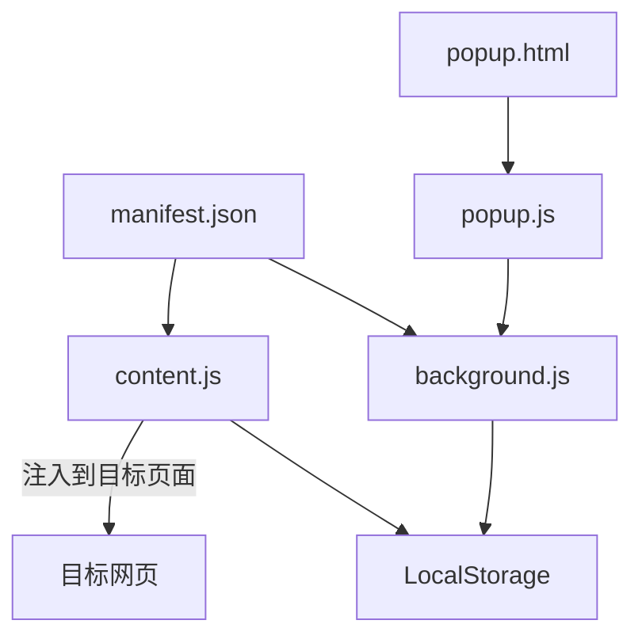
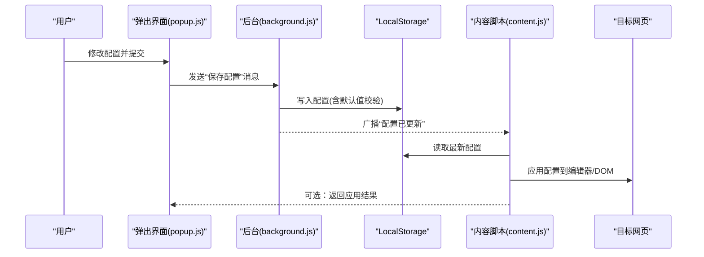

# 配置管理

<cite>
**本文引用的文件**
- [manifest.json](file://manifest.json)
- [background.js](file://background.js)
- [content.js](file://content.js)
- [popup.js](file://popup.js)
- [popup.html](file://popup.html)
</cite>

## 目录
1. [简介](#简介)
2. [项目结构](#项目结构)
3. [核心组件](#核心组件)
4. [架构总览](#架构总览)
5. [详细组件分析](#详细组件分析)
6. [依赖关系分析](#依赖关系分析)
7. [性能考虑](#性能考虑)
8. [故障排查指南](#故障排查指南)
9. [结论](#结论)
10. [附录](#附录)

## 简介
本文件为 HTML 编辑器浏览器扩展的配置管理文档，聚焦于以下目标：
- 全面说明 manifest.json 的扩展元数据、权限声明与内容脚本注入规则。
- 解释运行时配置管理机制（用户偏好存储与读取）。
- 详细说明 LocalStorage 的使用方式与数据结构设计。
- 提供配置验证与默认值处理方案。
- 制定配置迁移策略以保障向后兼容。
- 给出安全配置最佳实践（权限最小化原则）。
- 提供常见配置场景与示例指引。

## 项目结构
本项目采用典型的浏览器扩展分层组织：
- 清单与资源：manifest.json 定义扩展元数据、权限与脚本注入规则。
- 后台服务：background.js 负责持久化配置、跨上下文通信与事件监听。
- 页面注入：content.js 在目标网页中运行，读取并应用运行时配置。
- 弹出界面：popup.html/popup.js 提供用户设置入口，读写配置。



图表来源
- [manifest.json:1-200](file://manifest.json#L1-L200)
- [background.js:1-200](file://background.js#L1-L200)
- [content.js:1-200](file://content.js#L1-L200)
- [popup.js:1-200](file://popup.js#L1-L200)

章节来源
- [manifest.json:1-200](file://manifest.json#L1-L200)
- [background.js:1-200](file://background.js#L1-L200)
- [content.js:1-200](file://content.js#L1-L200)
- [popup.js:1-200](file://popup.js#L1-L200)

## 核心组件
- 清单配置（manifest.json）
  - 扩展元数据：名称、版本、描述、图标等。
  - 权限声明：按需申请如 storage、activeTab、tabs、scripting 等。
  - 内容脚本注入：通过 content_scripts 指定匹配模式与注入时机。
  - 后台脚本：通过 background.scripts 注册后台逻辑。
  - 弹出界面：通过 action.popup 或 browser_action 关联 UI。
- 后台服务（background.js）
  - 配置初始化与默认值合并。
  - 配置变更监听与广播。
  - 与 content/popup 的消息通道。
- 内容脚本（content.js）
  - 读取当前站点/全局配置。
  - 将配置应用到编辑器实例或 DOM。
  - 响应来自 popup/background 的配置更新。
- 弹出界面（popup.html/popup.js）
  - 渲染配置表单。
  - 保存配置到 storage。
  - 触发配置生效与通知。

章节来源
- [manifest.json:1-200](file://manifest.json#L1-L200)
- [background.js:1-200](file://background.js#L1-L200)
- [content.js:1-200](file://content.js#L1-L200)
- [popup.js:1-200](file://popup.js#L1-L200)

## 架构总览
下图展示配置从用户设置到页面生效的端到端流程。



图表来源
- [popup.js:1-200](file://popup.js#L1-L200)
- [background.js:1-200](file://background.js#L1-L200)
- [content.js:1-200](file://content.js#L1-L200)

## 详细组件分析

### 清单配置（manifest.json）
- 扩展元数据
  - 字段建议：name、version、description、icons、permissions、host_permissions、action、background、content_scripts、options_page 等。
  - 作用：声明扩展身份、能力边界与行为。
- 权限声明
  - 最小权限原则：仅申请必要权限，例如 storage、activeTab、scripting、tabs。
  - 主机权限：仅在需要访问特定域名时声明 host_permissions。
- 内容脚本注入
  - 使用 content_scripts 的 matches 精确控制注入范围。
  - 合理设置 run_at（document_start/document_end/document_idle）与 all_frames。
- 后台脚本
  - 通过 background.scripts 注册后台逻辑，用于配置持久化与消息路由。
- 弹出界面
  - 通过 action.popup 或 browser_action 关联 UI 页面。

章节来源
- [manifest.json:1-200](file://manifest.json#L1-L200)

### 运行时配置管理（background.js）
- 配置初始化
  - 首次安装或升级时，写入默认配置到 storage。
  - 对缺失字段进行补全，确保数据结构稳定。
- 配置读取
  - 提供统一读取接口，返回合并后的最终配置对象。
- 配置写入与校验
  - 接收来自 popup 的配置变更请求。
  - 执行类型与取值范围校验，失败则拒绝并返回错误信息。
- 配置变更广播
  - 监听 storage 变更事件，向所有 content 脚本广播新配置。
- 消息通道
  - 处理来自 popup/content 的消息，转发至 storage 或目标上下文。

章节来源
- [background.js:1-200](file://background.js#L1-L200)

### 内容脚本（content.js）
- 配置订阅
  - 监听来自 background 的配置更新消息。
  - 根据当前页面 URL 选择站点级或全局配置。
- 配置应用
  - 将配置映射到编辑器 API 或 DOM 属性。
  - 支持增量更新，避免重绘与性能抖动。
- 状态上报
  - 可选向 popup 回传应用结果，便于调试与反馈。

章节来源
- [content.js:1-200](file://content.js#L1-L200)

### 弹出界面（popup.html/popup.js）
- 配置表单
  - 动态渲染配置项，绑定输入控件。
- 保存流程
  - 收集表单数据，调用 background 保存接口。
  - 显示保存成功/失败提示。
- 实时预览
  - 可选通过消息机制让 content 即时应用配置并返回预览状态。

章节来源
- [popup.html:1-200](file://popup.html#L1-L200)
- [popup.js:1-200](file://popup.js#L1-L200)

## 依赖关系分析
- manifest.json 是入口，声明 background、content_scripts、action 等模块。
- background.js 依赖 storage 与 messaging，作为配置的权威源。
- content.js 依赖 messaging 与 storage，消费配置并作用于页面。
- popup.js 依赖 messaging 与 storage，提供用户交互入口。

```mermaid
graph LR
M["manifest.json"] --> BG["background.js"]
M --> CT["content.js"]
M --> PU["popup.js"]
BG < --> CT
BG < --> PU
CT --> LS["LocalStorage"]
BG --> LS
PU --> LS
```

图表来源
- [manifest.json:1-200](file://manifest.json#L1-L200)
- [background.js:1-200](file://background.js#L1-L200)
- [content.js:1-200](file://content.js#L1-L200)
- [popup.js:1-200](file://popup.js#L1-L200)

章节来源
- [manifest.json:1-200](file://manifest.json#L1-L200)
- [background.js:1-200](file://background.js#L1-L200)
- [content.js:1-200](file://content.js#L1-L200)
- [popup.js:1-200](file://popup.js#L1-L200)

## 性能考虑
- 配置读取与写入
  - 批量写入与防抖更新，减少 storage 操作频率。
  - 使用增量更新策略，避免整份配置重复计算。
- 内容脚本注入
  - 选择合适的 run_at 时机，降低首屏阻塞。
  - 针对大页面延迟应用非关键配置。
- 消息通信
  - 限制广播频率，必要时合并消息。
  - 使用单例或缓存避免重复初始化。

[本节为通用指导，不直接分析具体文件]

## 故障排查指南
- 常见问题
  - 权限不足：检查 manifest 中 permissions/host_permissions 是否包含所需能力。
  - 注入失败：核对 content_scripts.matches 与目标页面 URL 是否匹配。
  - 配置未生效：确认 background 是否正确广播，content 是否收到消息。
  - 数据损坏：检查 storage 中的配置结构，必要时重置为默认值。
- 定位步骤
  - 打开开发者工具，查看 console 与 network 面板。
  - 在 background 中打印关键路径日志。
  - 使用 popup 的“导出/导入配置”功能对比差异。

章节来源
- [background.js:1-200](file://background.js#L1-L200)
- [content.js:1-200](file://content.js#L1-L200)
- [popup.js:1-200](file://popup.js#L1-L200)

## 结论
通过清晰的清单配置、健壮的后台配置管理与可靠的内容脚本应用层，本扩展实现了可维护、可扩展且安全的配置体系。遵循最小权限原则、完善的校验与迁移策略，可确保在不同浏览器与版本下的稳定性与兼容性。

[本节为总结性内容，不直接分析具体文件]

## 附录

### 配置验证与默认值处理方案
- 默认值合并
  - 在首次加载或升级时，将默认配置与现有配置合并，缺失字段自动补齐。
- 类型与范围校验
  - 对数值型、布尔型、枚举型字段进行严格校验，非法值回退到默认值并记录告警。
- 版本化
  - 为配置对象增加 version 字段，便于识别与迁移。

章节来源
- [background.js:1-200](file://background.js#L1-L200)

### 配置迁移策略（向后兼容）
- 迁移钩子
  - 当检测到旧版本配置时，按版本顺序执行迁移函数。
- 兼容层
  - 保留旧字段名一段时间，并在读取时映射到新结构。
- 回滚与清理
  - 迁移失败时回滚到上一版本；清理废弃字段，避免污染。

章节来源
- [background.js:1-200](file://background.js#L1-L200)

### LocalStorage 使用方式与数据结构设计
- 键命名规范
  - 使用前缀区分环境与作用域，例如 ext_config_global、ext_config_site_{domain}。
- 数据结构建议
  - 顶层包含 meta（version、updated_at）与 data（具体配置）。
  - 站点级配置覆盖全局配置，形成优先级链。
- 读写约定
  - 统一通过 background 提供的接口读写，避免多处实现不一致。

章节来源
- [background.js:1-200](file://background.js#L1-L200)
- [content.js:1-200](file://content.js#L1-L200)

### 安全配置最佳实践
- 权限最小化
  - 仅申请 storage、activeTab、scripting、tabs 等必要权限。
  - 谨慎使用 host_permissions，限定到可信域名。
- 内容脚本安全
  - 避免注入不受信任的代码；对注入内容进行白名单校验。
- 消息安全
  - 校验消息来源与格式，拒绝非法消息。
- 隐私保护
  - 不收集敏感信息；如需记录日志，脱敏后再输出。

章节来源
- [manifest.json:1-200](file://manifest.json#L1-L200)
- [background.js:1-200](file://background.js#L1-L200)

### 常见配置场景与示例指引
- 全局启用/禁用编辑器增强
  - 在 popup 中切换开关，background 写入 storage 并广播。
- 按站点定制样式与行为
  - 使用站点级配置覆盖全局设置，content 根据 URL 选择。
- 灰度发布与实验特性
  - 通过 feature flags 控制新功能开关，逐步放量。
- 多语言与主题
  - 配置语言代码与主题 ID，content 动态加载资源。

章节来源
- [popup.js:1-200](file://popup.js#L1-L200)
- [content.js:1-200](file://content.js#L1-L200)
- [background.js:1-200](file://background.js#L1-L200)