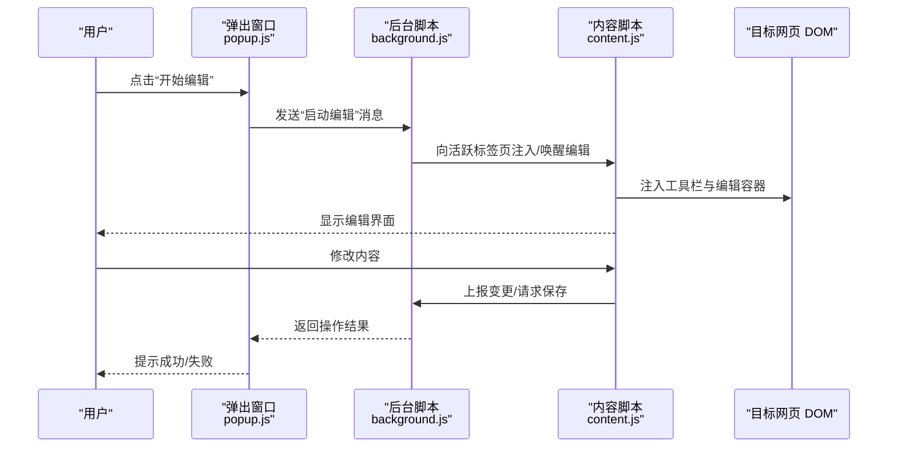
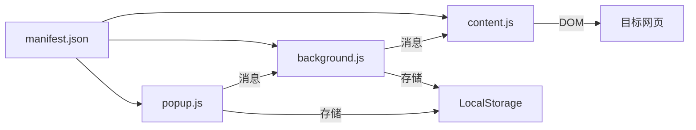

# 项目概述

<cite>
**本文引用的文件**
- [manifest.json](file://manifest.json)
- [background.js](file://background.js)
- [content.js](file://content.js)
- [content.css](file://content.css)
- [popup.html](file://popup.html)
- [popup.js](file://popup.js)
- [popup.css](file://popup.css)
- [test.html](file://test.html)
</cite>

## 目录
1. [简介](#简介)
2. [项目结构](#项目结构)
3. [核心组件](#核心组件)
4. [架构总览](#架构总览)
5. [详细组件分析](#详细组件分析)
6. [依赖分析](#依赖分析)
7. [性能考虑](#性能考虑)
8. [故障排查指南](#故障排查指南)
9. [结论](#结论)
10. [附录](#附录)

## 简介
本项目是一个基于浏览器扩展的 HTML 编辑器，目标是在任意网页中注入编辑能力，让用户在不离开当前页面的情况下快速编辑、预览和导出 HTML 内容。它通过浏览器扩展机制在页面中注入脚本与样式，提供轻量级工具栏与编辑功能，并通过弹出窗口进行配置与操作。

- 目的：为网页用户提供即开即用的 HTML 编辑体验，降低编辑门槛，提升效率。
- 核心功能：
  - 在目标页面注入编辑工具栏与编辑区域
  - 支持对页面 DOM 的选择、修改与预览
  - 通过弹出窗口进行设置与快捷操作
  - 持久化用户偏好（如主题、快捷键等）
- 目标用户：
  - 需要快速编辑网页内容的普通用户
  - 前端开发者与内容运营人员
  - 需要在生产环境中临时调试或演示的用户

## 项目结构
项目采用浏览器扩展的标准三进程模型：Background Script、Content Script、Popup。各职责清晰、耦合度低，便于维护与扩展。

```mermaid
graph TB
subgraph "扩展进程"
BG["后台脚本<br/>background.js"]
POP["弹出窗口<br/>popup.html / popup.js / popup.css"]
end
subgraph "目标网页"
CT["内容脚本<br/>content.js / content.css"]
WEB["目标网页 DOM"]
end
MAN["清单文件<br/>manifest.json"]
MAN --> BG
MAN --> CT
MAN --> POP
BG < --> |消息通信| POP
CT --> |注入/监听| WEB
POP --> |指令/配置| BG
BG --> |转发/桥接| CT
```

图表来源
- [manifest.json:1-200](file://manifest.json#L1-L200)
- [background.js:1-200](file://background.js#L1-L200)
- [content.js:1-200](file://content.js#L1-L200)
- [popup.html:1-200](file://popup.html#L1-L200)
- [popup.js:1-200](file://popup.js#L1-L200)
- [popup.css:1-200](file://popup.css#L1-L200)
- [content.css:1-200](file://content.css#L1-L200)

章节来源
- [manifest.json:1-200](file://manifest.json#L1-L200)

## 核心组件
- 清单文件 manifest.json：声明扩展名称、版本、权限、图标、入口脚本与可注入的页面规则，是扩展的“注册表”。
- 后台脚本 background.js：作为扩展的常驻进程，负责跨上下文的消息路由、状态管理、与页面脚本的通信协调。
- 内容脚本 content.js + content.css：注入到目标网页中，负责创建 UI、监听交互、操作 DOM、与后台脚本通信。
- 弹出窗口 popup.html/js/css：提供用户界面，用于触发编辑动作、查看结果、调整设置。

章节来源
- [manifest.json:1-200](file://manifest.json#L1-L200)
- [background.js:1-200](file://background.js#L1-L200)
- [content.js:1-200](file://content.js#L1-L200)
- [content.css:1-200](file://content.css#L1-L200)
- [popup.html:1-200](file://popup.html#L1-L200)
- [popup.js:1-200](file://popup.js#L1-L200)
- [popup.css:1-200](file://popup.css#L1-L200)

## 架构总览
本扩展采用事件驱动与模块化设计，结合 MVC 变体模式组织代码：
- 事件驱动：通过消息总线（Chrome Web Extensions API 的 messaging）在各进程间传递事件，解耦调用方与被调用方。
- 模块化：按职责划分文件，UI、逻辑、数据访问分离，便于测试与维护。
- MVC 变体：
  - Model：LocalStorage 存储用户配置与缓存数据
  - View：content.css/popup.css 负责样式；popup.html/content.js 中的 DOM 片段负责展示
  - Controller：background.js/popup.js/content.js 中的函数负责处理事件、协调流程



图表来源
- [popup.js:1-200](file://popup.js#L1-L200)
- [background.js:1-200](file://background.js#L1-L200)
- [content.js:1-200](file://content.js#L1-L200)

章节来源
- [popup.js:1-200](file://popup.js#L1-L200)
- [background.js:1-200](file://background.js#L1-L200)
- [content.js:1-200](file://content.js#L1-L200)

## 详细组件分析

### 清单文件 manifest.json
- 作用：定义扩展元信息、权限、图标、背景脚本、内容脚本注入规则、弹出窗口入口等。
- 关键点：
  - 声明 background script 与 content scripts 的加载时机与作用域
  - 声明所需权限（如 storage、activeTab、tabs 等）
  - 指定 popup 入口与图标资源

章节来源
- [manifest.json:1-200](file://manifest.json#L1-L200)

### 后台脚本 background.js
- 角色：扩展的“中枢”，负责：
  - 接收来自 Popup 的消息并转发到目标页面
  - 管理全局状态（如是否处于编辑模式、上次编辑位置）
  - 与 Content Script 建立可靠的消息通道
- 典型流程：
  - 监听 Popup 消息
  - 使用 tabs.sendMessage 将指令发送到活跃标签页的内容脚本
  - 处理来自内容脚本的结果回调

章节来源
- [background.js:1-200](file://background.js#L1-L200)

### 内容脚本 content.js 与样式 content.css
- 角色：运行在目标网页上下文中，负责：
  - 注入工具栏与编辑面板
  - 监听用户交互（点击、输入、键盘快捷键）
  - 操作 DOM 实现增删改查
  - 与后台脚本双向通信
- 样式：content.css 控制注入 UI 的布局与外观，避免与宿主页面冲突。

章节来源
- [content.js:1-200](file://content.js#L1-L200)
- [content.css:1-200](file://content.css#L1-L200)

### 弹出窗口 popup.html/js/css
- 角色：为用户提供可视化控制面板，包括：
  - 触发编辑、预览、导出等操作
  - 查看当前页面状态与错误信息
  - 管理本地设置（主题、快捷键、默认模板等）
- 与后台脚本通过消息通信，不直接操作目标页面 DOM。

章节来源
- [popup.html:1-200](file://popup.html#L1-L200)
- [popup.js:1-200](file://popup.js#L1-L200)
- [popup.css:1-200](file://popup.css#L1-L200)

### 测试页面 test.html
- 作用：本地验证注入效果与编辑流程的辅助页面，便于在无真实业务页面的情况下进行测试。

章节来源
- [test.html:1-200](file://test.html#L1-L200)

## 依赖分析
- 外部 API：
  - Chrome Web Extensions API：用于消息通信、标签页管理、存储读写等
  - DOM API：用于选择、创建、修改节点
  - LocalStorage API：用于持久化用户配置
- 内部依赖：
  - manifest.json 决定哪些脚本被加载以及何时加载
  - background.js 与 content.js 通过消息协议协作
  - popup.js 与 background.js 通过消息协议协作



图表来源
- [manifest.json:1-200](file://manifest.json#L1-L200)
- [background.js:1-200](file://background.js#L1-L200)
- [content.js:1-200](file://content.js#L1-L200)
- [popup.js:1-200](file://popup.js#L1-L200)

章节来源
- [manifest.json:1-200](file://manifest.json#L1-L200)
- [background.js:1-200](file://background.js#L1-L200)
- [content.js:1-200](file://content.js#L1-L200)
- [popup.js:1-200](file://popup.js#L1-L200)

## 性能考虑
- 最小化注入范围：仅在需要的页面类型与路径下注入内容脚本，减少开销。
- 延迟初始化：按需加载编辑器模块，避免首屏阻塞。
- 批量更新 DOM：合并多次修改，减少重排与重绘。
- 防抖与节流：对高频事件（如滚动、输入）做节流，降低 CPU 占用。
- 内存管理：及时移除事件监听器与 DOM 引用，防止泄漏。

[本节为通用指导，无需特定文件引用]

## 故障排查指南
- 扩展未生效：
  - 检查 manifest.json 是否正确声明内容与背景脚本
  - 确认目标页面是否在允许注入的范围内
- 无法通信：
  - 检查 background.js 与 content.js 的消息监听与发送是否匹配
  - 确认标签页已激活且具备所需权限
- 样式冲突：
  - 检查 content.css 是否使用了过于宽泛的选择器
  - 为注入元素添加唯一命名空间以避免覆盖
- 存储异常：
  - 检查 LocalStorage 读写权限与容量限制
  - 对关键数据进行校验与降级处理

章节来源
- [manifest.json:1-200](file://manifest.json#L1-L200)
- [background.js:1-200](file://background.js#L1-L200)
- [content.js:1-200](file://content.js#L1-L200)
- [popup.js:1-200](file://popup.js#L1-L200)

## 结论
本项目以清晰的三进程架构与事件驱动模式，实现了在任意网页中注入 HTML 编辑能力的目标。通过模块化设计与 MVC 变体，代码职责明确、易于扩展与维护。配合完善的安装与使用指引，新用户可快速上手，开发者也可在此基础上继续增强功能。

[本节为总结性内容，无需特定文件引用]

## 附录

### 技术栈与 API
- 技术栈：JavaScript、CSS、HTML5
- 主要 API：
  - Chrome Web Extensions API：消息通信、标签页管理、存储接口
  - DOM API：节点选择、创建、修改与事件绑定
  - LocalStorage API：用户偏好与缓存数据的持久化

[本节为概念性说明，无需特定文件引用]

### 安装指南
- 步骤：
  - 打开浏览器扩展管理页面
  - 启用“开发者模式”
  - 选择“加载已解压的扩展程序”，指向项目根目录
  - 在任意网页上点击扩展图标，进入弹出窗口
  - 点击“开始编辑”，即可在页面中看到注入的工具栏
- 注意事项：
  - 某些网站可能限制脚本注入，需在扩展设置中放行
  - 首次使用时请确保授予必要的权限

[本节为通用操作说明，无需特定文件引用]

### 基本使用示例
- 编辑流程：
  - 在目标页面点击扩展图标
  - 在弹出窗口中选择“编辑当前页面”
  - 使用工具栏插入文本、图片、链接等元素
  - 实时预览修改效果
  - 完成后导出或保存至本地存储
- 常用操作：
  - 撤销/重做：通过历史记录栈管理
  - 快捷键：自定义常用操作的快捷键
  - 主题切换：在弹出窗口中切换明暗主题

[本节为通用使用说明，无需特定文件引用]